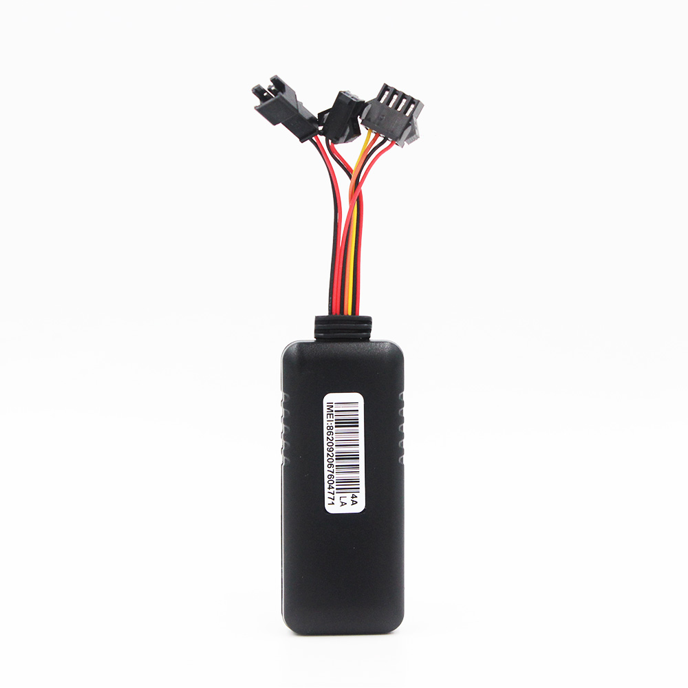

# CanTrack - G900LM-4G

El CanTrack G900LM-4G es un rastreador GPS mini, cableado y de formato compacto, perteneciente a una familia telemática consolidada. Está pensado para autos, camiones y vehículos comerciales, y combina conectividad LTE GSM con posicionamiento GNSS de alta sensibilidad, batería interna de respaldo y múltiples tipos de alarma para proteger activos y mejorar la telemetría operativa. El dispositivo está disponible en variantes de cableado de 4 y 8 pines para ofrecer opciones de instalación flexibles en distintos vehículos.

Este modelo es totalmente compatible con Plaspy, por lo que resulta idóneo para organizaciones que quieren integrar el rastreo a nivel de dispositivo dentro de una plataforma centralizada de gestión de flotas. Al integrarlo con Plaspy, el G900LM-4G proporciona actualizaciones de ubicación continuas, alertas configurables y opciones de control remoto que ayudan a los responsables de flota a monitorear vehículos en tiempo real y reaccionar ante robos o incidentes operativos.

## Características principales

- Compatible con Plaspy para seguimiento continuo en tiempo real y visibilidad de la flota.
- Diseño compacto y cableado con opciones de 4 y 8 pines para instalaciones versátiles.
- Múltiples tipos de alarma: detección de movimiento, cambio de ignición, exceso de velocidad y corte de energía para protección de activos.
- Control remoto opcional de relé para cortar combustible o alimentación eléctrica como respuesta de inmovilización cuando esté autorizado.
- Conectividad LTE multibanda para despliegues regionales amplios y enlaces de datos confiables.
- GNSS de alta sensibilidad y batería interna de respaldo para mantener el seguimiento ante pérdidas de energía.

## Cómo funciona con Plaspy

Una vez que el G900LM-4G esté conectado y configurado, transmite datos de ubicación y estado a Plaspy para que los operadores de flota puedan ver posiciones en vivo, recibir alertas y analizar movimientos históricos. Plaspy actúa como la plataforma central para alertas, reportes y comandos remotos, permitiendo a los responsables supervisar el desempeño de la flota y responder a incidentes desde la interfaz web o móvil.

- Actualizaciones de ubicación en tiempo real y reproducción histórica disponibles en Plaspy para revisar rutas y auditorías.
- Alertas configurables para eventos de encendido/apagado, movimiento, exceso de velocidad y corte de energía que apoyan la supervisión operativa.
- El control remoto de relé puede activarse desde Plaspy para deshabilitar combustible o alimentación cuando las políticas operativas lo permitan.
- Reportes centralizados y registros de eventos para análisis de utilización de flota, incidentes y cumplimiento.
- Soporte para configuración remota y comandos mediante mensajes de la plataforma y comandos que el dispositivo admite para ajustar intervalos de reporte y parámetros de alarma.

## Casos de uso típicos

- Gestión de flotas de autos, vans y camiones que requieren telemetría GPS continua y visibilidad para despachadores.
- Flujos de trabajo antirrobo e inmovilización usando alertas de movimiento, detección de cortes de energía y control remoto de relé.
- Operaciones de entrega y logística que necesitan actualizaciones de ubicación precisas y alertas de velocidad para optimizar la última milla.
- Despliegues en flotas mixtas donde el tamaño reducido y el amplio rango de voltaje operativo facilitan la estandarización del dispositivo.
- Monitoreo de vehículos de servicio y mantenimiento para mejorar la utilización y los tiempos de respuesta.

## Por qué elegir este rastreador con Plaspy

El G900LM-4G es una opción práctica para organizaciones que utilizan Plaspy porque combina un tamaño reducido con funciones de nivel flota que importan en la operación diaria. Su conectividad y desempeño GNSS permiten reportes de posición confiables, mientras que las opciones de cableado de 4 y 8 pines y el amplio rango de voltaje simplifican la instalación en distintos tipos de vehículos. Las alarmas integradas y la batería interna de respaldo aumentan la visibilidad ante manipulaciones o eventos de corte de energía, y el control remoto de relé amplía las opciones de respuesta cuando se integra mediante Plaspy.

Para equipos que requieren supervisión centralizada de la flota, el G900LM-4G se integra en los flujos de trabajo de Plaspy para seguimiento en vivo, gestión de alertas y configuración centralizada. Si usted desea saber más sobre cómo Plaspy funciona con dispositivos compatibles visite https://www.plaspy.com. Las especificaciones del producto, la disponibilidad y los detalles del fabricante pueden cambiar con el tiempo, por lo que verifique las especificaciones actuales en el sitio del fabricante https://www.cantrackgps.com/ antes de la compra o el despliegue.
