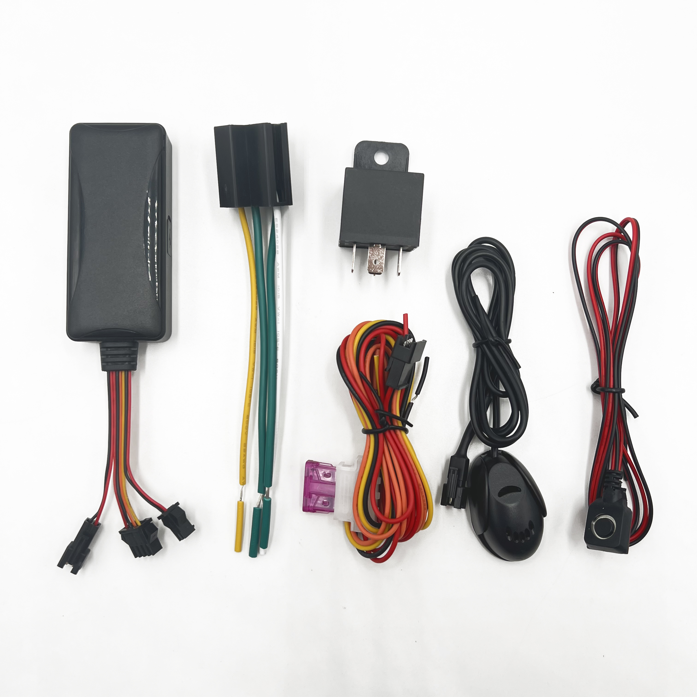

# CanTrack - G900LS

El G900LS es un rastreador GPS 4G profesional de instalación fija (hard‑wiring) de CanTrack, diseñado para propietarios de vehículos y operadores de flota que requieren posicionamiento preciso y control remoto confiable. Pensado para el monitoreo continuo del vehículo, el equipo ofrece seguimiento en tiempo real, telemetría detallada y alarmas configurables, de modo que los equipos operativos y los despachadores puedan conocer la ubicación, el estado de encendido y los eventos críticos. Sus variantes de cableado y su formato compacto facilitan una instalación discreta en una amplia variedad de vehículos.

Como dispositivo compatible con Plaspy desde el primer momento, el G900LS se integra en Plaspy para proporcionar mapas en vivo, alertas de eventos, informes históricos y la capacidad de enviar comandos remotos cuando está soportado. Esa compatibilidad permite a los responsables de flota consolidar la visibilidad de los vehículos y la supervisión operativa dentro de los paneles y el acceso móvil de Plaspy, habilitando notificaciones automáticas e informes accionables para las operaciones diarias.

## Aspectos destacados

- Listo para integrarse con Plaspy y facilitar la incorporación a flujos de trabajo y paneles existentes.
- Cobertura global 4G LTE con conmutación a GSM para mantener la conectividad en distintas regiones.
- Posicionamiento GNSS de alta precisión para un monitoreo confiable de rutas y activos.
- Múltiples alarmas y telemetría vehicular: detección de movimiento, encendido/apagado, alertas de velocidad y detección de corte de alimentación.
- Batería de respaldo integrada para soportar alertas por pérdida de alimentación y operación autónoma breve tras la desconexión de la alimentación principal.
- Control por relé opcional para inmovilización remota y respuesta ante robo cuando la plataforma y la instalación lo permiten.
- Versiones de cableado de 4 y 8 pines disponibles para adaptarse a los arneses de vehículo más comunes.

## Cómo funciona con Plaspy

Al emparejarse con Plaspy, el G900LS transmite datos de ubicación y eventos para que Plaspy muestre posiciones en vivo, active reglas y genere informes. Los intervalos de subida configurables y los reportes por eventos permiten a Plaspy equilibrar la frecuencia de actualización y el uso de datos, a la vez que suministran la visibilidad necesaria a los equipos operativos.

- Ubicación en vivo y telemetría que se reflejan en los mapas de Plaspy para seguimiento y despacho en tiempo real.
- Estado de encendido, movimiento y eventos de velocidad que alimentan las alertas y reglas de Plaspy para notificaciones automáticas.
- Alertas por corte de alimentación y eventos de batería de respaldo reportados a Plaspy para detectar manipulación o pérdida de energía.
- Comandos remotos de relé o inmovilizador disponibles a través de Plaspy cuando el dispositivo y la implementación lo soportan.
- Registros históricos de viajes y eventos accesibles en Plaspy para informes, análisis y cumplimiento normativo.

## Casos de uso típicos

- Gestión de flotas para supervisar rutas, monitorear conductores y mejorar la eficiencia operativa.
- Protección antirrobo mediante alertas de movimiento y corte de alimentación combinadas con inmovilización remota.
- Monitoreo logístico y de entregas para validar paradas y mejorar el cumplimiento de tiempos.
- Supervisión en alquiler y leasing para controlar encendido, uso y opciones de desactivación remota.
- Recuperación de vehículos y respuesta ante incidentes utilizando alertas de velocidad, cambios de ángulo y detección de movimiento.

## Por qué elegir este rastreador con Plaspy

El G900LS es una opción práctica para organizaciones que requieren monitoreo vehicular de nivel profesional junto con una plataforma de flota como Plaspy. Su combinación de posicionamiento GNSS preciso, amplia cobertura celular y alarmas configurables proporciona los datos fundamentales en los que confían la mayoría de los equipos de flota y seguridad. Plaspy aprovecha esa información para ofrecer mapas, alertas, informes programados y flujos de trabajo de comandos remotos que apoyan las operaciones diarias y la respuesta ante incidentes.

Debido a que el G900LS es compatible con Plaspy desde el primer momento, puede añadirse a una cuenta Plaspy existente con configuración mínima, permitiendo a los equipos escalar el monitoreo entre vehículos y beneficiarse de una visibilidad y reportes consolidados dentro de la plataforma.

Para obtener más información sobre cómo funciona Plaspy con rastreadores compatibles como el CanTrack G900LS, visite el sitio principal de Plaspy https://www.plaspy.com. Las especificaciones del producto, la disponibilidad y los detalles del fabricante pueden cambiar con el tiempo, por lo que le recomendamos verificar las especificaciones actuales y las guías de instalación en el sitio del fabricante https://www.cantrackgps.com/.
