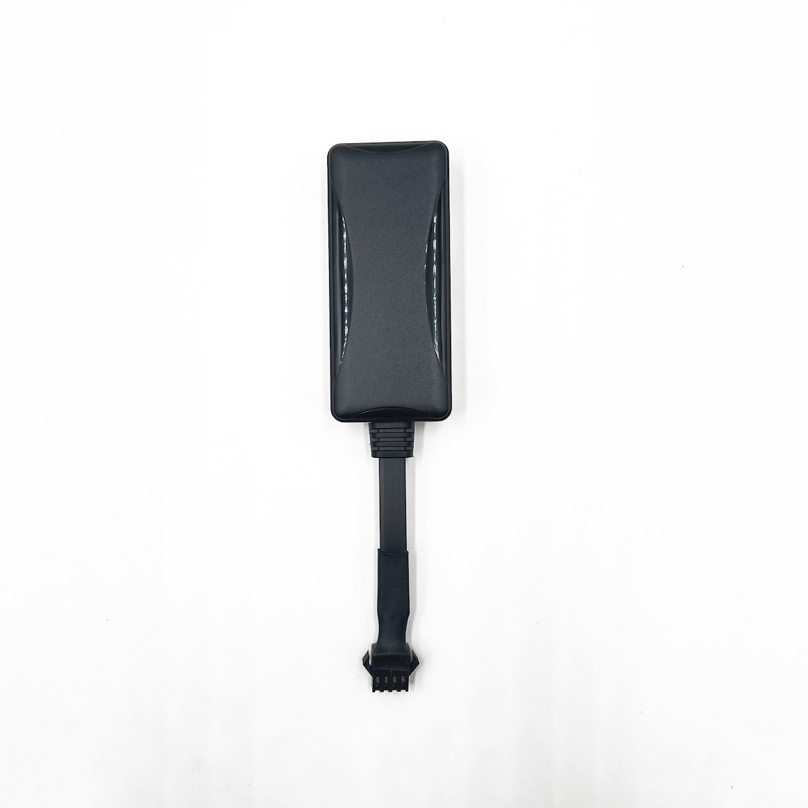

# CanTrack - G900LS-4G

El G900LS-4G es un rastreador GPS vehicular compacto de CanTrack pensado para monitoreo de ubicación en tiempo real y gestión de flotas confiable. Ofrece cobertura global 4G LTE con conmutación a GSM, reportes de posición continuos y telemetría estándar que incluye velocidad, estado de encendido e eventos de alarma. Está disponible en varias configuraciones de cableado y con un relé opcional para corte remoto, por lo que es apropiado tanto para flotas mixtas como para protección de vehículos individuales.

Como modelo compatible con Plaspy, el G900LS-4G se integra con las plataformas Plaspy mediante el protocolo GT06 series y reportes TCP IP estándar. Esta compatibilidad permite a los operadores de flotas incorporar datos de ubicación y telemetría en Plaspy para visualización en mapas, alertas e informes. La combinación de métodos de reporte probados y un factor de forma compacto hace del G900LS-4G una opción práctica para quienes desean gestionar activos a través de Plaspy.

## Características principales

- Compatibilidad con Plaspy mediante el protocolo GT06 series y reportes TCP IP para una integración sencilla.
- Comunicaciones 4G LTE a nivel global con fallback a GSM para seguimiento en tiempo real confiable en distintas regiones.
- Telemetría básica que incluye posición GPS, velocidad, detección de encendido y eventos de alarma.
- Alarma por corte de energía y batería de respaldo interna para mantener el rastreo durante interrupciones de suministro.
- Control por relé opcional para corte de combustible o electricidad que soporta acciones de inmovilización remota.
- Diseño compacto y resistente, apto para automóviles, motocicletas, bicicletas eléctricas y otros activos de flota mixta.
- Amplio rango de tensión de entrada para adaptarse a diversos sistemas eléctricos vehiculares.

## Cómo funciona con Plaspy

Al conectarse a Plaspy, el G900LS-4G envía paquetes regulares de posición y telemetría que Plaspy procesa para actualizar mapas, reglas y reportes. Plaspy utiliza esos datos entrantes para dar visibilidad del estado de los vehículos y automatizar alertas ante eventos predefinidos.

- Actualizaciones de ubicación y movimiento en tiempo real para mostrar la posición de los vehículos en los mapas de Plaspy.
- Reporte de estado de encendido y ACC para detección de viajes y registro de actividad del conductor.
- Alarma por corte de energía y reporte de batería de respaldo para detectar manipulación o pérdidas inesperadas de suministro.
- Reporte y control del estado del relé cuando está soportado, permitiendo acciones de inmovilización gestionadas desde Plaspy.
- Alarmas por movimiento, cambio de ángulo, exceso de velocidad y vibración integradas en los flujos de alerta de Plaspy para una respuesta rápida.

## Casos de uso típicos

- Gestión de flotas comerciales donde el seguimiento en tiempo real y los registros de viaje mejoran el enrutamiento y la utilización.
- Protección antirrobo mediante alarmas de movimiento y corte de energía junto con control opcional de inmovilizador remoto.
- Monitoreo del comportamiento del conductor a través de reportes de velocidad y eventos de encendido para apoyar programas de seguridad.
- Implementaciones en flotas mixtas que incluyen automóviles, motocicletas y vehículos eléctricos ligeros que se benefician de un rastreador compacto.
- Escenarios de comando y monitoreo remoto en los que los administradores necesitan recibir alertas y consultar el estado de los activos.

## Por qué elegir este rastreador con Plaspy

El G900LS-4G combina características de hardware prácticas con métodos de reporte estándar, lo que lo convierte en una opción adecuada para organizaciones que usan Plaspy. Su conjunto de funciones —seguimiento GPS en tiempo real, detección de encendido, reporte de alarmas y control por relé opcional— soporta flujos de trabajo comunes de flota y seguridad sin requerir desarrollo de protocolos personalizados. Para flotas que necesitan un rastreador discreto con amplia cobertura regional e integración directa con la plataforma, el G900LS-4G ofrece una alternativa equilibrada.

Para obtener más información sobre Plaspy y cómo este rastreador puede integrarse a la plataforma visite https://www.plaspy.com. Las especificaciones del producto y la disponibilidad pueden cambiar con el tiempo, por lo que verifique los detalles actuales y la documentación técnica en el sitio del fabricante https://www.cantrackgps.com/.
