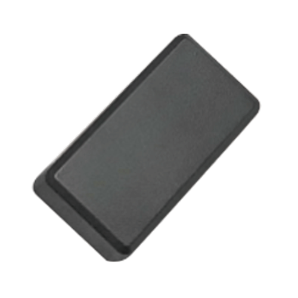

# CanTrack - GF10

El CanTrack GF10 Finger Tracker es un dispositivo de rastreo GPS compacto y versátil diseñado para el monitoreo de ubicación discreto. Con un tamaño aproximado al de un dedo, el GF10 ofrece actualizaciones de ubicación en tiempo real mediante una combinación de GPS, LBS y AGPS. Usted puede acceder a la información de posición vía SMS, a través de la plataforma o mediante una aplicación móvil. Entre sus funciones se incluyen alertas por geocerca, notificación de batería baja, alarma por vibración ante manipulación, modos de ahorro de energía y almacenamiento local de datos para periodos sin señal GSM.

Dado que el GF10 guarda los datos de ubicación cuando se pierde la conectividad y permite múltiples vías de reporte, es una opción práctica para integrarse con Plaspy como dispositivo rastreado. Plaspy puede ingerir y mostrar los datos del GF10 en sus capas de mapas e informes, enviar notificaciones basadas en eventos de geocercas y movimiento, e incluir el GF10 en grupos de dispositivos y flujos operativos de monitoreo tanto para flotas como para activos individuales.

## Características principales

- Diseño muy pequeño y discreto, ideal para colocación oculta y rastreo portátil
- Posicionamiento en tiempo real mediante múltiples métodos para mayor cobertura
- Datos accesibles por SMS, plataforma y aplicación móvil
- Alertas por geocerca y alarma por vibración ante movimiento o manipulación
- Alarma de batería baja y modos de ahorro y suspensión para extender el tiempo en espera
- Almacenamiento local que preserva registros de ubicación cuando no hay señal GSM
- Tiempo de espera típico de alrededor de 5 a 6 días en condiciones normales

## Cómo funciona con Plaspy

Plaspy puede presentar los datos del GF10 como un dispositivo rastreado habitual, de modo que usted vea ubicaciones en vivo e históricas, reciba alertas e incluya la unidad en informes y flujos de monitoreo. La integración se centra en visibilidad, notificaciones y supervisión operativa más que en la configuración de bajo nivel del dispositivo.

- Visualización de posición en vivo y rastro histórico en los mapas de Plaspy para revisar rutas
- Eventos de geocerca encaminados a las notificaciones de Plaspy para el control de límites
- Alertas por batería baja y por vibración o movimiento visibles para que usted actúe a tiempo
- Datos históricos y ubicaciones almacenadas visibles cuando el dispositivo se reconecta tras una pérdida de señal
- Agrupamiento y etiquetado de dispositivos en Plaspy para segmentación de flotas y categorización de activos

## Casos de uso típicos

- Rastreo discreto de objetos personales valiosos o equipos portátiles
- Monitoreo de ubicación de vehículos o activos pequeños donde se prefiera un rastreador compacto
- Necesidades de monitoreo a corto plazo o ad hoc que requieran colocación portátil
- Supervisión de personas o acompañantes cuando exista consentimiento y se cumplan las normativas locales
- Situaciones con conectividad intermitente que requieran almacenamiento local de datos de ubicación

## Por qué elegir este rastreador con Plaspy

El GF10 combina un tamaño muy reducido con un conjunto de funciones prácticas que lo hacen adecuado tanto para uso personal como para aplicaciones comerciales ligeras. Su posicionamiento multimodal y el almacenamiento en memoria aumentan la probabilidad de obtener datos de ubicación útiles en entornos con conectividad mixta, y las funciones de ahorro de energía ayudan a extender el tiempo operativo entre cargas o mantenimientos.

Al integrarlo con Plaspy, el GF10 forma parte de un entorno más amplio de monitoreo y reporte. Plaspy aporta visibilidad centralizada, gestión de eventos e informes históricos que convierten el flujo de ubicaciones del GF10 en información operativa accionable para equipos que gestionan activos, personal o flotas de vehículos pequeñas.

Para obtener más información sobre Plaspy y cómo puede funcionar con dispositivos como el CanTrack GF10, visite https://www.plaspy.com. Las especificaciones del producto, disponibilidad y detalles del fabricante pueden cambiar con el tiempo; verifique los detalles técnicos actuales en el sitio del fabricante https://www.cantrackgps.com/ antes de tomar decisiones de despliegue.
