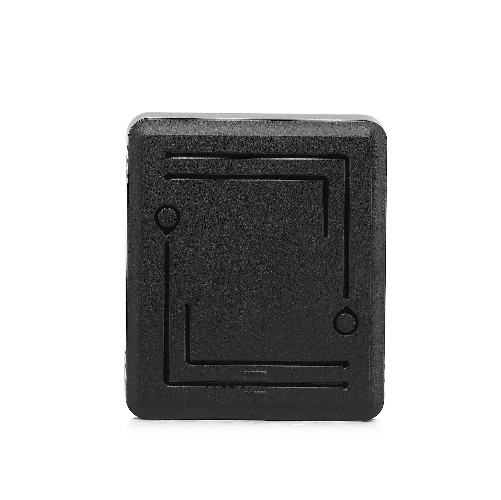

# CanTrack - GF200LS

El GF200LS es un rastreador GPS de larga autonomía y tipo desechable de CanTrack, diseñado para despliegues de baja intervención y larga duración. Pensado para vehículos de trabajo pesado, contenedores de carga y unidades prestadas o alquiladas, el GF200LS combina un diseño eficiente de bajo consumo con un potente imán para montaje, carcasa impermeable y sensor de luz para detección de manipulación. Configurado con tasas de reporte bajas, el dispositivo puede ofrecer hasta tres años en modo standby, lo que lo hace ideal para activos que se revisan con poca frecuencia.

Como dispositivo compatible con Plaspy, el GF200LS puede enviar posiciones y eventos a las plataformas web y móviles de Plaspy tanto en modo periódico como en tiempo real. Esta compatibilidad convierte al rastreador en una opción práctica para organizaciones que requieren reportes de ubicación confiables, alertas por manipulación y telemetría a largo plazo, minimizando al mismo tiempo el mantenimiento en sitio. Plaspy muestra los datos del GF200LS junto con la información de la flota para facilitar monitoreo, generación de informes y operaciones diarias.

## Características principales

- Autonomía ultra larga de hasta tres años en modos de reporte bajo para seguimiento de activos con mínima intervención
- Compatible con Plaspy para monitoreo en tiempo real e informes históricos en plataformas web y móviles
- Múltiples modos de funcionamiento para equilibrar frecuencia de reporte y duración de batería según las necesidades de despliegue
- Carcasa resistente IP65 en ABS con imán extraíble de gran sujeción para montaje externo en superficies metálicas
- Alerta por sensor de luz para detectar retiradas no autorizadas y apoyar los procesos de recuperación
- Rápido rendimiento GNSS con precisión típica por debajo de 5 m en condiciones normales
- Soporte celular multiplataforma para conectividad amplia y entrega de reportes de posición

## Cómo funciona con Plaspy

Al integrarse con Plaspy, los reportes de ubicación y los eventos del GF200LS son recibidos por la plataforma y presentados mediante paneles y vistas móviles para ofrecer visibilidad operativa. Plaspy procesa posiciones periódicas, actualizaciones en tiempo real y eventos de manipulación para que los administradores de flota y propietarios de activos puedan supervisar ubicaciones, recibir notificaciones y revisar el historial de actividad.

- Seguimiento en tiempo real para monitoreo activo a corto plazo cuando el dispositivo está configurado con reportes frecuentes
- Modos de telemetría periódica que preservan la batería a la vez que entregan actualizaciones programadas para despliegues de larga duración
- Alertas por manipulación o extracción enviadas a Plaspy para activar notificaciones y flujos de escalamiento
- Opciones de configuración remota soportadas por el dispositivo que Plaspy puede coordinar para garantizar reportes consistentes
- Consolidación de datos de posición y eventos del GF200LS con otras entradas compatibles con Plaspy para enriquecer informes y contexto operativo

## Casos de uso típicos

- Monitoreo de bajo mantenimiento de activos financiados para mantener visibilidad sobre garantías colaterales
- Seguimiento de contenedores y carga durante largos tránsitos o periodos de almacenamiento con actualizaciones periódicas de ubicación
- Asistencia en recuperación de activos robados mediante telemetría discreta y alertas de extracción
- Gestión de vehículos y equipos prestados o alquilados que se encuentran dispersos y se usan de forma intermitente
- Control de inventario a largo plazo para activos de flota estacionales o que se mueven raramente

## Por qué elegir este rastreador con Plaspy

El GF200LS es una opción acertada para organizaciones que priorizan la larga duración de batería y despliegues de baja intervención. Su diseño está enfocado en escenarios donde el mantenimiento frecuente no es factible, pero donde los reportes de ubicación y las alertas por manipulación siguen siendo críticos. En combinación con Plaspy, los datos del GF200LS resultan más útiles: usted puede alternar entre seguimiento en tiempo real y reportes por intervalos, recibir notificaciones inmediatas de manipulación y revisar rutas y estados históricos dentro de la plataforma Plaspy.

Para conocer más sobre Plaspy y cómo se visualizan los datos del GF200LS en los paneles y vistas móviles de Plaspy visite https://www.plaspy.com. Las especificaciones del producto y su disponibilidad pueden cambiar con el tiempo, por lo que le recomendamos verificar los detalles técnicos actuales y la documentación oficial en el sitio del fabricante https://www.cantrackgps.com/.
