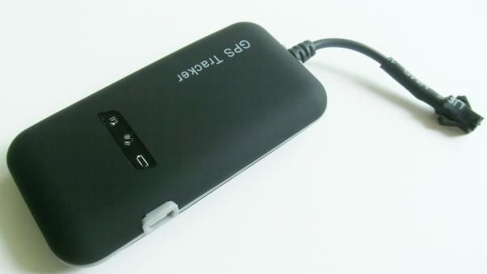

# CanTrack - GT02

El rastreador GPS CanTrack GT02 es un dispositivo compacto y fácil de usar diseñado para el seguimiento de vehículos. Utilizando la tecnología de satélites GSM / GPRS y GPS, este producto puede localizar y supervisar cualquier objetivo de forma remota a través de SMS o GPRS. Con un módulo GPS y GSM, captura datos GPS y los envía a un número de teléfono móvil autorizado a través de SMS, lo que le permite mostrar la ubicación actual en su teléfono o realizar un seguimiento en Google Earth o Google Maps. Además, los datos GPS también se pueden transmitir por GPRS a un servidor de Internet, lo que permite un seguimiento en tiempo real en su computadora.

El CanTrack GT02 es ideal para una variedad de aplicaciones, como el alquiler de vehículos, la gestión de flotas, la protección de activos y la tranquilidad para los hombres de negocios. También se puede utilizar para la gestión de personal. Con su capacidad de seguimiento en tiempo real, función de control de voz en tiempo real y alarmas de exceso de velocidad y fallo de alimentación, este rastreador GPS ofrece una solución completa para el seguimiento y la seguridad de sus activos.

Características destacadas:

- GSM de cuatro bandas de frecuencia para uso global
- Seguimiento en tiempo real de la ubicación por SMS / GPRS
- Función de control de voz en tiempo real
- Recuperación de contraseña original
- Configuración de números autorizados
- Reinicio del dispositivo
- Alarma de exceso de velocidad / alarma de fallo de alimentación
- Alarma ACC antirrobo
- Conexión de relé externo para control de aceite y circuito del vehículo \(versión de 4 hilos opcional\)
- Capacidad de batería de reserva para alarma de fallo de alimentación \(opcional\)

