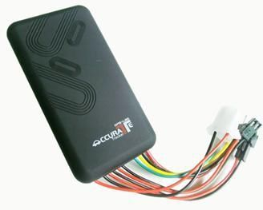

# CanTrack - GT06

El CanTrack GT06, también comercializado como TK100, es un rastreador GPS vehicular compacto diseñado para localizar y monitorear objetivos móviles mediante satélites GPS y la red GSM/GPRS. Registra datos de posición y puede proporcionar información inmediata de ubicación por SMS a números autorizados, mostrar posiciones en Google Maps o Google Earth y transmitir datos por GPRS a un servidor en Internet para visibilidad en tiempo real desde una computadora.

Como dispositivo compatible con Plaspy, el GT06 es adecuado para organizaciones que buscan centralizar datos de ubicación, alertas e informes básicos. Su combinación de reportes por SMS y transmisión a servidor lo hace práctico para equipos que requieren tanto un respaldo vía teléfono como seguimiento continuo en línea, mientras que Plaspy puede consolidar las señales de los dispositivos en un solo panel para la supervisión de flotas y activos.

## Puntos clave

- Diseño compacto orientado a vehículos para una instalación discreta y uso diario
- Módulos GPS y GSM integrados para capturar la ubicación y reportar vía SMS o GPRS
- Visibilidad de seguimiento en tiempo real en mapas cuando los datos se envían a un servidor en Internet
- Alarmas integradas como exceso de velocidad, SOS, ACC (antirrobo) y alerta por corte de energía
- Funciones opcionales disponibles como llamadas bidireccionales y corte remoto del vehículo o de un circuito
- Soporte GSM cuatribanda para amplia compatibilidad regional

## Cómo funciona con Plaspy

Cuando se configura para enviar sus datos GPRS a un endpoint de servidor compatible, el GT06 puede alimentar actualizaciones de ubicación en vivo a Plaspy para que vehículos y activos aparezcan en los mapas y vistas de flota. El reporte por SMS sigue disponible para avisos inmediatos a teléfonos autorizados, mientras que Plaspy ofrece monitoreo centralizado, historial y contexto operativo.

- Seguimiento en mapa en vivo en Plaspy para dispositivos que transmiten datos de ubicación al servidor
- Ingesta de alarmas y eventos para que excesos de velocidad, SOS y pérdidas de alimentación sean visibles y gestionables en Plaspy
- Reproducción de rutas históricas e informes básicos para revisar movimientos a lo largo del tiempo
- Paneles de flota e indicadores de estado para la supervisión agrupada de múltiples unidades GT06
- Usar SMS como canal de notificación de respaldo mientras Plaspy actúa como la plataforma centralizada de seguimiento principal

## Casos de uso típicos

- Gestión de flotas y monitoreo de vehículos de renta para flotas pequeñas y medianas
- Protección de activos móviles de alto valor con alertas y soporte para recuperación de ubicación
- Tranquilidad para directivos o propietarios mediante SOS y reportes de ubicación
- Seguimiento de personal o personal de campo para mejorar supervisión operativa y coordinación
- Seguimiento de entregas, servicios y arrendamientos de vehículos a corto plazo para monitorear asignaciones y rutas

## Por qué elegir este rastreador con Plaspy

El GT06 es una opción práctica para organizaciones que necesitan un rastreador vehicular sencillo con una combinación de respaldo por SMS e informes basados en servidor. Su conjunto de alarmas y funciones opcionales ofrece flexibilidad para controles básicos de seguridad y operativos, y su factor de forma compacto se adapta a muchas instalaciones en vehículos. Para equipos que usan Plaspy, el GT06 proporciona un flujo confiable de datos de posición y eventos que Plaspy puede unificar en mapas, alertas e informes.

Si usted busca un rastreador sencillo y ampliamente utilizado para integrar en una plataforma centralizada de flotas, el GT06 es una opción sensata a considerar. Conozca más sobre Plaspy y cómo puede centralizar el seguimiento, las alertas y los informes para dispositivos como el CanTrack GT06 en https://www.plaspy.com. Las especificaciones del producto y la disponibilidad pueden variar con el tiempo, por lo que le recomendamos verificar los detalles actuales en el sitio del fabricante https://www.cantrackgps.com/ antes de comprar.
