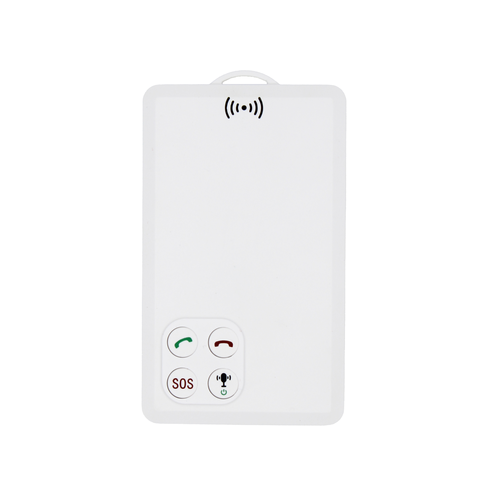

# CanTrack - P901

El CanTrack P901 es un rastreador GPS ultradelgado con formato de tarjeta de identificación diseñado para uso como wearable. Combina posicionamiento GNSS con conectividad celular e incorpora funciones de voz y alarma en un formato compacto pensado para personal de seguridad, staff de eventos y trabajadores en solitario. El P901 ofrece informes de ubicación, alertas SOS con un solo botón y comunicaciones por voz grupales tipo push-to-talk en un equipo delgado que puede llevarse o sujetarse durante patrullajes y operaciones móviles.

Como dispositivo compatible con Plaspy, el P901 integra datos de ubicación y estado en la plataforma para visibilidad en vivo, reproducción histórica de rutas y gestión de incidentes. Su combinación de reporte de posición, botón SOS y voz en el equipo permite a los usuarios de Plaspy correlacionar comunicaciones con la ubicación de activos, supervisar equipos en tiempo real y administrar dispositivos de forma remota mediante los flujos de trabajo estándar de la plataforma.

## Aspectos destacados

- Formato tipo credencial ultradelgado para uso portátil y transporte discreto
- Reporte de ubicación en tiempo real usando GPS y Beidou con respaldo celular para amplia cobertura
- Llamadas bidireccionales integradas y push to talk en grupos para comunicación de voz inmediata
- Alarma SOS con un solo botón y comportamiento de alerta configurable para escalar incidentes rápidamente
- Capacidad de registro en el dispositivo para captura de rutas sin conexión y posterior subida a Plaspy
- Soporte para actualización remota de firmware y configuración remota para simplificar el mantenimiento
- Batería recargable de larga duración e intervalos de envío configurables para equilibrar autonomía y frecuencia de reporte

## Cómo funciona con Plaspy

El P901 transmite datos de ubicación y eventos a Plaspy, lo que permite que la plataforma muestre las unidades en mapas, registre movimientos históricos y genere alertas cuando se activan alarmas o hay cambios de estado. El tráfico de voz y el PTT se gestionan en el dispositivo mientras Plaspy usa la posición y los metadatos de evento para colocar las comunicaciones en su contexto operativo.

- Ubicación y telemetría en tiempo real visibles en los paneles y vistas de mapa de Plaspy
- Alarmas SOS enviadas a Plaspy para notificación inmediata y activación de flujos de trabajo de incidentes
- Eventos de voz con etiqueta de posición y contexto de PTT grupal disponibles en los registros de actividad
- Reproducción de rutas históricas e informes basados en los registros almacenados en el dispositivo y subidos a Plaspy
- Gestión y configuración remota de dispositivos iniciada desde los flujos compatibles con Plaspy o mediante comandos soportados

## Casos de uso típicos

- Equipos de seguridad y patrullaje que requieren ubicación emparejada con comunicaciones de voz grupales
- Personal de eventos donde los rastreadores wearables facilitan contacto rápido y alertas de incidentes
- Protección de trabajadores en solitario con botón SOS, comunicación bidireccional y monitoreo remoto
- Supervisores móviles y equipos de campo que necesitan ubicación en vivo y historial de rutas para supervisión
- Seguimiento de personal o activos cuando se prefiere un dispositivo wearable de formato delgado

## Por qué elegir este rastreador con Plaspy

El P901 combina un diseño wearable compacto con funciones integradas de voz y SOS que se alinean con los casos de uso de Plaspy para coordinación de equipos y conciencia situacional. Para organizaciones que necesitan ubicación en tiempo real junto con contacto de voz inmediato y escalamiento de incidentes, el dispositivo ofrece una solución enfocada que alimenta a Plaspy con la telemetría y los datos de evento necesarios para supervisión y respuesta.

Para saber más sobre Plaspy y cómo dispositivos compatibles como el CanTrack P901 pueden integrarse en sus flujos de trabajo de rastreo y comunicaciones visite https://www.plaspy.com. Las especificaciones de producto, la disponibilidad y los detalles del fabricante pueden cambiar con el tiempo, por lo que es recomendable verificar la información técnica actual en el sitio oficial de CanTrack https://www.cantrackgps.com/ antes de la compra o el despliegue.
