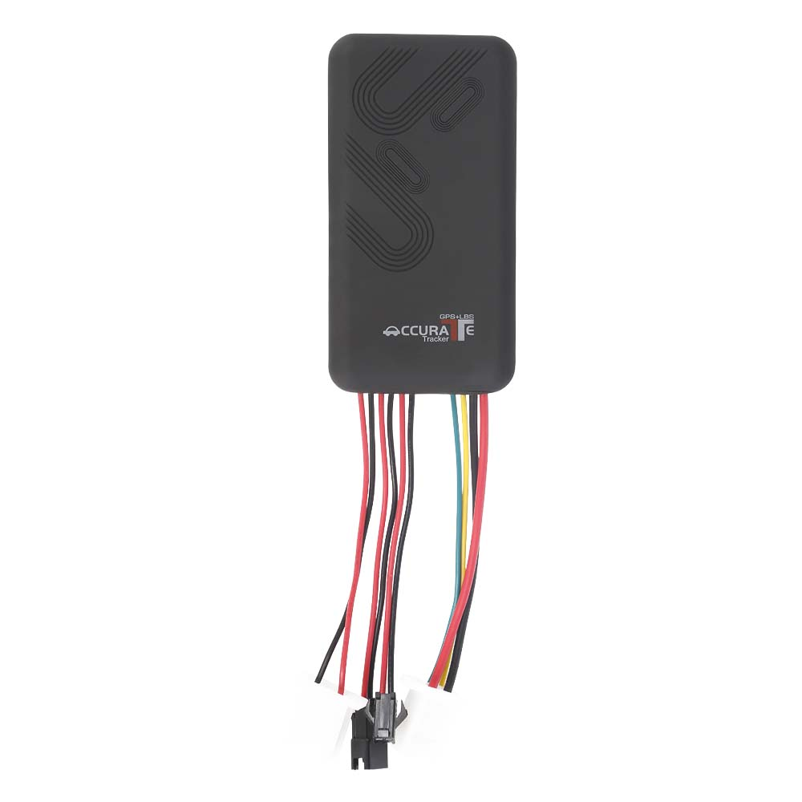

# CanTrack - TK100

El CanTrack TK100 es un rastreador GPS vehicular cableado diseñado para ofrecer posicionamiento continuo y control remoto. Frecuentemente instalado en autos, camiones y motocicletas, utiliza señales satelitales GPS y comunicaciones por GPRS y SMS para transmitir en tiempo real la ubicación, velocidad, estado del encendido y eventos de alarma a servidores y dispositivos móviles. El TK100 también incorpora funciones antirrobo como inmovilizador remoto y un botón SOS para reportes de emergencia.

Como dispositivo compatible con Plaspy desde el primer momento, el TK100 puede enviar telemetría consistente a los paneles y flujos de trabajo de Plaspy. Su combinación de subida por GPRS, reportes por SMS y soporte de comandos remotos lo convierte en una opción práctica para operadores que requieren visibilidad centralizada de la flota, alertas y análisis histórico sin integraciones complejas.

## Características principales

- Rastreador GPS compatible con Plaspy para seguimiento en tiempo real y gestión centralizada de flotas
- Diseño cableado con amplio rango de voltaje de entrada, apto para autos, camiones y motocicletas
- Inmovilizador remoto y control de circuitos vía SMS para respuestas antirrobo
- Reportes por GPRS y SMS a servidores y dispositivos móviles para telemetría y registro continuo
- Detección de encendido más alertas de exceso de velocidad y geocercas para supervisión operativa
- Alerta por corte de energía y batería de respaldo de 200 mAh para detectar manipulación y cortes breves
- Botón SOS de emergencia y capacidad de voz bidireccional para seguridad del conductor y gestión de incidentes

## Cómo funciona con Plaspy

Cuando se integra con Plaspy, el TK100 suministra datos de posición y eventos para que los operadores de flota puedan ver ubicaciones en vivo, recibir alertas y analizar viajes históricos en una sola plataforma. Plaspy ingiere la telemetría del rastreador y la pone a disposición para mapas, notificaciones e informes que respaldan las operaciones diarias y los flujos de seguridad.

- Actualizaciones de ubicación y telemetría en tiempo real entregadas a Plaspy vía GPRS o reportes SMS
- Estado de encendido y reporte de velocidad para segmentación de viajes y monitoreo de conductores
- Alertas de geocerca y exceso de velocidad dirigidas a Plaspy para notificación y acción inmediata
- Comandos de inmovilizador remoto y control por SMS disponibles para intervención antirrobo
- Alarmas SOS y eventos de voz bidireccional visibles en Plaspy para escalamiento de seguridad
- Detección de corte de energía y alertas de batería de respaldo para señalar posibles manipulaciones

## Casos de uso típicos

- Gestión de flotas para despacho en vivo, reproducción de rutas e informes operativos
- Protección antirrobo con inmovilización remota, alarmas SOS y alertas por manipulación
- Centros de servicio vehicular y aseguradoras para registro de kilometraje e incidentes
- Seguridad en motocicletas y bicicletas eléctricas donde se necesita instalación cableada compacta y ubicación discreta
- Operaciones de entrega y camiones ligeros que requieren cumplimiento de geocercas y alertas por exceso de velocidad

## Por qué elegir este rastreador con Plaspy

El TK100 es una opción práctica para organizaciones que necesitan ubicación vehicular confiable, telemetría básica y controles directos antirrobo. Su factor de forma cableado y soporte tanto para GPRS como para SMS lo hacen adaptable a diversos tipos de vehículos y condiciones de red, mientras que sus reportes de eventos alimentan Plaspy para monitoreo centralizado y análisis histórico.

Si desea obtener más información sobre Plaspy y cómo la plataforma funciona con dispositivos compatibles como el CanTrack TK100 visite https://www.plaspy.com. Las especificaciones del producto y la disponibilidad pueden cambiar con el tiempo, por lo que verifique los detalles técnicos y las recomendaciones del fabricante en https://www.cantrackgps.com/.
