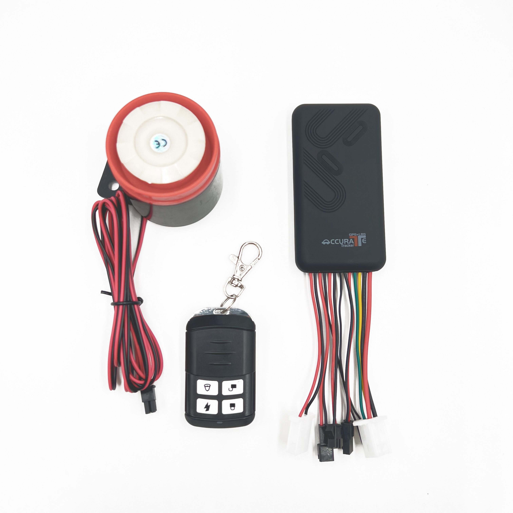

# CanTrack - TK100B

El CanTrack TK100B Accurate Pro es un rastreador GPS vehicular cableado diseñado para el monitoreo continuo y en tiempo real de la ubicación y la seguridad del vehículo. Como evolución profesional de la familia GT06/TK100, el TK100B ofrece telemetría y funciones de gestión remota del vehículo mediante GSM/GPRS con TCP/IP. Incluye controles antirrobo como corte y restauración del motor con una sola tecla, botón SOS, geocercas, soporte de voz bidireccional e interfaces para accesorios como sirena y control remoto.

Este modelo figura como compatible con Plaspy, lo que facilita integrar los datos de ubicación y eventos del TK100B en un entorno centralizado de gestión de flotas. Al emparejarlo con Plaspy, las actualizaciones en tiempo real, las alertas y las capacidades de control remoto del TK100B se muestran en paneles, notificaciones y flujos de trabajo operativos que ayudan a flotas, taxis y propietarios particulares a supervisar activos y responder con rapidez ante incidentes.

## Aspectos destacados

- Rastreador GPS cableado compatible con Plaspy para seguimiento continuo en tiempo real vía GSM/GPRS con TCP/IP
- Funciones antirrobo, incluyendo corte del motor con una sola tecla y restauración remota por control de relé
- Capacidad de voz bidireccional con micrófono externo para escucha remota y comunicación con el conductor
- Soporte para accesorios como control remoto inalámbrico y sirena externa para ampliar opciones de alerta y seguridad
- Chipset profesional MTK2503AV y soporte quad-band GSM para cobertura celular amplia y telemetría estable
- Factor de forma compacto pensado para instalación discreta en el vehículo y uso operativo robusto
- Rendimiento GNSS orientado a obtener fijaciones de ubicación confiables y tiempos predictibles de primer fijado para seguimiento de flotas

## Cómo funciona con Plaspy

El TK100B transmite ubicación y telemetría del vehículo a Plaspy mediante GSM/GPRS usando TCP/IP. Plaspy procesa esos datos para ofrecer seguimiento en vivo, reproducción histórica, alertas configurables y flujos de trabajo con comandos remotos. Los administradores de flota y los propietarios usan Plaspy para supervisar movimientos, recibir alarmas y ejecutar acciones remotas soportadas según los eventos del dispositivo.

- Las actualizaciones de ubicación y telemetría en tiempo real se muestran en los paneles de Plaspy para visibilidad operativa inmediata
- El reporte del estado de ignición y accesorios, junto con el control de relés, permite flujos de trabajo de inmovilizador remoto a través de Plaspy
- Las pulsaciones del botón SOS y las violaciones de geocerca se enrutan a Plaspy como notificaciones inmediatas para la gestión de incidentes
- La voz bidireccional y el soporte de micrófono externo pueden integrarse en flujos de monitoreo y comunicación
- El estado de accesorios, acciones del control remoto y disparos de sirena se reportan a Plaspy y pueden registrarse para auditoría

## Casos de uso típicos

- Gestión de flotas y despacho para visibilidad de rutas, control de uso y reproducción histórica
- Prevención y recuperación ante robo con inmovilizador remoto, alertas de sirena y notificación rápida de incidentes
- Supervisión de taxis y servicios de rideshare usando voz bidireccional, localización de vehículos y monitoreo para la seguridad del conductor
- Operaciones de logística y reparto que requieren alertas por geocerca, reportes SOS y telemetría de ubicación oportuna
- Seguridad de vehículos particulares con instalación cableada discreta y alertas de emergencia

## Por qué elegir este rastreador con Plaspy

El TK100B es una opción práctica cuando la seguridad del vehículo y el rastreo en tiempo real confiable son prioritarios. Sus controles antirrobo, soporte de accesorios y flujo de telemetría constante lo hacen adecuado para proporcionar los tipos de eventos y acciones de control que Plaspy muestra en paneles y sistemas de alerta. Para organizaciones que necesitan una solución integrada, combinar los datos del dispositivo TK100B con los informes y flujos de trabajo de Plaspy aporta supervisión operativa y un rastro de auditoría claro para incidentes.

Para obtener más información sobre Plaspy y cómo puede gestionar dispositivos como el CanTrack TK100B, visite el Plaspy main website https://www.plaspy.com. Product specifications, availability and manufacturer details can change over time, so please verify current specifications on the manufacturer's official site https://www.cantrackgps.com/.
