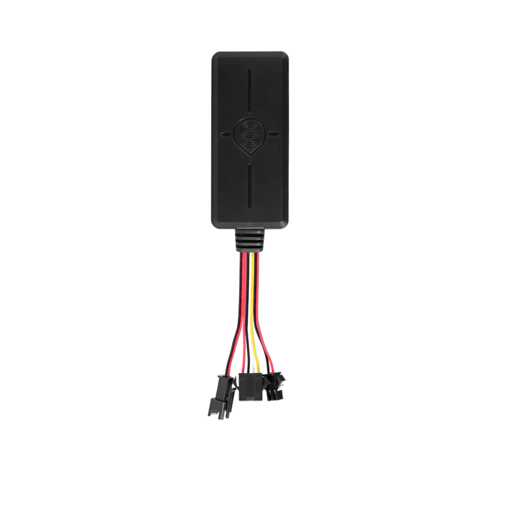

# CanTrack - TK100N

El TK100N, desarrollado por un fabricante OEM probado, es un rastreador GPS para vehículos de 2G, con conexión cableada y multifuncional, diseñado para despliegues profesionales. Compatible con Plaspy desde el primer momento, admite el protocolo GT06N y ofrece seguimiento en tiempo real fiable, detección de ACC, botón SOS de pánico y control remoto de relé — convirtiéndolo en una opción práctica para la gestión de flotas, la protección antirrobo y operaciones basadas en telemetría.

Diseñado para coches, motocicletas y bicicletas eléctricas, el TK100N se instala directamente en el arnés del vehículo y funciona dentro de un amplio rango de voltaje \(9–90V DC\). Con GNSS MTK de alta sensibilidad \(-159 dBm\) y una precisión típica de posición de alrededor de 10 metros, se integra con Plaspy para entregar ubicación en vivo, alertas de estado y capacidades de control remoto que operadores de flotas y equipos de seguridad esperan.

## Destacados clave

- Compatible con Plaspy vía protocolo GT06N para una rápida integración en la plataforma y una ingesta telemétrica estandarizada.
- Seguimiento en tiempo real vía GPRS/TCP-IP con respaldo por SMS para informes de ubicación resilientes.
- Herramientas anti-robos robustas: detección de ACC, botón de pánico SOS, alarmas de vibración y de apagado, además de control remoto del inmovilizador por relé.
- Chipset MTK GNSS de alta sensibilidad \(-159 dBm\) con una precisión típica de GPS de alrededor de 10 metros para un posicionamiento fiable.
- Amplio rango de voltaje de funcionamiento \(9–90V DC\) y baja corriente de consumo \(5–50 mA\) apto para distintos sistemas eléctricos de vehículos.
- Formato compacto y ligero \(~79 × 34 × 18 mm; ~50 g\) para instalación discreta en coches, motos y bicicletas eléctricas.
- Conjunto de comandos SMS completo para configuración remota, verificación de estado y operaciones de emergencia cuando la conectividad de datos es limitada.

## Cómo funciona con Plaspy

Conectado a Plaspy, el TK100N transmite datos de ubicación y eventos vía GPRS usando el formato de mensaje compatible con GT06N. Plaspy analiza los paquetes TCP/IP entrantes o acepta respaldos por SMS/GPRS para mostrar la posición en vivo, telemetría del vehículo y estados de alarma en el panel. Los comandos emitidos desde Plaspy \(o a través de un servidor configurado\) pueden activar acciones de relé y solicitar actualizaciones de estado, habilitando un control central de la flota y flujos de trabajo de antirrobo.

- Actualizaciones de ubicación y telemetría en tiempo real vía GPRS/TCP-IP al servidor de Plaspy usando el protocolo GT06N.
- Detección de ACC \(estado de ignition\) reportada a Plaspy para segmentación de viajes, informes de ralentí e información sobre el comportamiento del conductor.
- Alarmas SOS de pánico, vibración y apagado enviadas a Plaspy para alertas inmediatas y seguimiento de incidentes.
- Inmovilizador remoto \(control de relé\) — Plaspy puede emitir comandos para cortar o reanudar suministro de combustible y energía cuando lo permita la ley local y la instalación.
- Respaldo de comandos vía SMS y monitoreo de voz disponibles cuando los datos están limitados, ofreciendo rutas redundantes de control y verificación.

## Visión técnica

| Conectividad | 2G \(GSM/GPRS\) para control GPRS/TCP-IP y SMS; reporte TCP/IP a los servidores de Plaspy. |
| --- | --- |
| Bandas | Las bandas celulares varían según la variante de fabricación; consulte la hoja de datos del dispositivo o el proveedor para soporte regional de bandas. |
| Alimentación y Batería | Voltaje de operación 9–90V DC; bajo consumo 5–50 mA \(no se especifica una batería interna de respaldo a largo plazo en la descripción suministrada\). |
| Interfaces | Detección de encendido ACC, entrada de pánico SOS, control de relé para inmovilizador \(corte remoto\), reporte de alarmas de vibración y apagado, capacidad de escucha de voz. |
| GNSS | Chipset MTK de alta sensibilidad, sensibilidad de hasta -159 dBm, precisión típica alrededor de 10 metros. |
| Bluetooth | No especificado para sensores Bluetooth; no se observa BLE integrado en la descripción. |
| Gestión remota | Compatibilidad con protocolo GT06N; configuración y control vía comandos SMS y TCP/IP \(configurar IP de servidor/APN, intervalos de reporte, control de relé, configuración de alarmas, restablecimiento de fábrica\). |
| Ambiental | Operación: -20 °C a +55 °C; Almacenamiento: -40 °C a +85 °C; Tolerancia de humedad 15%–95% RH. |
| Formato | Módulo compacto cableado ~79 × 34 × 18 mm, peso ~50 g — destinado para instalación discreta en vehículos. |

## Casos de uso

- Gestión de flotas — ubicación en vivo, inicio/detención de viaje vía detección de ACC y reportes programados para visibilidad operativa.
- Recuperación antirrobo — alarmas SOS, alertas de vibración y de apagado, e inmovilización remota por relé para facilitar la recuperación.
- Monitoreo del comportamiento del conductor — eventos de encendido/ACC e historial de movimientos para apoyar la seguridad y el cumplimiento.
- Protección de activos para motocicletas y bicicletas eléctricas — formato compacto y bajo consumo permiten protección continua en vehículos de dos ruedas.
- Telemetría y control de inventario — combine datos de posición del TK100N con la analítica de Plaspy para optimización de rutas y prevención de pérdidas.

## Por qué elegir este rastreador con Plaspy

El TK100N es un rastreador práctico y compatible con Plaspy para organizaciones que necesitan seguimiento en tiempo real fiable, integración de plataforma sencilla y controles anti-robo robustos. Su compatibilidad con el protocolo GT06N facilita la incorporación a Plaspy, mientras que GPRS/TCP-IP con respaldo por SMS garantiza una entrega telemétrica resiliente. Para operadores de flotas, la combinación de detección de ACC, intervalos de reporte configurables y control remoto de relé ofrece telemetría accionable y capacidades de intervención directa. El formato compacto del dispositivo, su amplia tolerancia de voltaje y su robusta gama de temperaturas operativas lo hacen apto para diversos tipos de vehículos y climas, proporcionando un componente confiable para la gestión de flotas escalable, flujos de trabajo basados en telemetría y estrategias anti-robo.

