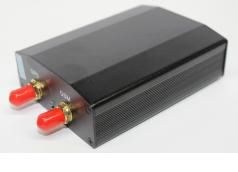

# CanTrack - TK103: rastreador GPS compacto

El CanTrack TK103 es un rastreador GPS compacto que combina posicionamiento por satélite con conectividad GSM GPRS para ofrecer reportes de ubicación, monitoreo remoto y funciones básicas antirrobo. Soporta rastreo en tiempo real, comunicación por SMS y GPRS, monitoreo por audio, alertas de geocerca, avisos por exceso de velocidad y vibración, además de control remoto de encendido y apagado, lo que lo convierte en una opción versátil para el seguimiento de vehículos y activos.

Al ser compatible con Plaspy, el TK103 puede enviar datos de ubicación y alertas a la plataforma para un monitoreo y reportes centralizados. Las organizaciones que usan Plaspy pueden agregar dispositivos TK103 a sus flotas o listados de activos para centralizar la visibilidad, recibir notificaciones de movimiento y geocercas, y conservar el historial de seguimiento dentro de la plataforma.

## Características principales

- Combina posicionamiento GPS con comunicación GSM GPRS para reportes remotos de ubicación.
- Soporta modos SMS y GPRS para entrega flexible de datos y envío de comandos.
- Funciones antirrobo integradas como alarma de geocerca, avisos por exceso de velocidad y detección de vibración.
- Capacidad de encendido y apagado remoto para gestionar el funcionamiento del dispositivo a distancia.
- Llamada de retorno activada por sonido y alarma por movimiento para mayor conciencia situacional.
- Almacenamiento local de datos y opciones de seguimiento individual para registro y revisión.

## Cómo funciona con Plaspy

El TK103 transmite actualizaciones de ubicación y alertas de eventos usando GSM GPRS o SMS, que Plaspy puede recibir y procesar para monitoreo en vivo y generación de historiales. Una vez configurado para reportar a Plaspy, el dispositivo pasa a formar parte de la vista consolidada de la flota para administradores y despachadores.

- Visualización de ubicación en vivo en los mapas de Plaspy para visibilidad en tiempo real de los objetivos rastreados.
- Ingesta de eventos y alarmas como violaciones de geocerca, exceso de velocidad o alertas por vibración.
- Historial de seguimiento almacenado en Plaspy disponible para reproducción y análisis de rutas.
- Notificaciones centralizadas y reglas de alerta gestionadas desde Plaspy para supervisión operativa.
- Paneles de control y reportes a nivel de flota que resumen la actividad y los eventos de los dispositivos.

## Casos de uso típicos

- Rastreo de vehículos para pequeñas flotas y autos particulares.
- Protección de activos y monitoreo antirrobo de equipos móviles.
- Monitoreo remoto donde exista cobertura SMS o GPRS.
- Revisión de rutas e historial de movimientos para auditorías operativas.
- Escenarios que requieren control remoto sencillo y verificación de estado de los objetivos rastreados.

## Por qué elegir este rastreador con Plaspy

El TK103 es una opción práctica para organizaciones que necesitan un dispositivo de seguimiento sencillo combinado con una plataforma de gestión de flotas capaz. Su conjunto de alarmas y funciones de control remoto responde a requisitos comunes de monitoreo de flotas y activos, mientras que Plaspy aporta la visibilidad centralizada, la gestión de alertas y los reportes necesarios para convertir las señales del dispositivo en información operativa.

Para equipos que evalúan rastreadores para usar con Plaspy, el TK103 ofrece un equilibrio entre funcionalidad de seguimiento y controles adecuados para despliegues de monitoreo básicos o de complejidad moderada. Si usted requiere telemática más avanzada o datos adicionales de sensores, revise las especificaciones del dispositivo y cómo se alinean con sus necesidades de reporte antes de decidir.

Para más información sobre cómo Plaspy soporta dispositivos como el CanTrack TK103 visite https://www.plaspy.com. Las especificaciones y la disponibilidad del producto pueden cambiar con el tiempo, por lo que le recomendamos verificar los detalles actuales en el sitio del fabricante https://www.cantrackgps.com/ antes de realizar la compra.
