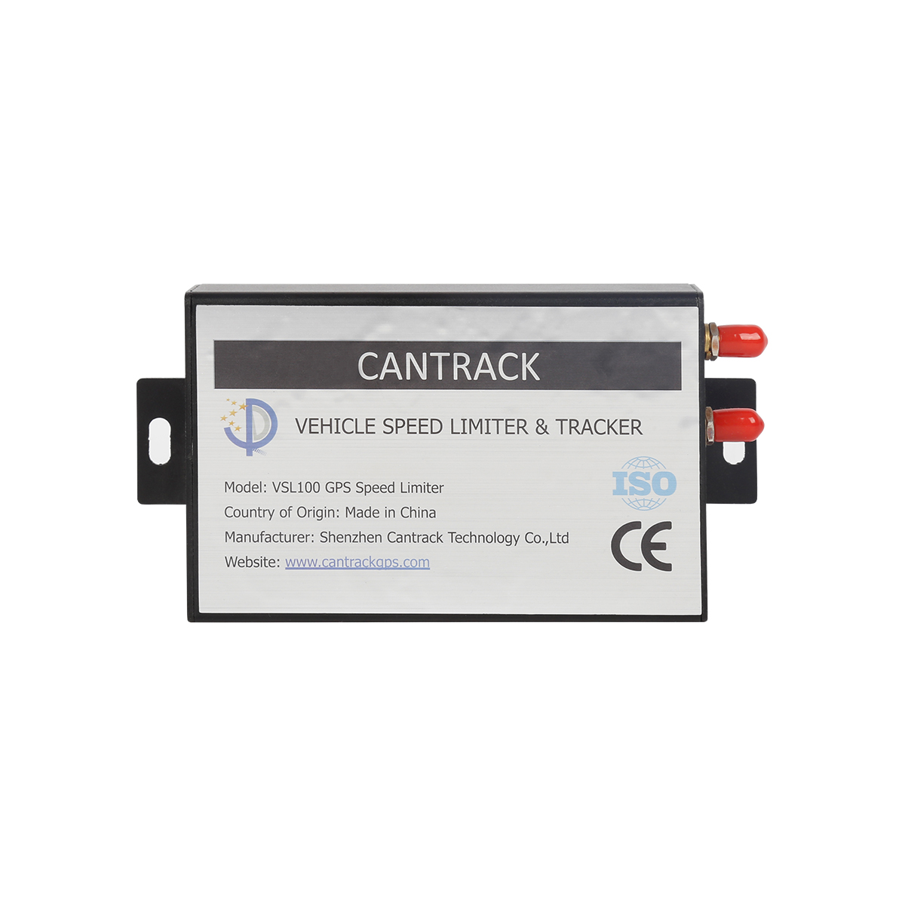

# CanTrack — VSL100

El VSL100 de CanTrack es un limitador de velocidad y rastreador GPS de nueva generación diseñado para vehículos pesados y la gestión de flotas. Integra gobernanza informática de velocidad con rastreo de ubicación en tiempo real de alta precisión, permitiendo a los operadores hacer cumplir límites máximos preestablecidos, registrar infracciones en el momento y recolectar telemetría para supervisión centralizada. El dispositivo está concebido para flotas de logística, maquinaria de obra, transportistas de mercancías peligrosas y transporte de pasajeros, donde el control de la velocidad, la resistencia a manipulaciones y la evidencia auditable de infracciones son críticos.

Como dispositivo compatible con Plaspy desde el primer momento, el VSL100 puede enviar sus actualizaciones de posición, eventos del limitador y señales de alarma a Plaspy para un monitoreo y generación de informes unificados. Los usuarios de Plaspy pueden incorporar la telemetría del VSL100 en paneles, alertas e informes históricos para mejorar la visibilidad operativa, gestionar procesos de cumplimiento y responder con rapidez a incidentes en una flota mixta.

## Aspectos destacados

- Combina limitación de velocidad aplicable con rastreo GPS en tiempo real para control de seguridad y visibilidad de ubicación simultáneos.
- Diseñado para uso en vehículos pesados y flotas, con carcasa resistente a manipulaciones y detección de inhibidores de señal para proteger la integridad operativa.
- Evidencia inmediata mediante una mini impresora portátil que genera reportes de infracciones recientes para inspecciones en carretera.
- Alto rendimiento GNSS para actualizaciones de posición fiables, apto para monitoreo continuo de flotas en Plaspy.
- Múltiples opciones de configuración y recuperación de datos que admiten tanto gestión remota como auditoría fuera de línea.
- Conserva operación a corto plazo durante interrupciones de energía gracias a respaldo integrado y amplio rango de tensión de entrada.

## Cómo funciona con Plaspy

Al integrarse con Plaspy, el VSL100 transmite ubicación, estado y eventos de infracción a la plataforma para que los operadores cuenten con conciencia situacional en vivo y un historial auditable de eventos. Plaspy procesa eventos del limitador, alarmas por manipulación y disparos de geocerca para activar alertas basadas en reglas, flujos de trabajo operativos e informes de cumplimiento en toda la flota.

- Las actualizaciones de ubicación y estado en tiempo real del VSL100 aparecen en los paneles de Plaspy para seguimiento continuo.
- Los eventos de exceso de velocidad y del limitador se reenvían a Plaspy para que los responsables registren infracciones y activen acciones de seguimiento.
- Las alarmas por manipulación, inhibición y pérdida de señal se envían a los administradores para una investigación y respuesta rápidas.
- Los registros históricos recientes pueden recuperarse y correlacionarse en Plaspy para análisis fuera de línea y evidencia de cumplimiento.
- Los registros impresos en sitio complementan los registros de eventos almacenados en Plaspy durante inspecciones y auditorías.

## Casos de uso típicos

- Aplicar políticas corporativas de velocidad en camiones pesados y flotas de reparto, manteniendo un registro auditable de infracciones.
- Supervisar maquinaria de construcción para reducir incidentes de exceso de velocidad y notificar a despachos en tiempo real.
- Respaldar el transporte seguro de mercancías peligrosas con gobernanza de velocidad, alertas por manipulación y monitoreo por geocerca.
- Proveer prueba documentada de infracciones para operadores de transporte de pasajeros y autocares durante controles en carretera.
- Integrar el control de velocidad GPS en flujos de trabajo de logística y despacho para mejorar el cumplimiento de rutas y la seguridad.

## Por qué elegir este rastreador con Plaspy

El VSL100 es apropiado para organizaciones que requieren algo más que el seguimiento básico de posición. Al combinar control de velocidad aplicable con telemetría de ubicación de alta fidelidad y protección contra manipulaciones, suministra datos accionables que Plaspy puede utilizar para informes de cumplimiento, respuesta a incidentes y supervisión operativa. La combinación de impresión en sitio y alarmas automatizadas ayuda a las flotas a cumplir requisitos regulatorios mientras mantienen registros centralizados en Plaspy.

Si sus operaciones necesitan gobernanza de velocidad visible y auditable junto con rastreo continuo, el VSL100 ofrece una solución enfocada que se integra en los flujos de trabajo de Plaspy. Para más detalles sobre las funciones de Plaspy y cómo se pueden utilizar los datos del VSL100 en su gestión de flotas, conozca más sobre Plaspy en el sitio principal https://www.plaspy.com. Las especificaciones, características y disponibilidad del producto pueden cambiar con el tiempo, por lo que le recomendamos verificar los detalles actuales del dispositivo con el fabricante en https://www.cantrackgps.com/.
