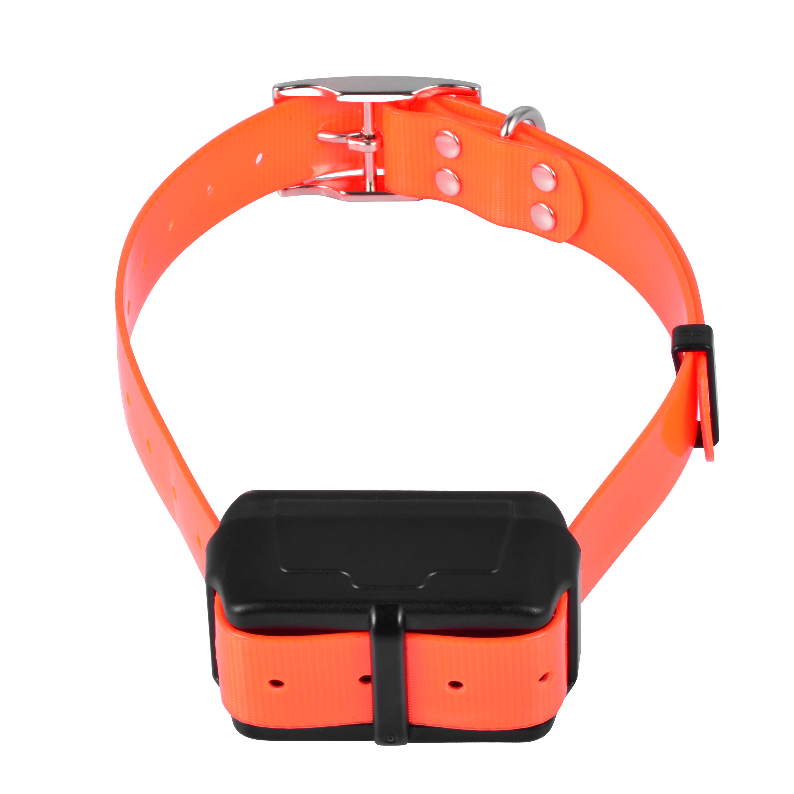

# CanTrack - YG119

El YG119 es un rastreador GPS compacto y recargable diseñado para perros de caza y mascotas activas. Envía posiciones de forma periódica según el movimiento o un intervalo de reporte configurado por el usuario, e incluye ayudas prácticas para la recuperación como la función remota de escucha de voz y un zumbador audible. Diseñado para entornos exigentes al aire libre, el YG119 combina conectividad celular multibanda, una batería de alta capacidad y una carcasa resistente y pequeña para soportar usos prolongados en campo.

Como dispositivo compatible con Plaspy, el YG119 entrega esas actualizaciones de ubicación y estado directamente a la plataforma, de modo que usted, como encargado o propietario, pueda monitorear a los animales desde las interfaces móvil o web de Plaspy. Alertas como geocercas y advertencias de batería baja se convierten en notificaciones accionables e informes históricos en Plaspy, facilitando las recuperaciones y mejorando la conciencia situacional cuando los animales están trabajando o sueltos.

## Características principales

- Totalmente compatible con Plaspy para cargas automáticas y transmisión de posiciones en vivo a una plataforma de seguimiento centralizada.
- Diseño compacto y resistente pensado para perros de caza y mascotas que pasan tiempo al aire libre.
- Gran autonomía gracias a una batería recargable de 4500 mAh y rendimiento en espera típico apto para varios días con actividad ligera.
- Posicionamiento GNSS preciso para obtener fijaciones fiables en condiciones de buena recepción y facilitar recuperaciones exactas.
- Función remota de escucha y zumbador audible para ayudar a localizar al animal en el sitio.
- Modos de reporte configurables que usan actualizaciones activadas por movimiento o intervalos programados para equilibrar oportunidad y duración de batería.
- Conectividad celular multibanda que proporciona disponibilidad amplia en diversas regiones.

## Cómo funciona con Plaspy

Al emparejarse con Plaspy, el YG119 envía posiciones y estados a la plataforma, donde esos datos se muestran y gestionan para uso operativo. Plaspy procesa las cargas del dispositivo y las convierte en vistas de mapa en tiempo real, reglas de alerta y registros históricos para que usted y su equipo puedan actuar rápidamente cuando sea necesaria una recuperación o respuesta.

- Actualizaciones de ubicación en tiempo real e indicadores de estado aparecen en los mapas y paneles de Plaspy para visibilidad inmediata.
- Los disparadores de geocerca y las alertas de movimiento son capturados y enrutados por Plaspy para entregar notificaciones a los encargados.
- El estado de la batería y las advertencias de batería baja se reportan a Plaspy para que usted planifique recargas o reemplace dispositivos.
- Los eventos de escucha remota y zumbador quedan registrados en el historial de Plaspy para documentar acciones de recuperación y apoyar la búsqueda en sitio.
- Las rutas históricas y los informes de eventos están disponibles en Plaspy para revisar patrones de movimiento y sesiones anteriores.

## Casos de uso típicos

- Seguimiento de perros de caza durante el trabajo de campo para mantener la ubicación bajo control y facilitar su recuperación.
- Revisión de entrenamiento y desempeño registrando el historial de movimiento y los datos de cada sesión para análisis posterior.
- Recuperación de mascotas perdidas usando la ubicación en tiempo real, la escucha remota y el zumbador junto con los mapas de Plaspy.
- Monitoreo de animales de trabajo en propiedades extensas donde las actualizaciones intermitentes y la larga duración de batería son importantes.
- Operaciones al aire libre que requieren hardware compacto y resistente con alertas de eventos fiables.

## Por qué elegir este rastreador con Plaspy

El YG119 es ideal para quienes necesitan un rastreador compacto y específico para mascotas y perros de trabajo, y desean que los eventos del dispositivo se integren en una plataforma de seguimiento robusta. Su combinación de autonomía, modos de reporte configurables y funciones de recuperación lo convierte en una opción práctica para encargados que dependen de datos oportunos y alertas accionables. Plaspy transforma las entradas del YG119 en telemetría organizada, notificaciones instantáneas e informes históricos que simplifican los flujos de trabajo de monitoreo y recuperación.

Para obtener más información sobre Plaspy y cómo dispositivos compatibles como el YG119 funcionan dentro de la plataforma visite https://www.plaspy.com. Las especificaciones del producto, disponibilidad y detalles del fabricante pueden cambiar con el tiempo, así que por favor verifique la información técnica actual y las variantes regionales en el sitio oficial de CanTrack https://www.cantrackgps.com/.
