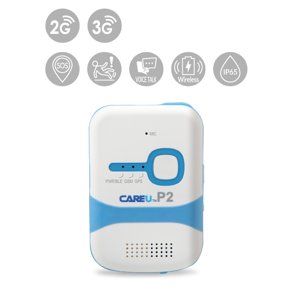

# CAREU - P2

El CAREU P2 es un rastreador GPS personal compacto diseñado para una supervisión sencilla de la ubicación y comunicación bidireccional. Ofrece actualizaciones frecuentes de posición y funciones básicas de seguridad como alerta SOS, llamadas de emergencia con números almacenados y sensibilidad configurable para detección de movimiento. El dispositivo está pensado tanto para usuarios particulares como para empresas que requieren seguimiento confiable sobre la persona y protección de pequeños activos.

Este modelo es compatible con Plaspy, por lo que resulta adecuado para organizaciones que deseen integrar dispositivos P2 en una plataforma de seguimiento centralizada. Al conectarse a Plaspy, el P2 puede aportar datos de ubicación en vivo, eventos de alerta y el estado relacionado con llamadas dentro de los flujos de trabajo de flotas y seguridad, ayudando a los operadores a mantener visibilidad y responder con rapidez ante incidentes.

## Características principales

- Rastreador personal compacto con reportes de posición frecuentes para actualizaciones precisas
- Comunicación bidireccional y alerta de emergencia SOS con hasta cuatro contactos de emergencia almacenados
- Sensibilidad ajustable y detección tipo «man down» para mayor seguridad personal
- Estación de carga opcional para carga inalámbrica y comodidad en despliegues con varios dispositivos
- Alertas por geocerca configurables para controlar entradas y salidas de zonas delimitadas
- Diseñado para casos de uso tanto de consumo como empresariales, como cuidado de adultos mayores y trabajadores en solitario

## Cómo funciona con Plaspy

Al usarse con Plaspy, el CAREU P2 envía su ubicación y señales de alerta a la plataforma Plaspy para que los operadores puedan supervisar los dispositivos en tiempo real y revisar movimientos históricos. Los usuarios de Plaspy pueden integrar los datos del P2 en paneles, notificaciones e informes junto con otros dispositivos para una supervisión operativa unificada.

- Visibilidad en tiempo real de la ubicación de unidades P2 en mapas y paneles de Plaspy
- Reenvío de alertas por eventos SOS y violaciones de geocerca a las reglas de notificación de Plaspy
- Informes periódicos de posición disponibles en Plaspy para seguimiento preciso y reproducción de recorridos
- Supervisión centralizada de múltiples rastreadores P2 para control de flotas o personal
- Informes y registros en Plaspy para apoyar revisiones de incidentes y análisis operativos

## Casos de uso típicos

- Monitorización de adultos mayores para asegurar asistencia oportuna y conocimiento de su ubicación
- Seguimiento de seguridad infantil para padres y tutores que requieren actualizaciones regulares de posición
- Seguridad de trabajadores en solitario, combinando alertas SOS con supervisión centralizada
- Rastreo de personal de seguridad y patrullaje para control de turnos y rutas
- Seguimiento de activos o equipos a pequeña escala donde dispositivos personales compactos son apropiados

## Por qué elegir este rastreador con Plaspy

El CAREU P2 combina funciones prácticas de seguridad personal con opciones que respaldan necesidades operativas diarias, como contactos de emergencia almacenados e informes configurables. Su estación de carga opcional y las capacidades de geocerca añaden conveniencia en despliegues que requieren logística de carga sencilla y supervisión automática de áreas.

Para organizaciones que evalúan dispositivos para Plaspy, el P2 representa una opción sensata cuando la prioridad es el seguimiento centrado en la persona, llamadas de emergencia simples y una integración fluida con una plataforma de monitoreo más amplia. Su conjunto de funciones se alinea bien con los casos de uso de Plaspy orientados a visibilidad, alertas y coordinación de respuesta rápida.

Para saber más sobre cómo Plaspy puede funcionar con dispositivos CAREU, visite https://www.plaspy.com. Las especificaciones y disponibilidad de productos pueden cambiar con el tiempo; por favor verifique los detalles técnicos y opciones actuales con el fabricante en https://www.systech-iot.com/ antes de tomar decisiones de compra.
