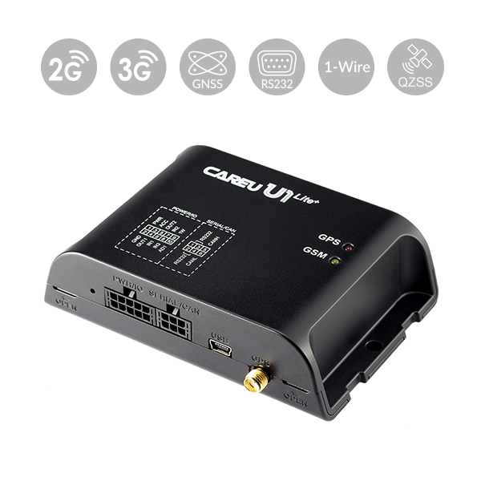

# CAREU - U1 Lite+ LTE

El rastreador CAREU U1 Lite+ LTE GPS es un dispositivo telemático compacto y rentable, diseñado para la gestión de flotas y telemática con video. Listo para usar con Plaspy desde el inicio, el U1 Lite+ combina una supervisión fiable de posición GPS/GLONASS/QZSS con diagnóstico OBD II/CAN, monitoreo de combustible e integración avanzada de sensores, de modo que los operadores pueden obtener seguimiento en tiempo real y telemetría de flotas mixtas con un mínimo esfuerzo de integración.

Diseñado para uso en vehículos comerciales, camiones pesados y flotas frigoríficas, la familia U1 Lite+ LTE admite LTE Cat 4/Cat 1 con retrocesos 3G/2G y, de manera opcional, un hotspot Wi‑Fi interno para transmisión de vídeo \(versión Cat.4\). El dispositivo también soporta configuración remota y actualizaciones de firmware FOTA, lo que lo convierte en una solución práctica compatible con Plaspy para operadores enfocados en medidas anti‑hurto, telemetría detallada del motor y seguimiento de la flota escalable.

## Puntos clave

- Rastreador GPS compatible con Plaspy que proporciona seguimiento continuo en tiempo real y datos de gestión de la flota.
- Conectividad multi‑red: LTE Cat 4/Cat 1 más soporte 3G/2G para una cobertura amplia y respaldo.
- Recepción GNSS integrada GPS/GLONASS/QZSS y acelerómetro de 3 ejes para detección de eventos duros e impactos.
- Interpretación integrada OBD II/CAN \(J1939/J1708\) para telemetría del motor \(nivel de combustible, RPM, odómetro, temperatura del motor\).
- Monitorización avanzada de combustible con soporte para sensores ultrasónicos y externos para reportes precisos de combustible.
- Listo para telemática de vídeo con hotspot Wi‑Fi interno opcional para transmisión de vídeo \(modelos Cat.4\).
- Funciones anti‑robo, incluyendo inmovilización remota del motor y detección de jamming GSM.
- Configuración remota y FOTA vía FTP para una gestión de dispositivos simplificada a gran escala.

## Cómo funciona con Plaspy

El U1 Lite+ se conecta a Plaspy para entregar ubicación, diagnóstico y datos de sensores en tiempo real. Una vez instalado en un vehículo, el rastreador utiliza su enlace celular \(LTE/UMTS/HSPA/GPRS/EDGE\) para transmitir las fallas GNSS, telemetría CAN/OBD y entradas de sensores a la plataforma Plaspy para monitorización en vivo, alertas e informes históricos. Plaspy lee los mensajes estandarizados del dispositivo y pone la telemetría a disposición en paneles, reglas de geocercas e informes automatizados.

- Actualizaciones de ubicación y telemetría en tiempo real transmitidas por LTE/3G/2G o mediante SMS/FTP cuando esté disponible.
- Datos del motor de OBD II/CAN \(nivel de combustible, odómetro, RPM, temperatura del motor\) visibles en los paneles de Plaspy.
- Informes de geocercas \(circulares y poligonales\) con alertas configurables para llegadas, salidas y violaciones.
- Integración de monitoreo de combustible: lecturas de sensores ultrasónicos y de combustible externos alimentan informes de combustible y análisis de consumo.
- Soporte de inmovilizador remoto para flujos de trabajo anti‑robo; Plaspy puede activar la inmovilización según las políticas del operador.
- Conectividad preparada para vídeo: modelos Cat.4 con hotspot Wi‑Fi interno permiten la transmisión de vídeo para dash cams y vigilancia \(el vídeo se gestiona a través de ingestión compatible con Plaspy o integraciones de terceros\).
- Configuración opcional por Bluetooth y periféricos que pueden emparejarse y mostrarse en Plaspy donde sea compatible.

## Visión técnica

| Conectividad | LTE Cat 4 / LTE Cat 1; 3G \(UMTS/HSPA\); 2G \(GPRS/EDGE\); SMS y FTP soportados. Los modelos Cat.4 incluyen hotspot Wi‑Fi interno opcional para vídeo. |
| --- | --- |
| Bandas | Dependen del modelo y la región; las bandas celulares específicas no se especifican en la descripción del producto; consulte al fabricante o al distribuidor para variantes regionales. |
| Alimentación y batería | Unidad telemática alimentada por el vehículo. Los detalles de la batería de respaldo no se especifican en la descripción. |
| Interfaces | Interpretador integrado OBD II / CAN \(J1939 o J1708\); soporte 1‑Wire para control de temperatura e ID de conductor i‑Button; RS‑232 para accesorios \(sensores de fatiga, RFID, dash cams, sensores externos de combustible\); cables de extensión RS‑232/IO/RS‑485 opcionales. Control remoto de inmovilización del motor soportado. |
| GNSS | Recepción de satélites GPS/GLONASS/QZSS con acelerómetro de 3 ejes incorporado para detección de aceleraciones, impactos y vuelcos. Precisión posicional no especificada. |
| Bluetooth | Configuración inalámbrica opcional por Bluetooth; periféricos basados en Bluetooth enumerados como mejora opcional \(soporte específico de sensores BLE no detallado\). |
| Gestión remota | Configuración remota y actualizaciones FOTA \(firmware over the air\) vía FTP soportadas. |
| Formato | Unidad telemática compacta para vehículos diseñada para instalación en coches, furgonetas, camiones y vehículos especializados \(compatible con telemática de vídeo\). |

## Casos de uso

- Antirrobo de flotas e inmovilización — inmovilizador remoto del motor y detección de jamming GSM ayudan a proteger activos y permiten una respuesta rápida.
- Telemática y vigilancia con vídeo — modelos Cat.4 con hotspot Wi‑Fi permiten conectividad de dash cams y vídeo en vivo para seguridad y revisión de incidentes.
- Optimización de gestión de combustible — sensores ultrasónicos de combustible y datos CAN/OBD permiten monitorización precisa del combustible y análisis de consumo.
- Monitorización de la cadena de frío — sensores de temperatura 1‑Wire y analógicos para transporte refrigerado y seguimiento de cumplimiento.
- Telemática para ciudades inteligentes y vehículos pesados — apto para camiones de basura con control de inclinación, autobuses escolares, logística internacional y diagnóstico de vehículos pesados.

## Por qué elegir este rastreador con Plaspy

Cuando se integra con Plaspy, el CAREU U1 Lite+ ofrece un equilibrio entre costo y capacidad para flotas que requieren algo más que GPS básico. Su soporte para diagnósticos OBD II/CAN eleva la telemetría del motor \(odómetro, RPM, temperatura del motor, nivel de combustible\) a los flujos de trabajo de gestión de flotas de Plaspy, mientras que la conectividad multi‑red y el hotspot de vídeo Wi‑Fi opcional lo convierten en una opción práctica para telemática con vídeo. Las funciones anti‑robo, incluyendo control de inmovilización remoto y detección de jamming GSM, añaden capas de seguridad que los responsables de flotas pueden automatizar mediante políticas de Plaspy.

Con diseño compatible con Plaspy, el U1 Lite+ minimiza la carga de integración: flujos de telemetría estandarizados, informes de geocercas y FOTA vía FTP permiten escalar despliegues en diferentes vehículos y regiones. Ya sea que su prioridad sea seguimiento en tiempo real, telemetría detallada para mantenimiento y monitorización de combustible, o telemática de vídeo para seguridad y cumplimiento, el U1 Lite+ ofrece las interfaces y funciones de gestión remota necesarias para mantener un costo total de propiedad bajo mientras se entrega información accionable.

