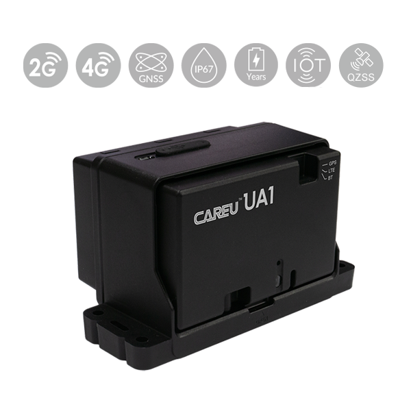

# CAREU - UA1

El CAREU UA1 es un rastreador GPS compacto con certificación IP67 diseñado para el seguimiento prolongado de activos sin alimentación y para instalaciones ocultas. Está pensado para despliegues en contenedores, carga y activos estáticos, y ofrece posicionamiento GNSS con énfasis en consumo de energía reducido y operación resistente a manipulaciones. El equipo admite opciones de batería de varios años, incorpora un acelerómetro de 3 ejes y permite configuración por Bluetooth para su puesta en servicio en campo.

Como dispositivo compatible con Plaspy, el UA1 puede enviar ubicación y telemetría esencial a los flujos de trabajo de gestión de flotas y supervisión de activos impulsados por Plaspy. Su soporte para reportes celulares con canales de respaldo y modos de reporte periódico de bajo consumo lo hacen idóneo para integrar seguimiento de larga duración, alertas por manipulación y telemetría opcional de sensores dentro de los paneles, alertas y reportes de Plaspy.

## Puntos clave

- Rastreador compatible con Plaspy que ofrece posicionamiento GNSS para actualizaciones de ubicación confiables.
- Carcasa IP67 adecuada para contenedores, carga y activos estáticos en exteriores.
- Diseño de bajo consumo con varias configuraciones de batería para operación prolongada sin supervisión.
- Reporte celular con canales de respaldo para mantener la entrega de datos en coberturas variables.
- Acelerómetro de 3 ejes integrado y sensor de manipulación en la base para alertas de movimiento e intrusión.
- Configuración inalámbrica por Bluetooth para instalación en campo y soporte para sensores externos opcionales.
- Soporta actualizaciones de firmware remotas y baterías externas acoplables para simplificar la gestión del ciclo de vida.

## Cómo funciona con Plaspy

El CAREU UA1 envía posiciones GNSS, eventos de movimiento y manipulación, y telemetría de sensores opcionales a Plaspy mediante los canales de datos que admite el dispositivo. Plaspy procesa estos reportes para ofrecer visibilidad de ubicación, activar alertas y generar informes que apoyan tanto las operaciones de flota como la supervisión prolongada de activos.

- Configure envíos frecuentes para actualizaciones de ubicación casi en tiempo real o use beaconing periódico para un seguimiento de larga duración y bajo consumo.
- Reciba notificaciones de movimiento, impactos y manipulación en Plaspy para impulsar flujos de trabajo anti robo y alertas inmediatas.
- Incluya datos ambientales u otros sensores BLE opcionales para que Plaspy supervise las condiciones de la carga y active alertas basadas en umbrales.
- Aproveche entradas/salidas digitales cuando estén disponibles para integrar estado de encendido o acciones básicas de inmovilizador en las reglas de Plaspy.
- Gestione dispositivos a escala con actualizaciones por aire (OTA) y procesos de puesta en servicio por Bluetooth que reducen el tiempo de servicio en campo.

## Casos de uso típicos

- Logística de contenedores e intermodal donde se requiere larga autonomía de batería y montaje oculto.
- Monitoreo de carga refrigerada o sensible cuando se combina con sensores de temperatura o ambientales externos.
- Protección de efectivo, paquetería y cajeros automáticos que se apoya en alertas de manipulación y movimiento para activar flujos de seguridad en Plaspy.
- Seguimiento de activos estáticos o de movimiento lento como generadores, remolques y equipos estacionados que necesitan operación prolongada sin supervisión.
- Seguimiento suplementario o de respaldo para vehículos y activos de alto valor cuando se desean señales basadas en encendido o E/S.

## Por qué elegir este rastreador con Plaspy

El CAREU UA1 es una opción práctica para organizaciones que requieren seguimiento duradero y de bajo mantenimiento integrado con Plaspy. Su combinación de opciones de batería de larga duración, resistencia IP67 y detección de movimiento y manipulación lo hace adecuado para despliegues mixtos que abarcan contenedores, activos estáticos y necesidades ocasionales de seguimiento activo. La configuración inalámbrica y la capacidad de actualizaciones remotas ayudan a reducir la carga operativa continua al administrar grandes flotas de dispositivos.

Al integrarlo con Plaspy, el UA1 ofrece una vía directa para traducir telemetría de bajo consumo en historial de ubicaciones consultable, alertas e informes operativos. Esa integración soporta tanto la supervisión rutinaria de flotas como flujos de trabajo específicos de prevención de robo o monitoreo ambiental sin requerir intervenciones intensivas en campo.

Para obtener más información sobre cómo Plaspy puede trabajar con dispositivos CAREU visite https://www.plaspy.com. Las especificaciones del producto, la disponibilidad y los detalles del fabricante pueden cambiar con el tiempo; por favor verifique las especificaciones actuales y la información de variantes en el sitio del fabricante https://www.systech-iot.com/ antes de finalizar despliegues.
