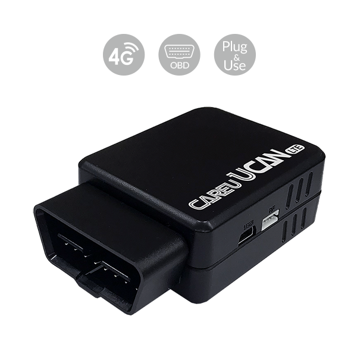

# CAREU - UCAN

El CAREU UCAN GPS Tracker es un rastreador OBD-II compatible con Plaspy, plug-and-play, diseñado para un despliegue rápido en flotas de vehículos. Diseñado para proporcionar un seguimiento en tiempo real y telemetría del vehículo fiables, el UCAN se conecta directamente a cualquier puerto OBD-II estándar para comenzar a suministrar ubicación, estado del motor/encendido y diagnósticos OBD a Plaspy para una visibilidad inmediata de las operaciones y la seguridad de la flota.

Con conectividad 4G LTE \(Cat.1 / Cat.M\) y retroceso a 3G/2G donde sea necesario, soporte opcional de eSIM, una antena GPS/GSM integrada y un acelerómetro de 6 ejes, el UCAN está diseñado para gestión de flotas, monitorización anti-robos, análisis del comportamiento del conductor y monitorización de combustible, todo accesible a través de tu panel de Plaspy para informes y alertas consolidados.

## Key Highlights

- Instalación OBD-II plug-and-play compatible con Plaspy para un despliegue rápido de la flota y un tiempo de inactividad mínimo.
- Conectividad 4G LTE Cat.1 / Cat.M con respaldo a 3G/2G \(según variante\) y soporte opcional de eSIM para roaming y aprovisionamiento flexibles.
- Lee datos OBD-II del vehículo — kilometraje/odómetro, RPM, velocidad del vehículo, nivel de combustible, horas de funcionamiento y códigos de error DTC — permitiendo telemetría robusta y visión de mantenimiento.
- Acelerómetro de 6 ejes integrado que detecta aceleración brusca, frenadas duras, eventos de impacto, virajes bruscos y vuelcos para el monitoreo de conducta y seguridad del conductor.
- Amplia memoria de registro a bordo: hasta 200,000 registros de posición \(versión 4G\) y 150,000 registros \(versión 3G/2G\) para conservar el historial durante interrupciones de red.
- Bluetooth 4.0 \(versión 4G\) para integrarse con sensores y accesorios Bluetooth cuando se requiera telemetría de sensores.
- Soporta configuración remota y actualizaciones FOTA \(firmware over-the-air\) vía FTP para gestión centralizada y reducción de viajes de mantenimiento.

## How It Works with Plaspy

El UCAN se integra directamente con Plaspy para proporcionar flujos de datos continuos del rastreador GPS compatibles con Plaspy. Una vez conectado al puerto OBD-II del vehículo, el dispositivo recopila posición GNSS y telemetría OBD, y transmite paquetes seguros a Plaspy a través de redes celulares. Los responsables de flotas pueden ver el seguimiento en tiempo real, configurar alertas y generar informes desde Plaspy sin cambios de hardware adicionales.

- Actualizaciones de ubicación y telemetría en tiempo real enviadas a Plaspy para seguimiento en vivo de la flota y monitorización de rutas.
- Detección de estado del motor/encendido y diagnósticos OBD-II \(códigos DTC, RPM, velocidad\) para flujos de mantenimiento y cumplimiento.
- Monitoreo de combustible mediante nivel de combustible OBD y lecturas de odómetro para apoyar la gestión de combustible y análisis de costos.
- Eventos de conducción brusca e impactos capturados por el acelerómetro de 6 ejes y reportados a Plaspy para informes de desempeño del conductor y alertas de seguridad.
- Soporte Bluetooth 4.0 \(versión 4G\) para conectar sensores o balizas Bluetooth y exponer datos de sensores dentro de los paneles de Plaspy.

## Resumen técnico

| Conectividad | 4G LTE \(Cat.1 / Cat.M\) con respaldo a 3G/2G según variante; soporte opcional de eSIM |
| --- | --- |
| Respaldo de red | Respaldo 3G / 2G donde esté soportado por la variante |
| Datos OBD-II | Kilometraje/odómetro, RPM, nivel de combustible, velocidad del vehículo, horas de funcionamiento, códigos de error DTC OBD-II |
| Sensores | Acelerómetro de 6 ejes integrado; batería interna de respaldo para registro limitado sin energía |
| Antenas | Antenas GPS y GSM integradas |
| Memoria | Hasta 200,000 registros de posición \(4G\); 150,000 registros de posición \(3G/2G\) |
| Interfaces | Puerto OBD-II; accesorio opcional RS-232 y E/S digital \(solo 4G\); accesorio opcional de relé inalámbrico \(solo 4G\) |
| Bluetooth | Bluetooth 4.0 disponible en la variante 4G para sensores y balizas Bluetooth |
| Firmware y gestión | FOTA \(firmware over-the-air\) vía FTP; configuración remota de intervalos de reporte, geocercas y umbrales de alerta |
| Forma | Unidad OBD-II compacta plug-and-play para montaje en vehículo/activo |

## Casos de uso

- Gestión de flotas y monitorización de rutas para logística, mensajería y servicios de entrega mediante seguimiento y telemetría en tiempo real.
- Distribución de vacunas y productos sensibles a la temperatura, donde el historial de ubicación y el tiempo de entrega son críticos \(combínalo con alertas de Plaspy\).
- Programas de comportamiento y seguridad del conductor que utilizan la detección de eventos mediante el acelerómetro para frenadas bruscas, aceleraciones y maniobras en curvas.
- Monitoreo de combustible y programación de mantenimiento aprovechando el nivel de combustible OBD-II, el odómetro y datos DTC para mantenimiento predictivo.
- Antirrobo y monitoreo de seguridad: alarmas de pérdida de energía/batería baja y accesorios de relé/digital I/O opcionales para integrarse con controles tipo inmovilizador cuando se configure.

## Por qué elegir este rastreador con Plaspy

El CAREU UCAN ofrece una mezcla equilibrada entre comodidad plug-and-play y profundidad telemática, lo que lo convierte en una opción sólida para flotas que requieren instalación rápida, seguimiento en tiempo real confiable y telemetría detallada del vehículo. Como rastreador GPS compatible con Plaspy, UCAN alimenta la ubicación, diagnósticos OBD y datos de eventos directamente a Plaspy, habilitando una gestión unificada de la flota, análisis del desempeño del conductor y monitorización de combustible desde una única plataforma. La configuración remota y el soporte FOTA reducen las visitas de mantenimiento en el sitio, mientras que el eSIM opcional y Bluetooth amplían las opciones de conectividad e integración de sensores. Para operadores de flotas que buscan rastreadores de vehículos escalables y de fácil despliegue que soporten telemetría, flujos de anti-robo y reporting integral, UCAN ofrece valor práctico sin cableado complejo ni procesos de instalación prolongados.

