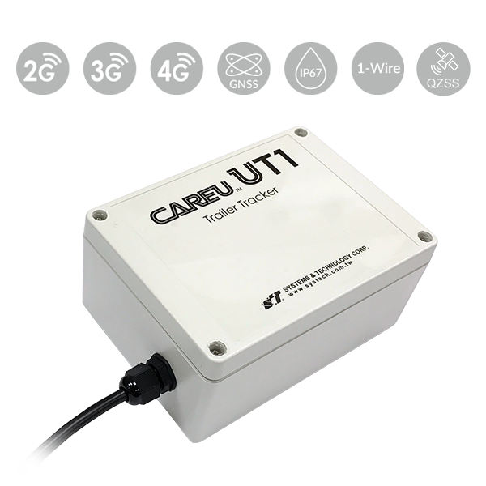

# CAREU - UT1

El CAREU UT1 es un rastreador GPS alimentado pensado para entornos industriales y de trabajo pesado. Con una carcasa con certificación IP67 y construcción robusta, el UT1 está diseñado para el seguimiento en tiempo real y la telemetría confiable de maquinaria de construcción, remolques, cajas fuertes y otros activos industriales. Sus especificaciones priorizan el rendimiento duradero en ambientes con polvo, humedad y vibraciones, e incluyen registro interno y opciones de respaldo de energía para soportar despliegues prolongados en campo.

Como dispositivo compatible con Plaspy, el UT1 transmite datos de localización y eventos a Plaspy para su monitoreo centralizado y supervisión operativa. Esa compatibilidad convierte al UT1 en una opción práctica para organizaciones que desean combinar hardware resistente con los paneles, alertas e informes de Plaspy para gestionar flotas, proteger activos de alto valor y apoyar procesos anti robo.

## Características principales

- Rastreador GPS compatible con Plaspy que ofrece seguimiento continuo en tiempo real sobre LTE Cat 1 con conmutación a 3G y 2G para una cobertura celular amplia.
- Carcasa robusta IP67 diseñada para resistir polvo, entrada de agua y vibraciones intensas en aplicaciones industriales y de campo.
- Opciones de batería interna de respaldo de aproximadamente 5.2 Ah o 10.4 Ah, además de modos de hibernación profunda para extender la autonomía sin conexión.
- Capacidades anti robo que incluyen inmovilización remota del motor y alarmas por manipulación o pérdida de alimentación para flujos de trabajo de seguridad.
- Gran capacidad de registro a bordo de hasta 200,000 posiciones para conservar trayectos y eventos históricos hasta su sincronización.
- Soporte flexible de sensores e interfaces, incluyendo 1-Wire y RS232, con CAN opcional para telemetría ampliada e integraciones.
- Soporte para configuración remota y actualización de firmware mediante FOTA over FTP para simplificar la gestión de dispositivos a escala.

## Cómo funciona con Plaspy

Cuando se integra con Plaspy, el CAREU UT1 entrega posiciones y telemetría a la plataforma para que los equipos puedan monitorear activos en tiempo real y responder a alertas. Plaspy ingiere eventos y datos de sensores del UT1 para generar informes de ubicación, paneles operativos y vistas para despachadores, administradores de flota y personal de seguridad.

- Actualizaciones de ubicación y telemetría en tiempo real aparecen en los paneles de Plaspy para facilitar el seguimiento en vivo y la visibilidad de rutas.
- Infracciones de geocerca, eventos de manipulación y alertas de corte o batería baja se reenvían a Plaspy para notificación y escalamiento inmediato.
- Eventos relacionados con el inmovilizador e ignición pueden integrarse en los flujos de trabajo de Plaspy para apoyar respuestas anti robo.
- El registro de eventos a bordo se sincroniza con Plaspy para análisis histórico y auditoría cuando se restablece la conectividad.
- Datos de sensores como temperatura o identificación del conductor pueden mostrarse en informes y vistas de cumplimiento en Plaspy.
- La configuración remota y las actualizaciones de firmware pueden coordinarse junto con la provisión desde Plaspy para reducir el mantenimiento en sitio.

## Casos de uso típicos

- Anti robo y inmovilización remota de flotas y equipos móviles en entornos mixtos de obra y campo.
- Seguimiento y telemetría de maquinaria pesada en obras de construcción o minería donde la robustez es esencial.
- Monitoreo de remolques y activos sin alimentación donde la larga autonomía y los modos de hibernación profunda prolongan la vida útil en campo.
- Protección de equipos de manejo de efectivo como cajeros automáticos y cajas fuertes, donde la resistencia a vibraciones y el sellado son necesarios.
- Telemetría de combustible y vehículos cuando se combina con interfaces CAN opcionales para el monitoreo operacional en flotas industriales.

## Por qué elegir este rastreador con Plaspy

El CAREU UT1 es una solución indicada para organizaciones que requieren un rastreador robusto y con capacidades de telemetría integrado en una plataforma centralizada de gestión de flotas. Su combinación de hardware duradero, respaldo de energía interno, amplio registro y opciones de E/S flexibles soporta una variedad de flujos de trabajo para protección de activos y operaciones de flota. Usar el UT1 con Plaspy permite la visibilidad del seguimiento en sitios complejos mientras los administradores gestionan alertas, informes y configuración remota desde una única plataforma.

Para obtener más información sobre cómo Plaspy puede funcionar con rastreadores compatibles visite https://www.plaspy.com. Las especificaciones del producto, la disponibilidad y los detalles del fabricante pueden cambiar con el tiempo, por lo que le recomendamos verificar la información técnica actual en el sitio oficial del fabricante https://www.systech-iot.com/ antes de tomar decisiones de compra o despliegue.
