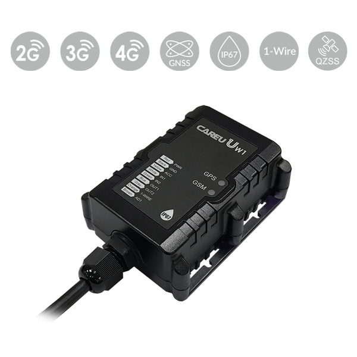

# CAREU - UW1

El CAREU UW1 es un rastreador GPS de grado industrial diseñado para aplicaciones exigentes de rastreo de vehículos y activos, y plenamente posicionado como un dispositivo compatible con Plaspy para operadores de flotas, integradores y equipos de seguridad. Con una carcasa impermeable IP67 y una construcción resistente a vibraciones \(versión LTE\), el UW1 ofrece fiabilidad robusta para el seguimiento en tiempo real de camiones, motocicletas, maquinaria de construcción y activos remotos de alto valor, integrándose directamente en la telemetría y en los flujos de trabajo de gestión de flotas de Plaspy.

El UW1 combina conectividad Cat‑1 LTE con respaldo a redes 3G y 2G, posicionamiento multi‑GNSS \(GPS/GLONASS/QZSS\), capacidad de registro offline prolongada y E/S flexible para sensores y datos del vehículo. Cuando se empareja con Plaspy, el CAREU UW1 permite seguimiento en tiempo real, controles avanzados de geocerca y antirrobo, reporte de telemetría y registro a largo plazo para operaciones que requieren monitoreo de activos resiliente y seguro.

## Key Highlights

- Diseño industrial, a prueba de agua \(IP67\) y construcción resistente a vibraciones para entornos exigentes.
- LTE Cat‑1 con respaldo a 3G/2G y múltiples opciones de transporte \(SMS, FTP, USSD\) para conectividad confiable.
- Soporte multi‑GNSS \(GPS/GLONASS/QZSS\) para una precisión de posición sólida en distintas regiones.
- Hasta 200,000 registros de posición para operación offline extendida cuando la cobertura de red es limitada.
- Acelerómetro de 3 ejes integrado \(opcional de 6 ejes disponible\) para detección de conducción agresiva, impactos y vuelcos.
- Soporte de sensores 1‑Wire para monitoreo de temperatura e identificación de conductor mediante i‑Button \(listo para cadena de frío\).
- Interfaces flexibles: RS‑232 para periféricos y CAN bus opcional para integrar telemetría del vehículo.
- Inmovilización remota \(bloqueo del motor\), informes de geocerca y múltiples tipos de alarmas para protección antirrobo.

## How It Works with Plaspy

Configurable como rastreador GPS compatible con Plaspy, el CAREU UW1 transmite ubicación y datos de sensores a la plataforma en la nube de Plaspy usando protocolos estándar de la industria sobre LTE/UMTS/HSPA/GPRS/EDGE. Plaspy ingiere la posición, telemetría y eventos de alarma para proporcionar mapas en vivo, informes históricos, alertas y flujos de trabajo automatizados. Cuando se interrumpe la conectividad, el registro a bordo de UW1 conserva hasta 200,000 entradas de posición y las sube cuando el dispositivo recupera el acceso a la red.

- Actualizaciones de ubicación y telemetría en tiempo real hacia Plaspy mediante LTE Cat‑1 con respaldo a 3G/2G.
- Eventos de conducción agresiva e impactos detectados por el acelerómetro integrado \(aceleración brusca, frenado, tomar curvas y vuelco\).
- Temperatura e identificación del conductor mediante sensores 1‑Wire \(i‑Button\) para visibilidad de la cadena de frío y verificación del conductor.
- Integración de accesorios RS‑232 \(sensores de fatiga, lectores RFID y otros periféricos\) transmitidos a Plaspy para informes combinados.
- Telemetría del vehículo, incluyendo datos de combustible o del motor cuando se integra a través de la interfaz CAN bus opcional.
- Controles antirrobo: alertas de geocerca \(circulares y poligonales\) y gestión de inmovilizador remoto \(bloqueo del motor\) vía Plaspy.

## Technical Overview

| Fabricante y Modelo | CAREU UW1 |
| --- | --- |
| Conectividad | Cat‑1 LTE con respaldo a 3G y 2G; datos sobre LTE/UMTS/HSPA/GPRS/EDGE; SMS, FTP, USSD soportados |
| Bandas | No especificadas en la descripción proporcionada |
| Alimentación y Batería | Rango de entrada de tensión 6–48 V; modo de reposo profundo; alarmas de bajo voltaje y pérdida de alimentación |
| Interfaces | RS‑232; sensores 1‑Wire para temperatura e i‑Button; CAN bus opcional; inmovilización remota \(bloqueo del motor\) |
| GNSS | GPS, GLONASS, QZSS |
| Acelerómetro | Acelerómetro de 3 ejes integrado \(opcional de 6 ejes disponible\) para detección de conducción agresiva e impactos |
| Almacenamiento / Registro | Hasta 200,000 registros de posición para operación offline |
| Seguridad y Detección | Detección de interferencia GSM; múltiples tipos de informes y alarmas |
| Gestión Remota | Configuración remota vía aire o mediante USB; actualizaciones FOTA \(firmware over the air\) vía FTP |
| Formato | Carcasa impermeable IP67; resistencia a vibraciones \(versión LTE\); formato industrial para vehículos/activos |
| Bluetooth | No se especifica Bluetooth interno en la descripción |

## Use Cases

- Gestión de flotas para camiones pesados y vehículos de servicio: ubicación en tiempo real, análisis de conducción agresiva y registro offline prolongado para rutas remotas.
- Seguimiento y recuperación de motocicletas: diseño compacto y resistente a vibraciones con opciones de geocerca e inmovilizador para protección antirrobo.
- Monitoreo de maquinaria de construcción y equipos pesados: carcasa rugged IP67 y detección de impactos para proteger máquinas de alto valor en sitio.
- Seguridad de cajeros automáticos y cajas fuertes: alertas de manipulación/impacto, más inmovilización remota y registros históricos para revisión forense.
- Logística de cadena de frío: sensores de temperatura 1‑Wire y identificación de conductor por i‑Button para mantener la conformidad y la visibilidad de la temperatura.

## Why Choose This Tracker with Plaspy

Emparejar el CAREU UW1 con Plaspy ofrece a las organizaciones una solución compatible con Plaspy que equilibra hardware robusto con una integración de plataforma flexible. La conectividad LTE Cat‑1 y el posicionamiento multi‑GNSS del UW1 aseguran un seguimiento en tiempo real confiable en áreas con cobertura variable, mientras que hasta 200,000 posiciones registradas y modos de reposo extremadamente profundos conservan datos y energía durante periodos prolongados sin conexión. La detección avanzada \(acelerómetro, temperatura 1‑Wire, periféricos RS‑232 y CAN bus opcional\) posibilita una amplia telemetría y recopilación de datos del vehículo; el monitoreo de combustible y parámetros de encendido/motor pueden mostrarse en Plaspy cuando se conectan las interfaces del vehículo.

Para gestores de flotas e integradores enfocados en anti‑robo, conocimiento operativo y telemetría escalable, el UW1 ofrece hardware endurecido y gestión remota \(configuración OTA y FOTA\) que simplifica el despliegue y el mantenimiento. En Plaspy, obtendrás paneles de control centralizados, aplicación de geocercas, alertas e informes históricos que convierten los datos brutos del UW1 en inteligencia accionable para la gestión de flotas.

