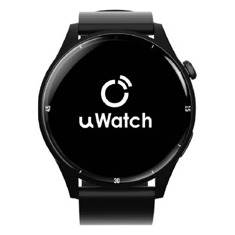

# CAREU - uWatch WT1

El CAREU uWatch WT1 es un rastreador GPS en formato reloj inteligente, diseñado para la seguridad personal y el monitoreo de la salud. Como dispositivo wearable combina el reporte continuo de ubicación y un botón SOS de emergencia con telemetría de signos vitales —frecuencia cardíaca, presión arterial, SpO2 y temperatura corporal— para apoyar a cuidadores, centros de atención, familias y organizaciones que requieren contexto posicional y fisiológico integrado.

Al ser compatible con Plaspy, los datos de ubicación y los signos vitales del uWatch WT1 pueden enviarse directamente a Plaspy para monitoreo centralizado, generación de alertas y reproducción histórica de recorridos. Esta integración permite a los equipos de atención consolidar señales de incidentes y datos de salud en una sola vista operativa para una respuesta y gestión más informadas.

## Características principales

- Wearable compatible con Plaspy que integra ubicación y telemetría de salud en una plataforma unificada.
- Seguimiento en tiempo real y reproducción histórica de rutas para mayor conciencia situacional y revisión.
- Botón SOS de emergencia y soporte de geocercas para notificar a los cuidadores cuando se requiere respuesta rápida.
- Telemetría de signos vitales que incluye frecuencia cardíaca, presión arterial, SpO2 y temperatura corporal para supervisión remota.
- Monitoreo multiusuario para que varios cuidadores u operadores puedan ver alertas y datos del mismo portador.
- Funciones diarias de bienestar como seguimiento de sueño y ejercicio, además de recordatorios por sedentarismo para apoyar el estado de salud.
- Utilidades prácticas como visualización de mensajes SMS, localizador del reloj y alarma para la gestión cotidiana.

## Cómo funciona con Plaspy

Al inscribir el uWatch WT1 en una cuenta Plaspy, el dispositivo transmite su ubicación y telemetría de salud a la plataforma, donde esos eventos quedan registrados con marca temporal, se visualizan en mapas y se integran en flujos de reportes y alertas. Plaspy convierte los datos del dispositivo en parte de una vista operativa consolidada junto con otros activos y personal rastreado, facilitando la respuesta y el análisis.

- Ubicación en tiempo real y actualizaciones periódicas de posición para mantener conciencia situacional continua.
- Alertas SOS y de emergencia entregadas en Plaspy para que los respondedores reciban notificaciones inmediatas.
- Notificaciones de geocercas que indican salidas de áreas seguras y violaciones de perímetro al equipo de monitoreo.
- Telemetría de signos vitales disponible para supervisar tendencias y correlacionar datos de salud con el contexto de ubicación.
- Reproducción histórica de rutas para revisar movimientos en investigaciones de incidentes o comprobaciones de rutina.
- Compartición multiusuario para que cuidadores y personal operativo reciban alertas y accedan a la misma información.

## Casos de uso habituales

- Centros de atención y residencias donde el monitoreo continuo de ubicación y signos vitales ayuda a gestionar la seguridad de los residentes.
- Cuidado familiar para la supervisión remota de adultos mayores o personas vulnerables con alertas compartidas.
- Seguridad laboral para personal que requiere monitoreo de trabajadores aislados y señalización rápida de emergencias.
- Programas diarios de bienestar que combinan actividad, sueño y datos de signos vitales para cuidados preventivos.
- Revisión de incidentes y cumplimiento, donde el historial de rutas y la telemetría respaldan reportes y líneas de tiempo.

## Por qué elegir este rastreador con Plaspy

El uWatch WT1 reúne funciones de seguridad personal y telemetría de salud en un solo wearable que aporta datos útiles a Plaspy. Para organizaciones y familias que necesitan tanto seguimiento de ubicación como visibilidad remota de signos vitales, el WT1 reduce la fragmentación de datos al canalizar eventos SOS, alertas de geocercas, historial de rutas y mediciones fisiológicas en una única plataforma para monitoreo e informes.

To learn more about Plaspy and how compatible devices are managed within the platform visit https://www.plaspy.com. Product specifications, availability, and manufacturer details can change over time so please verify current technical information on the official manufacturer website https://www.systech-iot.com/.
