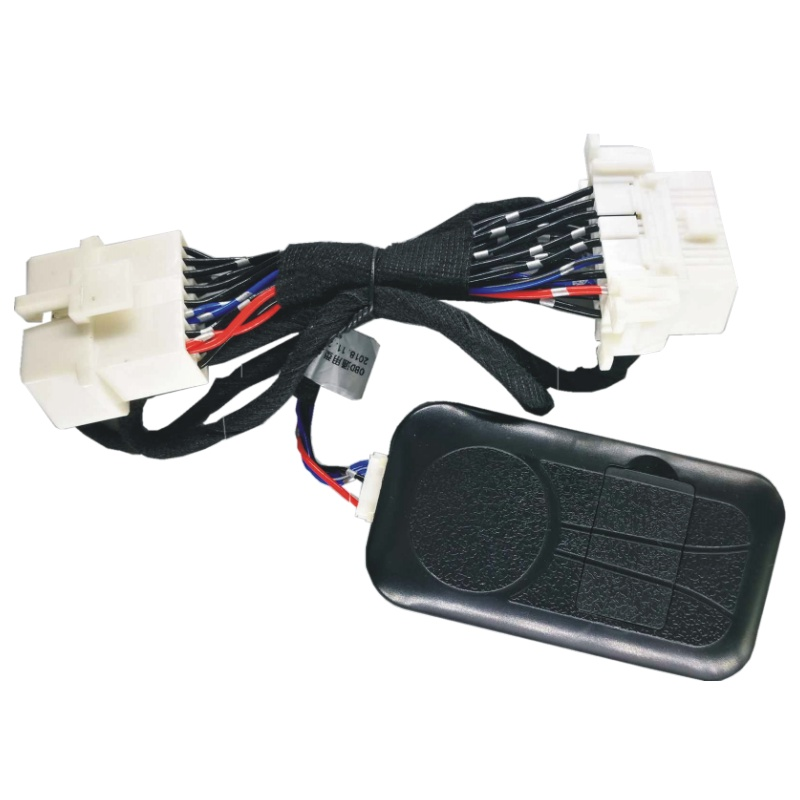

# Carscop - CC-338

El CC-338 es un rastreador telemático vehicular compacto 4G T Box de Carscop diseñado para renta de autos, car sharing y gestión de flotas. Integra radios celular y GNSS junto con conectividad OBD II CANBUS para convertir vehículos convencionales en activos monitoreables y controlables de forma remota, pensados para alquiler sin atención y servicios de uso compartido. La unidad captura ubicación, estado del vehículo y eventos básicos, a la vez que ofrece canales para control remoto y gestión de accesos locales.

Este modelo es compatible con Plaspy y puede funcionar como pasarela directa de datos y comandos hacia la plataforma. Gracias a sus opciones de conectividad abiertas y registro a bordo, los operadores pueden transmitir ubicación y telemetría al instante hacia Plaspy para monitoreo en vivo, alertas y flujos operativos. Su combinación de telemetría y múltiples vías de control lo convierte en una opción práctica para organizaciones que evalúan hardware compatible con Plaspy para renta, sharing o supervisión de flotas.

## Aspectos clave

- Unidad telemática compatible con Plaspy, adecuada para renta de autos, car sharing y gestión de flotas.
- Radios celulares y GNSS integrados con respaldo por GPS y por antenas celulares para mayor cobertura.
- Conectividad OBD II CANBUS que permite acceso a telemetría y canales de control cuando los sistemas del vehículo exponen datos.
- Múltiples métodos de control: API por internet, control inalámbrico local y salidas cableadas para bloqueo e inmovilización.
- Registro a bordo y retención de la última posición conocida para preservar eventos cuando se interrumpe la conectividad.
- Diseñado para integradores, con API abierta y conectividad TCP/IP para integración con servidores privados o plataformas.

## Cómo funciona con Plaspy

Cuando usted conecta el CC-338 a Plaspy, el dispositivo reenvía datos de ubicación y eventos del vehículo a la plataforma para visibilidad en tiempo real e informes históricos, además de recibir comandos remotos que soportan flujos de trabajo de sharing y seguridad. Plaspy puede aprovechar la transmisión de datos y los canales de control del equipo para automatizar alertas y respuestas operativas en flotas y despliegues de alquiler.

- Actualizaciones de ubicación en tiempo real e historial disponibles en los paneles e informes de Plaspy.
- Reporte del estado del vehículo y eventos como encendido, puertas y alarmas para seguimiento de seguridad y uso.
- Telemetría enviada a Plaspy para monitoreo operativo y programación de mantenimientos.
- Comandos de inmovilización remota y control de acceso desde Plaspy para apoyar antirobo y políticas de alquiler.
- Opciones de control inalámbrico local para accesos por proximidad y flujos offline, con registro que se sincroniza cuando se restablece la conectividad.

## Casos de uso habituales

- Renta de autos sin atención y car sharing de autos en modalidad self service con control de acceso remoto y facturación basada en uso.
- Seguimiento de flotas y supervisión operativa donde la ubicación y el estado del vehículo informan despacho y mantenimiento.
- Flujos antirobo que combinan eventos de alarma, corte remoto de motor y notificaciones a los operadores.
- Monitoreo de combustible y diagnósticos enviados a Plaspy cuando los datos están disponibles en el bus del vehículo.
- Desbloqueo por proximidad y acceso temporal mediante control inalámbrico local para clientes o conductores invitados.

## Por qué elegir este rastreador con Plaspy

El CC-338 combina telemetría vehicular detallada con canales de control flexibles, ideal para operadores de renta y flotas que requieren gestión remota y opciones de acceso local. Su conectividad OBD II CANBUS y los múltiples métodos de control permiten a los integradores diseñar flujos que combinan seguimiento en tiempo real, políticas basadas en uso y medidas antirobo, manteniendo capacidad offline mediante el registro a bordo.

Si desea saber más sobre cómo Plaspy puede integrarse con hardware compatible como el CC-338 visite https://www.plaspy.com. Las especificaciones de producto, disponibilidad y detalles del fabricante pueden cambiar con el tiempo, por lo que es recomendable verificar la información técnica actual en el sitio oficial de Carscop http://www.carscop.com/ antes de tomar decisiones de despliegue.
