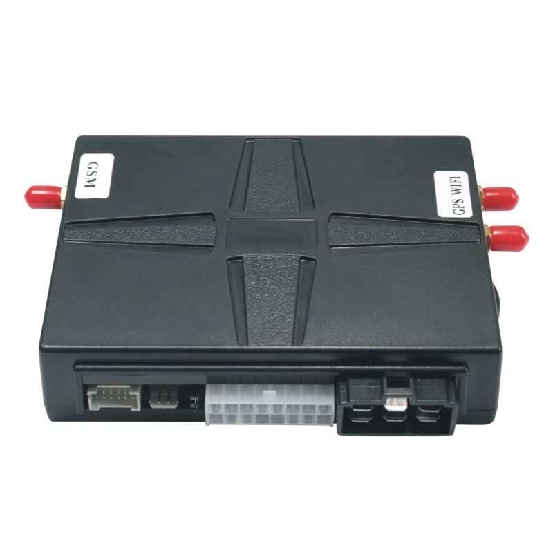

# Carscop - CC-688

La CC-688 T-Box es un dispositivo de control de vehículos y rastreador GPS específicamente concebido para operadores de alquiler de coches, car-sharing y gestión de flotas que requieren un dispositivo compatible con Plaspy para seguimiento en tiempo real y control remoto. Diseñado para flujos de alquiler sin supervisión, la CC-688 combina conectividad celular global \(2G/3G/4G\), opciones de posicionamiento GNSS, BLE, NFC, control de punto de acceso Wi‑Fi y un sistema de arranque sin llave para que los operadores puedan ofrecer acceso mediante la app y autenticación local por toque o NFC sin la llave original del coche.

La unidad integra telemetría CANBUS y OBD II para entregar datos del motor y sensores a plataformas Plaspy, además de salidas de relé y controles de actuadores para bloquear/desbloquear, bocina, luces y inicio/parada del motor. Con batería de respaldo opcional, detección de impactos con sensor G y actualizaciones de firmware OTA, la CC-688 está diseñada para soportar flujos de anti-robos, control de ignición y funciones de corte remoto del motor al estilo inmovilizador, manteniendo flujos de datos seguros compatibles con Plaspy para gestores de flotas y servicios de movilidad.

## Aspectos destacados

- T-Box compatible con Plaspy con conectividad celular global para una conectividad fiable del rastreador GPS y seguimiento en tiempo real.
- Soporte de alquiler sin llave y arranque push-start a través de la app móvil, lector NFC, módulo de contraseña en touchpad y Bluetooth BLE.
- Telemetría CANBUS y OBD II para datos del motor, DTC y sensores del vehículo; admite datos de monitorización de combustible cuando están disponibles a través del bus del vehículo.
- Control remoto de actuadores: salidas de relé integradas para bloquear/desbloquear puertas, bocina, luces y inicio/parada del motor o corte para flujos de inmovilizador.
- Funciones de seguridad que incluyen detección de impactos con sensor G, batería de respaldo opcional para alertas de manipulación/pérdida de energía y soporte para sirena externa.
- Actualizaciones de firmware y datos OBD vía OTA, además de cambios de parámetros remotos por SMS o Internet para una gestión de flotas escalable.
- API abierta y reenvío TCP/IP para una integración fluida con Plaspy, servidores privados y plataformas de car-sharing.

## Cómo funciona con Plaspy

La CC-688 transmite GNSS y telemetría del vehículo a Plaspy mediante conexiones TCP/IP seguras y la API abierta del proveedor. Plaspy recibe la ubicación, el estado y la telemetría CAN/OBD en tiempo real cercano y puede emitir comandos de control de vuelta al dispositivo, lo que habilita el rastreo en vivo, la inmovilización remota, el control de acceso y la generación de informes automatizados. Los parámetros del dispositivo, como el intervalo de subida de GPS y los umbrales de alerta, pueden gestionarse de forma central desde Plaspy o modificarse por SMS cuando sea necesario.

- Actualizaciones de ubicación y telemetría en tiempo real enviadas a Plaspy para seguimiento y reproducción histórica.
- Estado de ignición y motor reportado vía CANBUS/OBD II; admite arranque/parada remotos y comandos de corte del motor \(inmovilizador\).
- Entradas de señales de puerta, ACC, freno de mano y alarma disponibles para alertas basadas en eventos en los paneles de Plaspy.
- Monitoreo de combustible y otra telemetría de motor/sensor disponible vía CAN/OBD II cuando el vehículo lo soporte.
- Eventos Bluetooth BLE, NFC y touch pad \(acceso concedido/denegado\) enviados a Plaspy para registros de acceso y auditoría.

## Resumen técnico

| Conectividad | Celular global: 2G GSM / 3G WCDMA / 4G LTE; reenvío de datos TCP/IP a través de redes móviles |
| --- | --- |
| Bandas | Soporta redes celulares globales \(2G/3G/4G LTE\) — las bandas regionales específicas dependen del modelo/ variante |
| Alimentación y batería | Amplio rango de tensión de operación: 9–40V, apto para vehículos de 12V y 24V; batería de respaldo opcional para alarmas de manipulación/pérdida de energía |
| Interfaces | CANBUS y OBD II para telemetría y DTC; salidas de relé para control de actuadores; múltiples entradas de señal \(puerta, ACC, ON, freno de mano\); soporte para módulo de bypass |
| GNSS | Posicionamiento GPS con opción GPS/BEIDOU/GLONASS y asistencia A-GPS |
| Bluetooth | Bluetooth BLE para sensores, emparejamiento con teléfono y autenticación local |
| Otros sensores y E/S | Sensor G para detección de impactos y registro de conductas de conducción; lector NFC y módulo de contraseña en touch pad; control de punto de acceso Wi‑Fi |
| Gestión remota | Actualizaciones de firmware y datos OBD vía OTA; cambios remotos de parámetros por SMS o Internet; API abierta para integración de datos y control |
| Formato e instalación | T-Box para vehículo con soporte de antena externa GSM/GPS; el paquete típico incluye arnés de cableado, touchpad, sirena, botón de arranque, módulo de bypass y antenas; se recomienda instalación profesional para la integración CAN/OBD |

## Casos de uso

- Gestión de flotas: seguimiento en tiempo real, telemetría, monitorización del comportamiento del conductor y inmovilización remota del motor para reducir riesgos y mejorar la utilización de la flota.
- Alquiler de coches sin atención y car-sharing: reservas mediante app, desbloqueo por NFC/touch pad o BLE y arranque push-start para la entrega de vehículos sin llave.
- Antirrobo y recuperación: alertas de manipulación e impacto, notificaciones de batería de respaldo y corte remoto del motor para asegurar vehículos robados o mal utilizados.
- Telemetría y mantenimiento: DTC del motor, datos de sensores y combustible \(vía CAN/OBD II\) para mantenimiento predictivo y monitorización del combustible cuando estén disponibles desde el bus del vehículo.

## Por qué elegir este rastreador con Plaspy

La CC-688 ofrece un conjunto completo de características que se alinean con las necesidades de Plaspy para el seguimiento de vehículos escalable y seguro y el control remoto. Su combinación de posicionamiento GNSS, acceso por BLE/NFC, telemetría CAN/OBD y salidas de actuadores lo hace práctico para la gestión de flotas, car-sharing y automatización de alquiler. La integración compatible con Plaspy se admite mediante el reenvío TCP/IP y una API abierta, lo que permite seguimiento en tiempo real inmediato, manejo de alarmas y escenarios de inmovilizador remoto, manteniendo la gestión del dispositivo centralizada a través de actualizaciones OTA y control remoto de parámetros.

Los operadores que requieren medidas robustas anti-robos, control de ignición y telemetría detallada \(incluido datos relacionados con el combustible cuando el vehículo los expone a través de CAN/OBD II\) encontrarán que la CC-688 está preparada para implementaciones empresariales. Con instalación profesional e integración con Plaspy, la CC-688 ayuda a convertir los vehículos en activos conectados que mejoran la utilización, reducen el fraude y racionalizan la experiencia del cliente para servicios de movilidad compartida.

