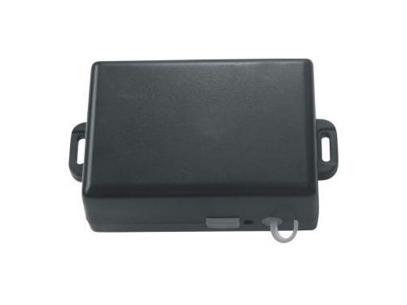

# Carscop - CCTR-800

El Carscop CCTR-800 es un rastreador GPS portátil pensado para colocación discreta y seguimiento versátil. Su diseño compacto y el potente imán permiten montarlo oculto en superficies metálicas, mientras que la batería de 5200 mAh proporciona largas autonomías en espera. Con protección resistente al agua, el CCTR-800 cubre distintas necesidades de rastreo móvil, desde objetos personales hasta equipos y maquinaria comercial.

Como dispositivo compatible con Plaspy, el CCTR-800 se integra en flujos modernos de gestión de flotas y activos. El rastreador soporta localización por GPS y por la red GSM, ofrece múltiples opciones de reporte, incluidas notificaciones SMS con la ubicación, y permite configuración en línea, lo que lo convierte en una opción práctica dentro de Plaspy para visibilidad de ubicación, historial y control operativo.

## Características principales

- Diseño compacto y portátil para colocación discreta y fácil ocultamiento  
- Fijación magnética sólida para montaje seguro sobre superficies metálicas  
- Batería de gran capacidad de 5200 mAh que ofrece tiempos de espera extendidos de varias semanas  
- Clasificación IP56 contra el agua, apto para uso exterior y entornos expuestos  
- Doble método de localización: GPS y LBS basado en red para mayor cobertura  
- Reportes por SMS con enlace de mapa y opciones de reporte hacia la plataforma en línea  
- Soporte para actualizaciones de firmware en línea y configuración automática de APN GPRS

## Cómo funciona con Plaspy

El CCTR-800 puede enviar datos de ubicación y estado básico a Plaspy para que los equipos tengan visibilidad centralizada de activos y vehículos. Una vez emparejado con Plaspy, las opciones de reporte del dispositivo y el almacenamiento histórico lo hacen útil para monitorear desplazamientos, revisar viajes pasados y activar alertas.

- Vista centralizada de ubicación en tiempo real para unidades individuales y flotas agrupadas dentro de Plaspy  
- Retención de historial de rastreo para revisar movimientos pasados y respaldar informes  
- Alertas de entrada y salida de geocercas que pueden mostrarse en Plaspy para monitoreo por zona  
- Intervalos de envío configurables y horarios de sueño para equilibrar visibilidad y duración de batería  
- Notificaciones desde el dispositivo, como alertas por movimiento, que pueden canalizarse a paneles y notificaciones de Plaspy

## Casos de uso típicos

- Rastreo discreto de vehículos de alquiler y unidades de flotas compartidas  
- Monitoreo de vehículos de transporte y remolques para ubicación y historial de movimientos  
- Seguimiento de equipos portátiles y activos que se trasladan entre sitios  
- Uso personal o de seguridad donde la colocación oculta y la larga autonomía son importantes  
- Despliegues a corto o mediano plazo donde la impermeabilidad y el montaje magnético aportan mayor resistencia

## Por qué elegir este rastreador con Plaspy

El CCTR-800 es una opción práctica para organizaciones que requieren un rastreador discreto y de larga autonomía que pueda supervisarse de forma centralizada. La combinación de montaje magnético, larga vida de batería y múltiples opciones de reporte lo hace versátil tanto en escenarios personales como comerciales. Al conectarlo a Plaspy, el dispositivo forma parte de una solución de rastreo unificada donde la visibilidad de ubicaciones, los datos históricos y el sistema de alertas se administran en conjunto.

Conozca más sobre Plaspy en el sitio principal https://www.plaspy.com. Las especificaciones del producto, su disponibilidad y los datos del fabricante pueden cambiar con el tiempo, por lo que le recomendamos verificar las características actuales con el fabricante en http://www.carscop.com/.
