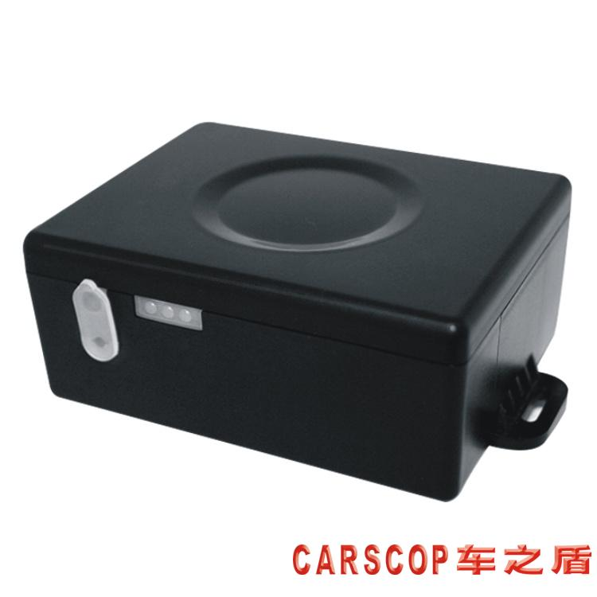

# Carscop - CCTR-800G-4G

### CCTR-800G-4G

El CCTR-800G-4G es un rastreador GPS robusto y portátil, diseñado para el seguimiento exterior de larga duración y una fácil integración con plataformas en la nube como Plaspy. Construido para resistir entornos exigentes, esta unidad compatible con Plaspy combina conectividad global 2G/3G/4G con posicionamiento GPS + BeiDou de alta sensibilidad, una batería recargable de 6000mAh, protección IP65 y un imán interno fuerte para montaje rápido y oculto en superficies metálicas — lo que la convierte en una opción ideal para seguimiento en tiempo real confiable, gestión de flotas y monitoreo antirrobo.

Diseñado para implementaciones flexibles, el CCTR-800G-4G admite una dirección IP/web de subida configurable y un enfoque de protocolo abierto para que los integradores puedan dirigir los datos del dispositivo a Plaspy u otras plataformas de terceros. Con grabación de trayectos sin conexión, localización por SMS como respaldo ante la red, actualizaciones de firmware OTA y múltiples modos de funcionamiento para prolongar la vida de la batería, este rastreador GPS ofrece datos listos para telemetría y conectividad robusta para vehículos, activos y personal.

## Puntos destacados

- Compatible con Plaspy mediante una dirección IP de subida configurable y un protocolo abierto — integración de plataforma sencilla para seguimiento en tiempo real y gestión de flotas.
- Batería Li‑ion recargable de 6000mAh de larga duración con múltiples modos de energía: funcionamiento continuo, movimiento diario y modo de espera para equilibrar precisión y duración de la batería.
- Conectividad global 2G/3G/4G con antenas integradas y GNSS \(GPS + BeiDou\), además de asistencia A-GPS para una localización rápida.
- Carcasa resistente con clasificación IP65 y un imán interno potente permiten rastreo encubierto de activos y uso al aire libre sin preocupaciones.
- Grabación de trayectos sin conexión en memoria interna y localización por SMS cuando no hay acceso al servidor de la plataforma.
- Alertas configurables que incluyen alarma de choque, notificaciones SOS \(tres números\), SMS de batería baja y notificaciones push de la plataforma para respuesta antirrobo.
- Actualizaciones de firmware OTA y opciones OEM \(dominio privado, logotipo y aplicación\) simplifican la implementación de la flota y el branding.

## Cómo funciona con Plaspy

El CCTR-800G-4G se conecta a redes celulares y envía telemetría GNSS a una dirección de servidor que configure. Dado que el dispositivo admite una dirección IP/web de subida configurable y un protocolo abierto \(con opciones de cambio de protocolo\), puede dirigirse directamente a los puntos finales de Plaspy para seguimiento en tiempo real, alertas e informes. Plaspy recibe fijaciones de ubicación, eventos de movimiento y alarma, y estado de la batería para mostrar posiciones en tiempo real, generar geocercas y alarmas de choque, y producir informes de gestión de la flota.

- Actualizaciones de ubicación y telemetría en tiempo real \(intervalo de subida configurable; por defecto 30 segundos\).
- Eventos de alarma: alarma de choque, notificaciones SOS y alertas de batería baja enviadas a Plaspy como notificaciones de la plataforma o como respaldo vía SMS/llamada.
- Almacenamiento de trayectos sin conexión: la memoria interna guarda los trayectos cuando no hay GSM; los datos almacenados se cargan a Plaspy cuando se restablece la conexión.
- Actualizaciones OTA: el firmware puede actualizarse vía OTA para mantener la compatibilidad y añadir funciones para integraciones con Plaspy.
- Localización por SMS y configuración automática de APN/GPRS proporcionan informes de respaldo si la conectividad de la plataforma se pierde temporalmente.

## Resumen técnico

| Conectividad | 2G GSM / 3G WCDMA / 4G LTE \(global\) |
| --- | --- |
| Redes / Bandas | Global 2G/3G/4G \(las bandas específicas dependen de la variante de hardware\) |
| Alimentación y batería | 6000mAh Li‑ion recargable; compatibilidad con adaptador de alimentación externo \(opcional 9V–40V\); modos de ahorro de energía; notificaciones por SMS de batería baja |
| Interfaces y E/S | Sensor de choque para cargas/movimiento y alarmas; admite tres números SOS y notificaciones de alarma vía SMS/llamada telefónica/push de la plataforma; cable USB y placa de carga incluidos |
| GNSS | GPS + BeiDou en modo dual con asistencia A-GPS para fijaciones más rápidas; antena GNSS integrada |
| Antenas | Antenas integradas 2/3/4G y GNSS |
| Memoria | Grabación interna de trayectos para almacenamiento offline cuando GSM no está disponible |
| Gestión remota | Actualización de firmware OTA \(FOTA\); dirección IP/web de subida configurable; soporte de protocolo abierto y cambio de protocolo para compatibilidad con plataformas |
| Carcasa y Montaje | Carcasa IP65 a prueba de agua; imán interno potente para montaje oculto en superficies metálicas |
| Dimensiones y peso | 70 mm x 55 mm x 32 mm; 160 g |
| Contenido de la caja | 1 unidad principal, 1 cable USB, 1 placa de carga, 1 manual, caja a color \(dimensiones de la caja: 160 mm x 130 mm x 60 mm\) |

## Casos de uso

- Rastreo discreto de activos: montar de forma segura en remolques, maquinaria o carga para telemetría de ubicación y movimiento de forma discreta.
- Rastreo de vehículos para coches y furgonetas ligeras: ubicación en tiempo real, alarma de choque y alertas de batería baja compatibles con flujos de trabajo antirrobo.
- Monitoreo de personal y equipos: montaje magnético portátil y largos tiempos en espera lo hacen adecuado para implementaciones temporales o remotas.
- Gestión de flotas — integre con Plaspy para reproducción de rutas, vistas en vivo de la flota e informes basados en eventos para mejorar la utilización y la respuesta.
- Telemetría remota con resiliencia offline — grabación interna de trayectos y localización por SMS aseguran continuidad en áreas con baja cobertura.

## Por qué elegir este rastreador con Plaspy

Cuando necesita un rastreador GPS compatible con Plaspy que equilibre hardware robusto con integración flexible, el CCTR-800G-4G destaca. Su batería de 6000mAh y sus múltiples modos de funcionamiento proporcionan una larga vida operativa tanto en contextos portátiles como de vehículo, mientras que la robustez con clasificación IP65 y su formato con imán permiten instalaciones rápidas y discretas. El protocolo abierto y la dirección de subida configurable facilitan dirigir los datos a Plaspy para seguimiento en tiempo real, telemetría y alertas de plataforma. Además, la grabación de trayectos sin conexión, la localización por SMS como respaldo y las actualizaciones de firmware OTA aumentan la fiabilidad y simplifican la gestión a nivel de flota.

Se envía con una demo de plataforma de rastreo gratuita \(www.999gps.net — cuenta de prueba: 123456 / contraseña: 123456\) y opciones OEM como dominio privado, logotipo personalizado y aplicación propia. El CCTR-800G-4G ofrece funcionalidad lista para usar y la flexibilidad necesaria para proyectos de gestión de flota con marca o escalados. Para implementaciones que requieran telemetría adicional — como monitorización de combustible, detección de encendido, control de inmovilizador o sensores Bluetooth — consulte a su proveedor sobre opciones de cableado y E/S soportadas para adaptar la integración a Plaspy y sus necesidades operativas.

