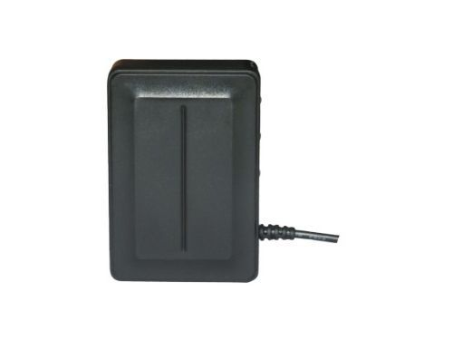

# Carscop - CCTR-808

El Carscop CCTR-808 es un rastreador GPS compacto y versátil pensado para la vigilancia de activos a largo plazo. Sus principales características de hardware incluyen un panel solar y una batería de gran capacidad para extender la autonomía en espera, una carcasa con clasificación IP56 resistente al agua para uso exterior y un pin magnético de alta fuerza que facilita la fijación a vehículos o equipos. El dispositivo también admite localización por Cell ID para mejorar los reportes de posición en entornos interiores o subterráneos complicados, y ofrece intervalos de subida configurables con control por SMS para adaptar su comportamiento de seguimiento.

Como modelo compatible con Plaspy, el CCTR-808 se integra en flujos de trabajo de gestión de flotas y activos para ofrecer visibilidad de localización y supervisión operativa. Su combinación de larga autonomía, resistencia a la intemperie y montaje magnético lo hace adecuado para despliegues de bajo mantenimiento, mientras que la localización por Cell ID y los reportes configurables ayudan a conservar datos de ubicación útiles cuando la señal GPS es limitada. Los usuarios de Plaspy pueden añadir dispositivos como el CCTR-808 a su configuración de monitoreo para centralizar el seguimiento, los reportes y las alertas.

## Características principales

- Asistencia solar y una batería interna de gran capacidad para mayor autonomía en espera y menos mantenimiento.
- Diseño resistente al agua IP56, apto para entornos exteriores y expuestos.
- Pin magnético extra fuerte para un montaje sencillo y seguro en vehículos y equipos.
- Función de localización por Cell ID que ofrece información de ubicación de respaldo en interiores o zonas subterráneas.
- Intervalos de subida configurables y controles por SMS que permiten estrategias de reporte flexibles.
- El dispositivo no incluye cargo por servicio de plataforma, lo que reduce los costos continuos de seguimiento.

## Cómo funciona con Plaspy

Al conectarse a Plaspy, el CCTR-808 proporciona información de ubicación y estado que se puede visualizar junto con otros dispositivos en una única plataforma de gestión de flotas. Plaspy consume los datos del rastreador para mejorar la conciencia operativa y simplificar la gestión de activos distribuidos.

- Muestre en los mapas de Plaspy la ubicación en tiempo real y el historial reciente de unidades CCTR-808 para mayor visibilidad de la flota.
- Use los intervalos de subida configurables del dispositivo para equilibrar la frecuencia de reporte y la vida de la batería según las necesidades operativas.
- Confíe en la función de localización por Cell ID como respaldo en áreas con recepción GPS limitada y visualice estas ubicaciones de contingencia dentro de Plaspy.
- Agrupe y supervise múltiples rastreadores CCTR-808 para una supervisión centralizada de vehículos, contenedores o equipos remotos.
- Genere informes de ubicación y exportes resumidos en Plaspy para apoyar revisiones operativas y la toma de decisiones.

## Casos de uso típicos

- Seguimiento a largo plazo de remolques, contenedores o vehículos estacionados donde el bajo mantenimiento es una prioridad.
- Activos exteriores expuestos a la intemperie que requieren un rastreador resistente.
- Bienes que pueden ingresar a áreas interiores o subterráneas donde la localización por Cell ID mejora la trazabilidad.
- Despliegues temporales o reutilizables en los que el montaje magnético acelera la instalación y la retirada.
- Visibilidad de flota para organizaciones que prefieren intervalos de reporte configurables para extender la vida útil de la batería.

## Por qué elegir este rastreador con Plaspy

El CCTR-808 es una opción práctica para organizaciones que necesitan un rastreador durable y de bajo mantenimiento compatible con una plataforma centralizada como Plaspy. Su soporte solar y batería de gran capacidad reducen la frecuencia de las visitas de servicio, mientras que el diseño resistente al agua y el montaje magnético lo hacen adaptable a una variedad de vehículos y equipos de campo. La capacidad de localización por Cell ID ayuda a conservar información de ubicación útil cuando la recepción GPS es limitada, lo que convierte al dispositivo en una alternativa resistente para entornos con cobertura mixta.

Plaspy aporta valor al integrar los datos de ubicación del CCTR-808 en un tablero unificado para monitoreo, reportes y control operativo. En conjunto, son adecuados para despliegues donde la larga autonomía, la resistencia a la intemperie y la instalación sencilla son importantes. Para especificaciones detalladas y disponibilidad, verifique la información actual con el fabricante.

Para obtener más información sobre Plaspy y las capacidades de la plataforma visite https://www.plaspy.com. Las especificaciones del producto, la disponibilidad y los detalles del fabricante pueden cambiar con el tiempo, así que por favor confirme los detalles técnicos actuales en el sitio oficial de Carscop en http://www.carscop.com/ antes de finalizar una compra.
