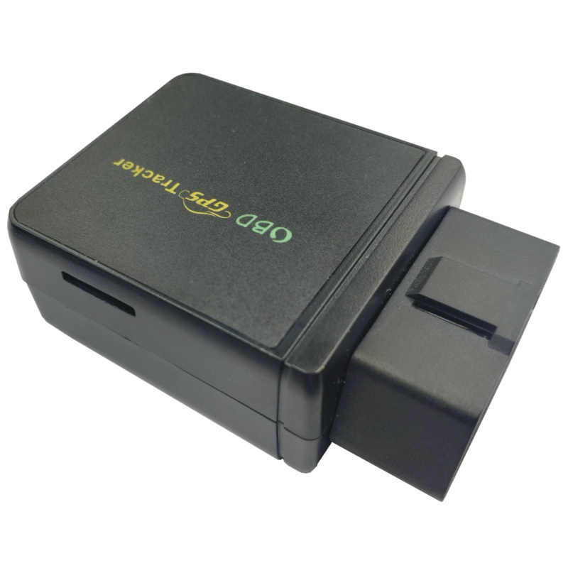

# Carscop - CCTR-830G-4G

El CCTR-830G-4G es un rastreador GPS compacto con conector OBD II diseñado para seguimiento plug and play y diagnóstico básico del vehículo. Combina posicionamiento GNSS dual con asistencia A-GPS para ofrecer fijaciones de ubicación confiables y está concebido para acceder a información de diagnóstico y telemetría a través de la interfaz del vehículo sin requerir cableado adicional. La unidad está pensada para despliegues rápidos en vehículos individuales o instalaciones de flota donde la instalación sencilla y la supervisión continua son prioritarias.

Como dispositivo compatible con Plaspy, el CCTR-830G-4G integra la ubicación del vehículo, los códigos de falla (DTC) y telemetría básica en Plaspy para visibilidad en tiempo real, alertas configurables e informes históricos. Su batería de respaldo, capacidades de gestión remota y opciones de protocolo lo convierten en una alternativa práctica cuando usted necesita monitoreo centralizado y gestión escalable de dispositivos en la plataforma Plaspy.

## Características principales

- Factor de forma OBD II plug and play para instalación rápida y monitoreo centralizado con Plaspy.
- Operación GNSS dual que incluye GPS y BeiDou con asistencia A-GPS para posicionamiento más rápido.
- Lectura de DTC en el dispositivo y acceso a datos del bus CAN para exponer diagnósticos y telemetría del vehículo.
- Batería de respaldo integrada para alertas por manipulación y cortes de energía, y para proteger contra pérdidas breves de alimentación.
- Intervalos de subida configurables e historial de rastreo offline para preservar datos de ubicación cuando la red celular no está disponible.
- Gestión remota de firmware y protocolos para simplificar el despliegue y la integración con la plataforma.
- Opciones de bandas celulares personalizables para ajustarse a los requisitos de redes móviles regionales.

## Cómo funciona con Plaspy

Cuando se usa con Plaspy, el CCTR-830G-4G transmite ubicación y telemetría del vehículo mediante una conexión celular, de modo que administradores y operadores de flota pueden supervisar activos en tiempo real, revisar códigos de diagnóstico y configurar alertas desde una única plataforma. Plaspy ingiere los datos del dispositivo y los pone a disposición para mapeo, generación de informes y flujos operativos.

- Actualizaciones de ubicación y telemetría en tiempo real con intervalos configurables para supervisión de flota en vivo.
- Informes de DTC y estado del vehículo disponibles en Plaspy para revisión de diagnósticos y análisis de tendencias.
- Alertas por corte de energía y manipulación basadas en el estado de la batería de respaldo para apoyar la respuesta antirrobo.
- Almacenamiento offline de recorridos cuando el servicio celular se interrumpe y reanudación automática de las subidas al restablecerse la conectividad.
- Reglas de alerta centralizadas, geovallas e informes históricos para respaldar operaciones y seguimiento de cumplimiento.

## Casos de uso típicos

- Gestión de flotas para autos, taxis, vehículos de alquiler y flotas comerciales ligeras que requieren visibilidad de ubicación y diagnóstico.
- Monitoreo antirrobo donde las alertas por corte de energía y la retención de rastros offline ayudan en la recuperación del vehículo.
- Monitoreo de la salud del vehículo y reportes de diagnóstico básicos para la planificación de mantenimiento preventivo.
- Telemetría operativa y supervisión del conductor para mejorar rutas, utilización y tiempos de respuesta.
- Despliegues B2B y programas de distribución donde se requieren gestión remota y personalización de protocolos.

## Por qué elegir este rastreador con Plaspy

El CCTR-830G-4G es una opción práctica para organizaciones que buscan rastreo vehicular plug and play con visibilidad diagnóstica integrada en Plaspy. Su factor de forma OBD II reduce el tiempo de instalación, mientras que la lectura de diagnósticos en el dispositivo y la retención de recorridos offline ayudan a mantener la continuidad de los datos tanto para la supervisión operativa como para la respuesta ante incidentes. Las funciones de gestión remota y las opciones de protocolo personalizables facilitan despliegues a gran escala y el mantenimiento continuo.

Para organizaciones que usan Plaspy, combinar este rastreador ofrece una forma sencilla de integrar seguimiento de ubicación, diagnóstico vehicular básico y detección de manipulación en un único flujo de monitoreo e informes. Conozca más sobre Plaspy en el sitio principal https://www.plaspy.com y tenga en cuenta que las especificaciones del producto, la disponibilidad y los datos del fabricante pueden cambiar con el tiempo; verifique las especificaciones actuales en el sitio oficial de Carscop http://www.carscop.com/.
