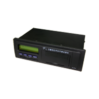

# Castel - MPIP-618W-YB

El rastreador GPS Castel MPIP-618W-YB es un dispositivo de registro de datos de viaje para vehículos que permite un seguimiento eficaz en tiempo real de la ubicación del vehículo, la velocidad y varios estados. Utiliza la red de telecomunicaciones inalámbricas para enviar la información de localización del vehículo, la velocidad de carrera y las alertas \(como exceso de velocidad, fatiga y alerta de emergencia\) al centro de monitoreo en tiempo real.

Este rastreador GPS ofrece una serie de características destacadas, como seguimiento en tiempo real, comunicación a través de GPRS/SMS, función de grabación de viaje, análisis del comportamiento de conducción, alerta de baja tensión de la fuente de alimentación principal, alerta por consumo de combustible anormal, alerta de encendido ilegal del vehículo y alerta de apertura ilegal de puertas, corte remoto de energía o aceite, alerta SOS, almacenamiento ciego/área de reenvío, estadísticas de kilometraje, funciones de mantenimiento local, alerta de exceso de velocidad, alerta por fatiga de conducción, captura de información multimedia, monitoreo de voz y TTS.

Este rastreador GPS es ideal para su uso en logística, vehículos de ingeniería, productos peligrosos, taxis y transporte público.

Especificaciones técnicas:

- Dimensión: 188mm \* 100mm \* 60mm
- Peso: 620g
- Apalancamiento de protección: Aleación de aluminio
- Voltaje de operación: 9-36 VDC
- Temperatura de trabajo: -30 ℃ a 70 ℃
- Corriente de trabajo: &lt;10013.8V
- Precisión de localización GPS: &lt;15m
- Precisión de velocidad GPS: 0,1 m / s
- Frecuencia GPS: 1575.42MHz
- Temperatura de almacenamiento: -40 ℃ ~ +85 ℃
- Humedad relativa: 5% ~ 95% \(No Frost\)
- Batería de reserva: batería de 3,7 V / 500 Li-ion
- Tiempo de adquisición GPS: Arranque en frío &lt;38s, inicio en caliente &lt;25s, Hot Start &lt;1s

