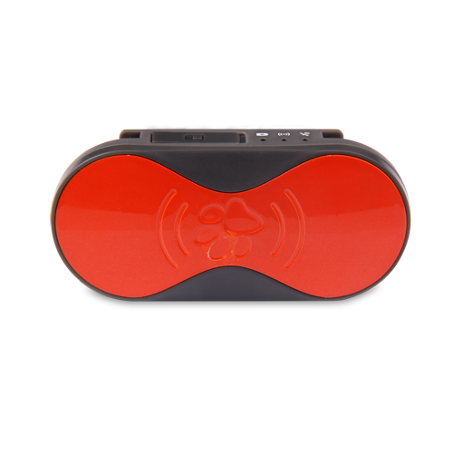

# Castel - PT-690

El Castel PT-690 es un rastreador GPS portátil pensado para mascotas. Su formato compacto y liviano lo hace adecuado para colocarlo en un collar o arnés, mientras que sus funciones integradas de posicionamiento permiten a los propietarios localizar y supervisar a sus animales. El dispositivo utiliza conectividad GSM GPRS y posicionamiento satelital para ofrecer actualizaciones de ubicación en tiempo real, y cuenta con modos de posicionamiento dual (GPS y A-GPS) para mejorar la precisión. Una aplicación complementaria para Android e iOS y funciones de alertas por geocerca facilitan recibir notificaciones cuando la mascota abandona un área designada.

Como dispositivo compatible con Plaspy, el PT-690 puede enviar información de ubicación y estado a la plataforma de monitoreo de flotas y activos de Plaspy, otorgando visibilidad centralizada a propietarios y operadores. Esa integración permite mostrar posiciones en vivo en un mapa, conservar el historial de movimientos para revisión y generar alertas mediante los flujos de trabajo de Plaspy. El tamaño reducido del PT-690, su carcasa resistente de ABS PC y su autonomía de varios días en modo espera lo convierten en una opción práctica para casos de rastreo de mascotas que se benefician de los informes y capacidades de supervisión de Plaspy.

## Puntos clave

- Rastreador GPS portátil diseñado para fijarse a collares o arneses
- Dimensiones compactas y bajo peso para interferir mínimamente con la mascota
- Receptor GPS de alta sensibilidad con modos duales GPS y A-GPS para mayor precisión
- Conectividad GSM GPRS y posicionamiento satelital para actualizaciones de ubicación en tiempo real
- Aplicaciones móviles para Android e iOS con capacidades de alertas por geocerca
- Carcasa resistente de ABS PC y larga autonomía en espera para uso diario
- Bajo consumo energético y alerta de voltaje bajo para ayudar a mantener el dispositivo operativo

## Cómo funciona con Plaspy

Cuando se usa con Plaspy, el PT-690 proporciona información oportuna de posición y estado que Plaspy muestra y archiva para su uso operativo. Plaspy consolida las señales de los dispositivos para que los dueños de mascotas o los operadores de servicios puedan monitorear múltiples rastreadores desde una sola interfaz y actuar según las alertas y los datos de movimiento.

- Ver la ubicación en vivo y el estado actual del dispositivo en el mapa de Plaspy
- Recibir y gestionar alertas de geocerca y notificaciones de batería baja a través de Plaspy
- Acceder al historial de ubicaciones y reproducir rutas para investigaciones e informes
- Usar las herramientas de reportes de Plaspy para resumir la actividad y supervisar el tiempo de actividad del dispositivo
- Centralizar múltiples unidades PT-690 junto con otros dispositivos compatibles para facilitar la supervisión

## Casos de uso habituales

- Rastrear la ubicación de la mascota durante paseos y actividades al aire libre
- Supervisar mascotas que deambulan en casa o en patios mediante alertas por geocerca
- Llevar registros en servicios de hospedaje o cuidado de mascotas que gestionan varios animales
- Localizar rápidamente una mascota perdida mediante actualizaciones de posición en vivo
- Monitoreo temporal durante viajes o visitas a lugares desconocidos

## Por qué elegir este rastreador con Plaspy

El Castel PT-690 es un rastreador simple y enfocado en mascotas que se integra bien con Plaspy cuando necesita visibilidad centralizada y alertas sencillas. Su equilibrio entre diseño compacto, modos de posicionamiento precisos y alertas mediante app lo hace útil para propietarios y pequeñas operaciones de servicios para mascotas que requieren información continua de ubicación. Al integrarlo con Plaspy, las unidades PT-690 pueden administrarse junto a otros dispositivos, lo que facilita la supervisión y los informes en conjuntos mixtos de activos.

Si necesita un rastreador ligero para mascotas y desea gestionar los datos de ubicación de forma centralizada, el PT-690 con Plaspy ofrece una combinación sensata de portabilidad del dispositivo y supervisión a nivel de plataforma. Para obtener más información sobre la gestión de dispositivos con Plaspy visite https://www.plaspy.com. Las especificaciones del producto, la disponibilidad y los datos del fabricante pueden cambiar con el tiempo por lo que verifique las especificaciones actuales en el sitio del fabricante http://www.castelecom.com/
