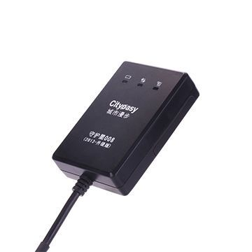

# Cityeasy - 008

El rastreador GPS para coche Cityeasy 008 es una excelente opción para aquellos que desean tener un control total sobre la ubicación de su vehículo. Con la capacidad de proporcionar una posición en tiempo real a través de la tecnología LBS / GPS, este rastreador garantiza una precisión y confiabilidad excepcionales en la localización de su vehículo en todo momento.

Una de las características destacadas del Cityeasy 008 es su capacidad para enviar alertas de vibración, lo que significa que recibirá una notificación inmediata en caso de que su vehículo se mueva sin su autorización. Esto es especialmente útil para proteger su vehículo contra robos o usos no autorizados.

Otra característica impresionante del Cityeasy 008 es su capacidad para rastrear y almacenar rutas históricas. Esto le permite revisar y analizar los movimientos de su vehículo en un período de tiempo determinado, lo que puede ser útil para el seguimiento de flotas o para tener un registro detallado de los viajes realizados.

Además, el Cityeasy 008 cuenta con una clasificación de resistencia al agua IP67, lo que significa que está protegido contra la inmersión en agua hasta 1 metro de profundidad durante un máximo de 30 minutos. Esto garantiza que el rastreador funcione correctamente incluso en condiciones climáticas adversas o en situaciones donde pueda estar expuesto a líquidos.

En resumen, el rastreador GPS para coche Cityeasy 008 es una opción confiable y versátil para aquellos que desean tener un control total sobre la ubicación de su vehículo. Con características como la posición en tiempo real, alertas de vibración, rutas históricas y resistencia al agua, este rastreador ofrece una solución completa para la seguridad y el seguimiento de su vehículo.

