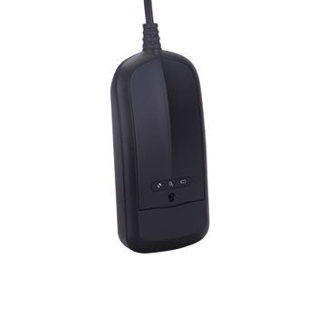

# Cityeasy - 200

El rastreador GPS Cityeasy 200 es un dispositivo confiable y eficiente diseñado para rastrear la ubicación de vehículos en tiempo real. Con su capacidad de rastreo GPS y LBS, este rastreador proporciona una precisión excepcional al determinar la posición exacta del vehículo en todo momento.

Una de las características destacadas del Cityeasy 200 es su capacidad para enviar alertas en caso de vibración, barreras geográficas o desplazamiento no autorizado. Esto permite a los propietarios de vehículos recibir notificaciones instantáneas en sus dispositivos móviles en caso de cualquier actividad sospechosa.

Otra característica importante de este rastreador es su capacidad para almacenar y relé el historial de rutas recorridas. Esto es especialmente útil para aquellos que desean realizar un seguimiento de los movimientos pasados ​​de su vehículo o para aquellos que necesitan acceder a información de ubicación anterior.

Además, el Cityeasy 200 cuenta con una clasificación de resistencia al agua IP67, lo que significa que es resistente al agua y puede soportar condiciones climáticas adversas. Esto garantiza que el rastreador funcione de manera óptima incluso en entornos húmedos o lluviosos.

En resumen, el rastreador GPS Cityeasy 200 es una opción confiable y versátil para aquellos que desean mantener un control preciso sobre la ubicación de sus vehículos. Con su capacidad de rastreo en tiempo real, alertas personalizadas y resistencia al agua, este rastreador es una herramienta valiosa para la seguridad y el monitoreo de vehículos.

### Características destacadas:

- Rastreo GPS y LBS en tiempo real
- Alertas de vibración, barreras geográficas y desplazamiento
- Historial de rutas almacenado y relé
- Clasificación de resistencia al agua IP67

