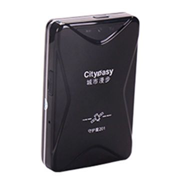

# Cityeasy - 201

El Cityeasy 201 es un rastreador GPS compacto para automóviles diseñado para ofrecer monitoreo de ubicación confiable y funciones básicas de seguridad para vehículos particulares y pequeñas flotas. Integra posicionamiento LBS y GPS en tiempo real junto con registro de historial de rutas para que los operadores tengan visibilidad sobre los movimientos y recorridos pasados.

Como dispositivo compatible con Plaspy, el Cityeasy 201 puede enviar información de ubicación y alertas a Plaspy para monitoreo centralizado y supervisión operativa. Sus alertas por vibración, reporte de rutas, diseño resistente al agua y batería extraíble lo convierten en una opción práctica para emparejar con Plaspy y mantener seguimiento continuo del vehículo y detección de incidentes.

## Características principales

- Posicionamiento en tiempo real por LBS y GPS para visibilidad actualizada de la ubicación
- Sistema de alertas por vibración para notificar movimiento o posible manipulación
- Registro y reproducción de rutas para revisar recorridos y trayectos anteriores
- Certificación IP67 para rendimiento fiable en exteriores
- Batería extraíble de 5000 mAh para operación extendida sin recarga frecuente
- Adecuado tanto para vehículos individuales como para pequeñas flotas

## Cómo funciona con Plaspy

Al integrarse con Plaspy, el Cityeasy 201 suministra actualizaciones de ubicación y alertas que Plaspy presenta en su panel para facilitar el monitoreo, la generación de informes y el uso operativo. Plaspy procesa los datos del dispositivo para que gestores de flotas y propietarios puedan ver la posición, acceder al historial de rutas y recibir notificaciones de actividad desde una sola plataforma.

- Visualización centralizada de la ubicación en vivo de cada dispositivo Cityeasy 201 dentro de Plaspy
- Visualización y exportación del historial de rutas para apoyar revisiones operativas y auditorías
- Enrutamiento de alertas para que las notificaciones por vibración lleguen a los operadores en Plaspy
- Visión de conjunto a nivel de flota para monitorear varias unidades Cityeasy 201 simultáneamente
- Informes y registros que combinan eventos del dispositivo e historial de movimiento para análisis

## Casos de uso típicos

- Seguimiento de vehículos en tiempo real para autos particulares y vehículos de empresa
- Monitoreo de flotas para grupos pequeños de vehículos comerciales
- Supervisión de seguridad y detección de manipulación mediante alertas por vibración
- Revisión de rutas de conductores para planificación y optimización operativa
- Despliegues temporales de seguimiento aprovechando la batería extraíble para colocación flexible

## Por qué elegir este rastreador con Plaspy

El Cityeasy 201 ofrece un conjunto equilibrado de funciones que cubre necesidades comunes de rastreo: actualizaciones consistentes de ubicación, alertas básicas de seguridad e historial de rutas para revisión posterior. Unido a Plaspy, estas capacidades se vuelven accionables mediante monitoreo centralizado, gestión de alertas e informes diseñados tanto para propietarios individuales como para operadores de flotas.

Si usted desea evaluar cómo encaja el Cityeasy 201 en su entorno de rastreo, Plaspy puede proporcionar la capa de plataforma para recolectar y presentar los datos del dispositivo junto con otra información de la flota. Learn more about Plaspy on the main website https://www.plaspy.com. Product specifications, availability, and manufacturer details can change over time so please verify current specifications with the official Cityeasy documentation.
