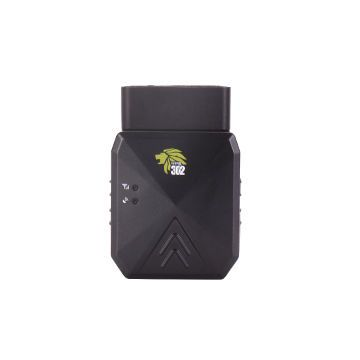

# Cityeasy - 302

El Cityeasy 302 es un rastreador GPS para automóviles diseñado para ofrecer monitoreo continuo de la ubicación del vehículo y alertas básicas de seguridad. Soporta reportes de posición tanto por LBS como por GPS para seguimiento en tiempo real, incluye alertas por movimiento y manipulación como exceso de velocidad, vibración, desplazamiento y corte de alimentación, y registra rutas históricas para su revisión posterior. El dispositivo cuenta con clasificación IP67, lo que le permite operar en condiciones húmedas, y se describe como de instalación gratuita y encendido sencillo.

Como dispositivo compatible con Plaspy, el Cityeasy 302 puede enviar información de ubicación y alertas a la plataforma Plaspy para visibilidad centralizada y supervisión de la flota. Los usuarios de Plaspy pueden ver posiciones en vivo, revisar rutas históricas y recibir las alertas del rastreador dentro del entorno de Plaspy, ayudando en la vigilancia, la respuesta a incidentes y los flujos de trabajo de informes. La compatibilidad hace del 302 una opción práctica para equipos que desean combinar un rastreador compacto con las funciones de monitoreo y gestión de Plaspy.

## Principales características

- Rastreador GPS enfocado en automóviles con seguimiento en tiempo real por LBS y GPS
- Detección de manipulación mediante alerta por corte de alimentación para notificar interrupciones de energía
- Alertas habituales en vehículos como exceso de velocidad, vibración, geocerca y desplazamiento
- Registro y retransmisión de rutas históricas para revisión y análisis de uso
- Clasificación IP67 para operación confiable en condiciones húmedas
- Instalación gratuita y encendido sencillo para simplificar el despliegue inicial

## Cómo funciona con Plaspy

Al integrarse con Plaspy, el Cityeasy 302 envía puntos de ubicación y eventos de alerta para que los operadores puedan supervisar los vehículos desde una única plataforma. Plaspy recoge los datos del rastreador y los presenta junto con otros activos para respaldar decisiones operativas y la supervisión.

- Visualización en vivo de la ubicación de vehículos individuales para seguimiento en tiempo real
- Reenvío de eventos y alertas para que exceso de velocidad, manipulación y movimientos aparezcan en Plaspy
- Reproducción de rutas históricas dentro de Plaspy para revisión de viajes y análisis operativo
- Gestión de eventos de geocerca para notificaciones basadas en áreas y comprobaciones de políticas
- Informes y registros consolidados que incluyen eventos del rastreador e historial posicional

## Casos de uso típicos

- Monitoreo de la ubicación de vehículos para flotas pequeñas y medianas
- Detección de robo o manipulación mediante alertas de corte de energía y vibración
- Análisis de rutas para vehículos de reparto y servicio mediante reproducción histórica
- Monitoreo de seguridad y cumplimiento con alertas de exceso de velocidad y comprobaciones de geocerca
- Protección de activos para vehículos que operan en condiciones climáticas variables

## Por qué elegir este rastreador con Plaspy

El Cityeasy 302 combina un conjunto de funciones concisas con una construcción impermeable, lo que lo hace práctico para organizaciones que necesitan seguimiento esencial de vehículos y alertas básicas de seguridad. Su capacidad de registrar rutas históricas y los tipos comunes de alertas encajan bien con las funciones de Plaspy para visibilidad, notificaciones y revisión posterior de incidentes.

Dado que la descripción del dispositivo se centra en funciones centrales de seguimiento y alertas, es una buena opción cuando la simplicidad y la fiabilidad en el reporte posicional son prioridades. Las organizaciones deben evaluar si el conjunto de funciones del 302 se ajusta a sus necesidades operativas y usar Plaspy para centralizar el monitoreo y la generación de informes de los rastreadores que desplieguen.

Si desea conocer más sobre Plaspy y cómo se integran los rastreadores compatibles con la plataforma visite https://www.plaspy.com. Las especificaciones del producto, la disponibilidad y los detalles del fabricante pueden cambiar con el tiempo, por lo que se recomienda verificar la información técnica y la compatibilidad actual en la documentación oficial de Cityeasy antes de comprar o desplegar.
