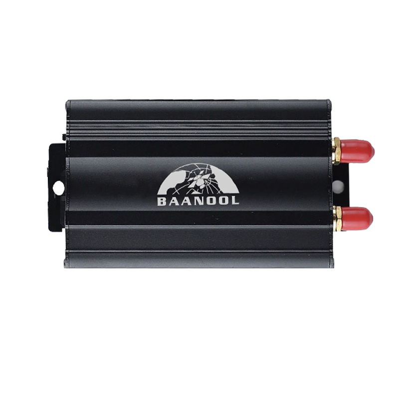

# Coban - BN-103A

El BN-103A, rastreador GPS inteligente para montaje en vehículo, es compatible con Plaspy y está diseñado para un seguimiento en tiempo real fiable, gestión de flotas y protección antirrobo. Diseñado para una instalación directa en vehículos de 12–24V, el BN-103A combina posicionamiento GNSS de alta sensibilidad, conectividad GSM/GPRS de múltiples bandas y entradas de alarma configurables para entregar los datos de telemetría y eventos que esperan los operadores de flotas modernos en soluciones integradas con Plaspy.

Diseñado para automóviles privados, flotas logísticas, vehículos de ingeniería y supervisión de alquiler, el BN-103A ofrece actualizaciones de ubicación oportunas, estado de encendido y de las puertas, y un conjunto completo de alarmas. Cuando se integra con la plataforma Plaspy, este rastreador habilita seguimiento en tiempo real, reproducción de trayectos, geocerca y flujos de control remoto que mejoran la seguridad del vehículo, la eficiencia operativa y el control de riesgos.

## Aspectos clave

- Compatible con Plaspy: soporte nativo para la integración con plataformas de rastreo y aplicaciones móviles para seguimiento en tiempo real y generación de informes.
- GNSS de alta precisión: receptor sensible \(-165 dBm\) y una precisión típica de GPS de alrededor de 5 metros para datos de ubicación fiables.
- Amplio soporte de red: 2G GSM/GPRS 850/900/1800/1900 MHz \(cuatro bandas, red completa\) con transporte TCP/UDP/SMS.
- Alarmas y telemetría integrales: SOS, sobrevelocidad, movimiento, puerta abierta, encendido ACC, golpe, batería baja y alertas de geocerca.
- Funciones de control remoto: supervisión de voz a distancia \(escucha\), corte remoto de combustible/energía para inmovilización e intervención de emergencia.
- Informes inteligentes y gestión de energía: modos de informe de movimiento y en reposo, además de modo de sueño inteligente para ahorrar energía del vehículo mientras se mantiene la alerta.
- Conjunto robusto para vehículo: carcasa compacta para montaje en vehículo, batería de respaldo integrada y soporte para antena externa para una instalación estable en el vehículo.

## Cómo funciona con Plaspy

Cuando está conectado a Plaspy, el BN-103A transmite correcciones GNSS y telemetría sobre TCP/UDP/SMS para que los despachadores y gestores vean ubicaciones en tiempo real y alertas basadas en eventos. Plaspy ingiere la posición del dispositivo, estados de alarma y entradas configurables para generar paneles de control, informes y notificaciones automáticas. Esto crea una visión unificada para la gestión de flotas, la respuesta ante robos y el análisis operativo.

- Actualizaciones de ubicación y telemetría en tiempo real enviadas por TCP/UDP/SMS para su visualización inmediata en Plaspy.
- Encendido \(ACC\), estado de puertas y alarmas reportados a Plaspy para reproducción de eventos y notificaciones basadas en reglas.
- Monitoreo de combustible opcional: consultas de nivel de combustible y alarmas de detección de combustible disponibles cuando se conecta un sensor externo de combustible.
- Capacidad de inmovilización remota mediante comandos de corte de combustible o energía emitidos a través de Plaspy.
- Integración de sensores Bluetooth: Plaspy puede combinar la telemetría del BN-103A con datos de sensores Bluetooth si la instalación incluye una puerta de enlace BLE o accesorio compatible.

## Visión técnica

| Conectividad | 2G GSM/GPRS 850/900/1800/1900 MHz \(4-band full-network\) |
| --- | --- |
| Bands | 850/900/1800/1900 MHz |
| Alimentación y batería | Alimentación directa del vehículo 12–24V; batería de respaldo Li‑ion interna recargable de 3,7V 300 mAh |
| Interfaces | Soporte para antena GPS y GSM externa; entrada de encendido ACC; entradas de alarma; accesorios opcionales \(sirena, sensor de combustible, sensor de golpe\) |
| GNSS | Receptor GNSS de alta sensibilidad \(-165 dBm\); precisión típica ~5 m; TTFF ~45 s en frío, 35 s en cálido, 1 s en caliente |
| Bluetooth | No incorporado — Plaspy puede agregar datos de sensores BLE si una puerta de enlace BLE o accesorio los suministra a la plataforma |
| Gestión remota | Compatible con la integración de la plataforma y uso de la app móvil para seguimiento en vivo, reproducción de ruta, geocercas y control remoto |
| Protocolos de transporte | TCP, UDP, SMS |
| Ambiente | Operación -20°C a +45°C; almacenamiento -40°C a +85°C; humedad 5%–95% sin condensación |
| Factor de forma | Carcasa compacta para montaje en vehículo, 83 × 54 × 26 mm; peso ≈ 120 g |
| Características especiales | Monitoreo de voz remoto \(escucha\); informes de sueño inteligente; alarmas configurables y soporte de geocerca |

## Casos de uso

- Antirrobo de flota e inmovilización: seguimiento en tiempo real y corte remoto de combustible/energía para evitar usos no autorizados.
- Gestión de flotas de logística y transporte: seguimiento en tiempo real, alertas de sobrevelocidad y reproducción de trayectos para mejorar la eficiencia de las rutas.
- Supervisión de vehículos en alquiler y arrendamiento: notificaciones de eventos ACC y alarmas de geocerca para hacer cumplir las condiciones de alquiler y recuperar los vehículos.
- Monitorización de equipos y vehículos públicos: integrar telemetría y eventos de alarma en Plaspy para mantenimiento proactivo y respuesta a incidentes.
- Optimización de la gestión de combustible: consultar sensores de combustible externos y recibir alarmas de detección de combustible para controlar pérdidas y monitorizar el consumo.

## Por qué elegir este tracker con Plaspy

El BN-103A ofrece un equilibrio práctico entre posicionamiento fiable, telemetría esencial del vehículo y amplia compatibilidad de plataforma que lo convierte en una opción sólida para implementaciones con Plaspy. Su GNSS de alta sensibilidad, conectividad GSM de múltiples bandas y alarmas configurables proporcionan el seguimiento en tiempo real y las capacidades anti-robo que los gestores de flotas requieren. Dado que admite protocolos de transporte comunes \(TCP/UDP/SMS\) y se integra con aplicaciones móviles y plataformas de rastreo, el BN-103A se integra en los flujos de trabajo de Plaspy para alertas, informes y control remoto sin necesidad de personalización compleja.

Para organizaciones centradas en la gestión de flotas, control de riesgos automotrices y supervisión de alquiler, el BN-103A ofrece telemetría fiable \(encendido, puerta, sobrevelocidad, golpe\), monitoreo opcional de combustible y inmovilización remota: características que se traducen directamente a los dashboards en tiempo real de Plaspy, informes de telemetría y reglas de notificación. Combinado con Plaspy, este rastreador ayuda a reducir los tiempos de respuesta, reforzar los controles anti-robo y ofrecer una visión operativa más clara en las flotas de vehículos.

