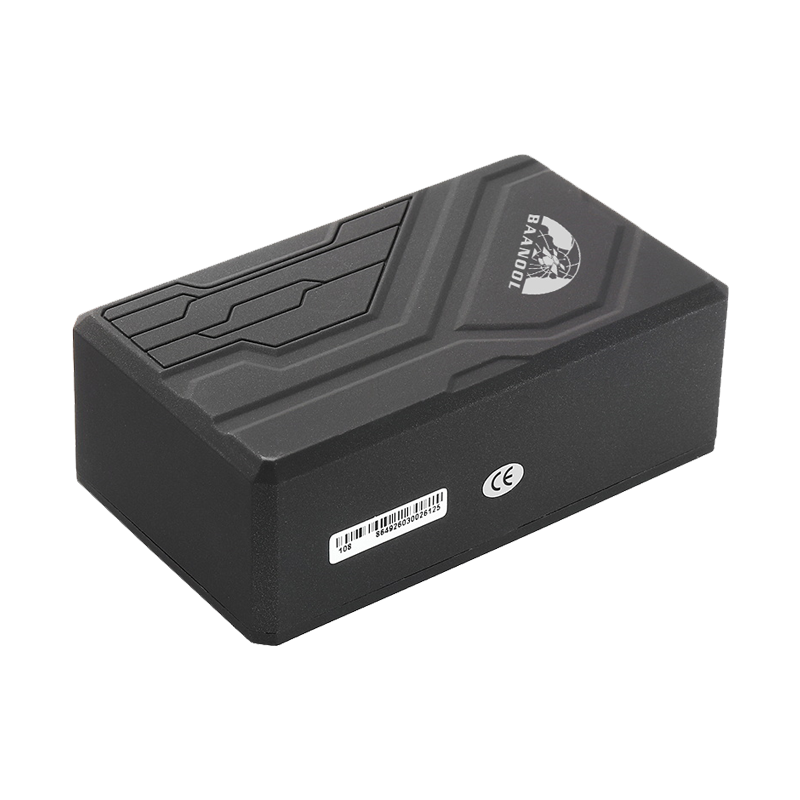

# Coban - BN-108B

El BN-108B es un rastreador GPS 2G portátil de Coban diseñado para la gestión de activos móviles de larga duración y la protección antirrobo. Combina una carcasa magnética resistente para montaje discreto con una batería recargable de gran capacidad, proporcionando tiempos de espera prolongados y seguimiento extendido para vehículos, remolques, autos de alquiler y equipos portátiles de alto valor. El dispositivo ofrece modos de reporte configurables y un conjunto de funciones de seguridad pensadas para permitir monitoreo continuo sin necesidad de cableado permanente.

Como dispositivo compatible con Plaspy, el BN-108B puede integrarse con Plaspy para ofrecer posiciones en tiempo real, alertas de eventos y recorridos históricos para flotas y gestión de activos. Su soporte para métodos de transporte celular comunes y estrategias de reporte flexibles facilita la integración, permitiendo a los usuarios de Plaspy equilibrar la frecuencia de actualizaciones y la autonomía de la batería mientras emplean alarmas y controles remotos para respaldar procesos antirrobo y operativos.

## Características principales

- Batería recargable de gran capacidad que brinda mayor tiempo de espera y seguimiento prolongado entre cargas.
- Carcasa magnética resistente para una sujeción rápida y discreta a activos móviles y vehículos.
- Seguimiento en tiempo real compatible con Plaspy usando métodos de transporte celular estándar para actualizaciones de posición en vivo.
- Múltiples estrategias de reporte, incluyendo tiempo real, modo Smart activado por movimiento y modo de ahorro de energía programado, para equilibrar autonomía y frecuencia de rastreo.
- Funciones de seguridad como alarma por desconexión de alimentación externa, alarma SOS e inmovilización remota para apoyar flujos de trabajo antirrobo.
- Armado y desarmado automático por Bluetooth y monitoreo de voz remoto para control local y consciencia situacional.
- Capacidades telemáticas estándar como alertas de geocercas, reproducción de recorridos, alarmas de movimiento o golpes y notificaciones de batería baja.

## Cómo funciona con Plaspy

Cuando se integra con Plaspy, el BN-108B actúa como un nodo de telemetría compacto que envía datos de posición y eventos a Plaspy para visualización, alertas y reproducción histórica. Plaspy procesa los informes del dispositivo y los presenta como marcadores en el mapa en tiempo real, trayectos en la línea de tiempo y eventos de alarma para que gestores de flota y equipos de seguridad puedan monitorear activos y responder a incidentes.

- Actualizaciones de ubicación en vivo y visualización de rutas en Plaspy usando los reportes del rastreador para visibilidad operativa continua.
- Reenvío inmediato de alarmas y eventos como desconexión de alimentación externa, SOS, alertas de movimiento y golpes, violaciones de geocerca y avisos de batería baja.
- Integración de inmovilización remota y manejo de SOS dentro de los flujos de trabajo de Plaspy para apoyar respuestas y recuperaciones coordinadas.
- Reproducción de recorridos y análisis histórico de posiciones en Plaspy usando las marcas de tiempo y posiciones almacenadas que reporta el dispositivo.
- Informes de estado por armado y desarmado Bluetooth para que los cambios de control local sean visibles dentro de los paneles de Plaspy.

## Casos de uso típicos

- Rastreo de flotas y activos pesados donde la sujeción discreta y la larga autonomía facilitan el monitoreo de vehículos, remolques y equipos de contratistas.
- Protección antirrobo con alertas por desconexión de alimentación externa, manejo de SOS e inmovilización remota para respuesta rápida.
- Monitoreo de autos de alquiler y movilidad compartida para capturar historial de ubicaciones, alertas de movimiento y apoyar investigaciones de seguridad.
- Protección de equipos portátiles como herramientas, generadores y otros artículos de alto valor que requieren seguimiento temporal pero confiable.
- Monitoreo encubierto a largo plazo donde son necesarios modos de ahorro de energía y gran capacidad de batería sin instalación permanente.

## Por qué elegir este rastreador con Plaspy

El BN-108B es una opción práctica para organizaciones que necesitan seguimiento portátil y de larga autonomía con gestión remota sencilla. Su formato magnético y la batería de gran tamaño reducen tiempos de instalación y mantenimiento, mientras que los modos de reporte configurables permiten ajustar el equilibrio entre frecuencia de actualizaciones y duración de la batería según las necesidades operativas. Las capacidades orientadas a la seguridad, como las alertas por desconexión de alimentación externa, SOS e inmovilización, agregan controles útiles para casos de uso antirrobo cuando se combinan con las herramientas de alerta y respuesta de Plaspy.

Para despliegues que requieren sujeción discreta, larga autonomía y alertas integradas dentro de una plataforma de gestión de flotas o activos, el BN-108B ofrece una solución compacta que se integra de forma natural con Plaspy para seguimiento en vivo, monitoreo de eventos y reproducción histórica. Para saber más sobre cómo Plaspy puede funcionar con dispositivos como el BN-108B visite https://www.plaspy.com. Las especificaciones del producto, disponibilidad y detalles del fabricante pueden cambiar con el tiempo, así que verifique las especificaciones y documentación actuales con el fabricante en https://www.coban.net/.
