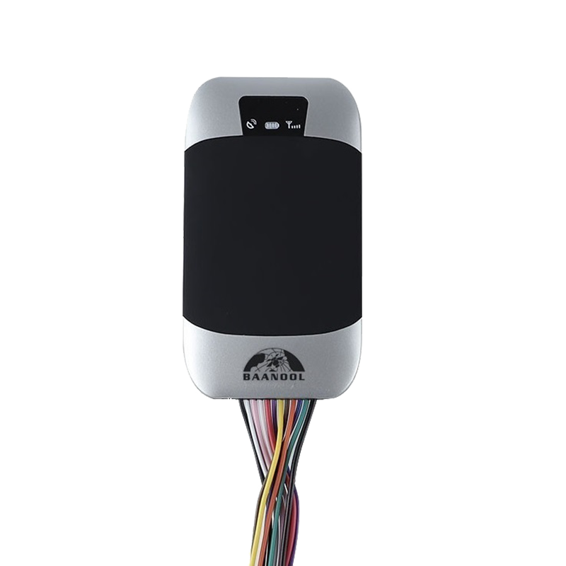

# Coban - BN-303F

El BN-303F, también listado como modelo 303FG, es un rastreador GPS compacto para montaje en vehículo diseñado para despliegues confiables en escenarios de antirrobo, gestión de flotas y seguimiento en tiempo real. Pensado para instalaciones ocultas en automóviles, camiones comerciales y vehículos de alquiler, el BN-303F ofrece posicionamiento GNSS, telemetría continua y alertas configurables para mantener a administradores de flota y propietarios informados y en control.

Como dispositivo compatible con Plaspy, el BN-303F se integra con los flujos de telemetría en la nube y los procesos de monitoreo para proporcionar visibilidad en vivo y supervisión operativa. Su comunicación 2G GSM GPRS, modos de reporte basados en eventos y capacidades de control remoto lo convierten en una opción práctica para emparejar con Plaspy y gestionar actualizaciones de ubicación, manejo de alertas y flujos de inmovilización en flotas administradas y esquemas de seguridad vehicular.

## Características principales

- Compatible con Plaspy para seguimiento en tiempo real y reproducción histórica de trayectos.
- Conjunto de alarmas configurables que incluye SOS, detección de impacto/movimiento, geocercas, apertura de puertas y encendido.
- Opciones de control remoto para corte de combustible o alimentación, que facilitan flujos de inmovilización.
- Factor de forma compacto y discreto, adecuado para autos particulares y vehículos comerciales.
- Posicionamiento GNSS continuo para reportes de ubicación confiables en entornos de flota.
- Modos de reporte flexibles y mecanismos de respaldo en comunicaciones para entrega consistente de telemetría.

## Cómo funciona con Plaspy

Cuando se conecta a Plaspy, el BN-303F transmite telemetría de ubicación y estado para que la plataforma muestre posiciones en vivo, reproduzca recorridos y genere alertas. Plaspy procesa mensajes basados en eventos e informes del dispositivo para habilitar monitoreo, reportes y respuestas operativas en toda la flota.

- Actualizaciones de ubicación en tiempo real y reproducción de trayectos para visibilidad operativa y revisión de rutas.
- Alertas basadas en eventos como SOS, violaciones de geocercas, y cambios en el estado de encendido o puertas para notificar a los operadores.
- Acciones de inmovilización y control remoto disparadas desde Plaspy cuando el dispositivo y la instalación lo permiten.
- Telemetría consolidada en Plaspy para paneles de flota, enrutamiento de alertas y seguimiento de incidentes.
- Informes históricos y datos exportables que apoyan cumplimiento, planificación de mantenimiento y análisis operativo.

## Casos de uso típicos

- Gestión de flotas pequeñas y medianas que requieren seguimiento continuo y historial de rutas.
- Protección antirrobo de vehículos con instalación oculta, alertas SOS y opciones de inmovilización remota.
- Monitoreo de vehículos de renta y leasing mediante geocercas y alarmas de encendido y puertas para proteger activos.
- Supervisión logística y de rutas para confirmación de entregas y validación de viajes en operaciones de distribución.
- Control de vehículos corporativos para apoyar programación de mantenimiento y revisión del comportamiento de conductores.

## Por qué elegir este rastreador con Plaspy

El BN-303F es un terminal telemático práctico que se integra bien con las funcionalidades en la nube de Plaspy. Su tamaño compacto, posicionamiento GNSS y reportes basados en eventos ofrecen las capacidades esenciales que los operadores de flota necesitan para seguimiento, alertas y respuesta remota. Combinado con los paneles, alertas y reportes de Plaspy, el dispositivo facilita la supervisión diaria de la flota y las medidas antirrobo sin añadir complejidad innecesaria.

Para obtener más información sobre Plaspy y cómo se soportan los dispositivos compatibles, visite https://www.plaspy.com. Las especificaciones y la disponibilidad del producto pueden cambiar con el tiempo, por lo que le recomendamos verificar los detalles actuales y la documentación del fabricante en https://www.coban.net/ antes de su compra o despliegue.
