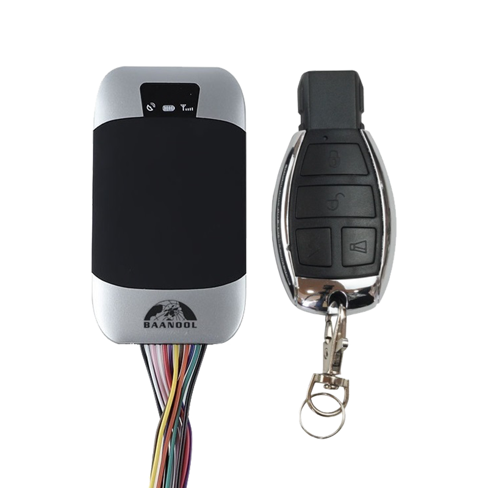

# Coban - BN-303G

El BN-303G es un rastreador GPS compacto montado en vehículo, desarrollado por Coban para ofrecer seguimiento en tiempo real y protección antirrobo confiable. Diseñado para instalaciones ocultas en automóviles y vehículos comerciales, el equipo incorpora posicionamiento GNSS de alta sensibilidad y un conjunto de alarmas por eventos para que gestores de flota, empresas de renta y propietarios particulares puedan monitorear ubicación, estado de encendido y telemetría básica de forma sencilla.

Como dispositivo compatible con Plaspy, el BN-303G puede transmitir datos de ubicación y eventos a la plataforma usando opciones de transporte habituales, permitiendo seguimiento en vivo, notificaciones y reportes históricos dentro de un panel de gestión unificado. Su soporte para múltiples modos de transporte de datos y su amplia suite de alarmas lo hacen práctico para integrarlo en Plaspy y mejorar la visibilidad operativa y la respuesta ante incidentes.

## Características principales

- Rastreador compacto montado en vehículo, pensado para instalación oculta y monitoreo continuo.
- Posicionamiento GNSS de alta sensibilidad para reportes de ubicación consistentes, ideal para supervisión de flotas.
- Varias opciones de comunicación incluyendo TCP, UDP y SMS para una integración flexible con el back end.
- Modo inteligente de ahorro de energía que reduce el consumo mientras el vehículo está estacionado y despierta por movimiento o alarmas.
- Amplio conjunto de alarmas que incluye SOS, exceso de velocidad, geocercas, apertura de puertas y batería baja para flujos de trabajo de seguridad.
- Batería interna recargable de respaldo para cubrir cortes a corto plazo y preservar la configuración.
- Capacidades de telemando remoto como llamada unidireccional, escucha remota de voz y control tipo corte remoto para respuesta antirrobo.

## Cómo funciona con Plaspy

Cuando se usa con Plaspy, el BN-303G envía posiciones y mensajes de eventos a la plataforma para que los operadores puedan supervisar los activos en tiempo real y reaccionar ante alertas. Plaspy procesa la telemetría y los datos de alarma para mostrar mapas, notificaciones y registros históricos que apoyan las operaciones de flota y los procesos de seguridad.

- Actualizaciones en tiempo real de ubicación y eventos entregadas a Plaspy vía TCP, UDP o SMS.
- Ingesta de alarmas como SOS, exceso de velocidad, geocerca y apertura de puertas para activar notificaciones y flujos de trabajo.
- Reporte del estado del vehículo, incluyendo notificaciones relacionadas con el encendido, para apoyar análisis de rutas y utilización.
- Telecomandos de tipo corte remoto y funciones de llamada unidireccional integradas en procesos de respuesta a incidentes.
- Informes históricos de rutas y eventos para auditorías, análisis de tendencias y revisiones operativas.

## Casos de uso típicos

- Monitoreo antirrobo de flotas y respuesta de inmovilización en casos de vehículos robados o no autorizados.
- Seguimiento de flotas de reparto y transporte con alertas por exceso de velocidad e historial de rutas para cumplimiento y eficiencia.
- Monitorización de vehículos de renta para detectar salidas de geocerca, eventos de encendido y recibir alertas SOS.
- Supervisión de transporte público y municipal donde se requiera telemetría centralizada y reportes por eventos.
- Monitoreo opcional de nivel de combustible al integrarse con sensores externos para análisis de consumo y detección de anomalías.

## Por qué elegir este rastreador con Plaspy

El BN-303G combina funciones prácticas enfocadas en vehículos con opciones de transporte flexibles que facilitan su integración en Plaspy. Su mezcla de posicionamiento confiable, conjunto integral de alarmas y respaldo de energía a corto plazo es adecuada para organizaciones que necesitan visibilidad continua de la ubicación y un proceso claro de respuesta a alertas sin integraciones complejas.

Si desea evaluar este rastreador para su despliegue, Plaspy puede recibir sus streams de ubicación y eventos para proporcionar mapas, alertas e informes en toda su flota. Conozca más sobre Plaspy en el sitio principal https://www.plaspy.com. Las especificaciones del producto, su disponibilidad y los detalles del fabricante pueden cambiar con el tiempo, por lo que verifique las especificaciones actuales en el sitio oficial del fabricante https://www.coban.net/
