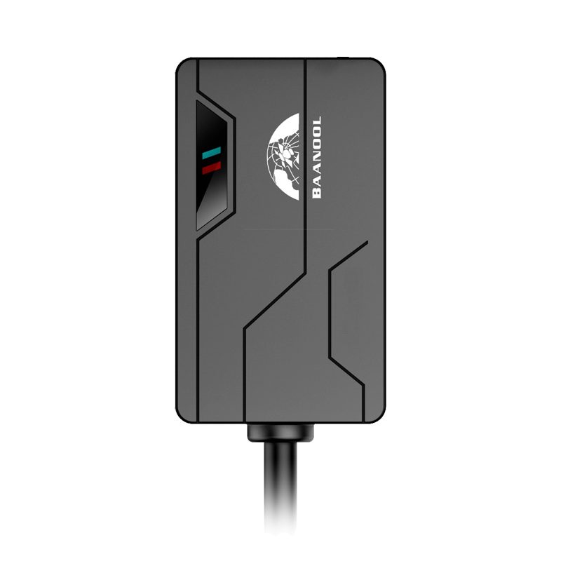

# Coban - BN-311B

El BN-311B es un terminal GSM GPS compacto diseñado para la gestión de motocicletas, pensado para ofrecer seguimiento en tiempo real y protección antirrobo en vehículos pequeños. Concebido para instalaciones ocultas en motos y autos pequeños, combina posicionamiento GNSS, conectividad 2G y una batería de respaldo recargable en un formato reducido para cubrir necesidades de seguridad y monitoreo vehicular.

Este modelo es compatible con Plaspy y está diseñado para transmitir ubicación y telemetría a la plataforma, permitiendo monitoreo en vivo y revisión histórica. Sus entradas de alarma y capacidades de reporte facilitan su integración en los flujos de trabajo de Plaspy para supervisión de flotas, alertas perimetrales y acciones de inmovilización remota cuando sea necesario.

## Características principales

- Diseño compacto y discreto, adecuado para motocicletas y vehículos pequeños.
- Posicionamiento GNSS en tiempo real con precisión práctica para seguimiento y reproducción de rutas.
- Conectividad GSM 2G con opciones de reporte por TCP, UDP y SMS para mayor flexibilidad.
- Batería de respaldo recargable que mantiene la operación ante pérdida de la alimentación principal.
- Varias entradas de alarma, incluyendo ignición, movimiento, impacto, batería baja y desconexión de alimentación externa.
- Soporte para corte remoto de combustible o alimentación para inmovilización y respuesta ante robo.
- Modos inteligentes de reporte que reducen el uso de datos cuando el vehículo está estacionado.

## Cómo funciona con Plaspy

Cuando se integra con Plaspy, el BN-311B envía datos de ubicación y eventos a la plataforma, donde se procesan para mapa en vivo, alertas y generación de informes. Plaspy recibe la telemetría y las señales de alarma para entregarle a usted conocimiento situacional, reproducción histórica y notificaciones configurables según las necesidades de la flota o de vehículos individuales.

- Actualizaciones de ubicación en vivo y mapeo para visibilidad en tiempo real de cada unidad.
- Eventos de alarma y estado como ignición, movimiento, impacto y batería baja para activar notificaciones y flujos de trabajo en Plaspy.
- Geocercas y alertas por exceso de velocidad configuradas y aplicadas desde Plaspy para gestionar perímetros y velocidad.
- Comandos de inmovilización remota disponibles desde Plaspy para apoyar medidas antirrobo.
- Reproducción histórica de rutas e informes en Plaspy para revisión de incidentes y análisis operativo.

## Casos de uso típicos

- Gestión de flotas de motocicletas con seguimiento centralizado, historial de rutas y supervisión de estado.
- Protección antirrobo de vehículos individuales mediante instalación oculta, alarmas y inmovilización remota.
- Monitoreo remoto del estado de ignición y de la alimentación externa para control operativo.
- Seguridad en vehículos de alquiler y compartidos donde el tamaño y la ocultación son importantes.
- Investigación de incidentes y revisión de comportamiento del conductor usando reproducción histórica y registros de eventos.

## Por qué elegir este rastreador con Plaspy

El BN-311B ofrece un conjunto de funcionalidades enfocado a las necesidades de operadores que gestionan flotas de vehículos pequeños o que desean asegurar motocicletas individuales. Su combinación de diseño compacto, posicionamiento GNSS confiable, entradas de alarma y batería de respaldo lo convierten en una opción práctica para integrar en sistemas Plaspy sin añadir complejidad innecesaria.

Para organizaciones que requieran seguimiento discreto y flujos de trabajo antirrobo sencillos, el BN-311B aporta la telemetría y el control esenciales para construir procesos de monitoreo e inmovilización eficientes dentro de Plaspy. Su flexibilidad de reporte y las señales de evento ayudan a que Plaspy entregue alertas oportunas y datos históricos útiles para la toma de decisiones operativas.

Para saber más sobre Plaspy y cómo funcionan en la plataforma dispositivos compatibles como el BN-311B visite https://www.plaspy.com. Las especificaciones del producto, disponibilidad y datos del fabricante pueden cambiar con el tiempo, por lo que le recomendamos verificar la información técnica actual en el sitio oficial del fabricante https://www.coban.net/.
