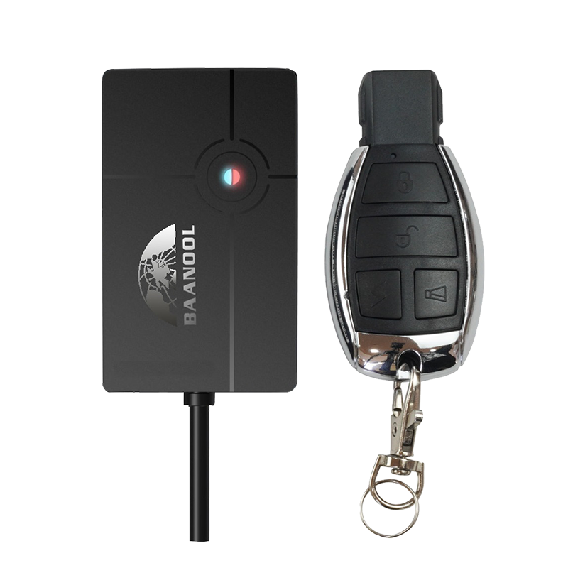

# Coban - BN-401B

El BN-401B es un rastreador GPS 4G compacto y un terminal de gestión de motocicletas diseñado para una protección antirrobo sencilla y un seguimiento en tiempo real. Diseñado para vehículos ligeros y coches privados, el BN-401B ofrece posicionamiento GPS fiable, lógica de alarmas configurable y telemetría esencial para que los gestores de flota y los propietarios puedan supervisar sus activos desde Plaspy con un mínimo esfuerzo de instalación. Su conectividad 4G y su formato ligero lo convierten en un dispositivo compatible con Plaspy ideal para aplicaciones que priorizan actualizaciones rápidas de ubicación, inmovilización simple y verificaciones de estado bajo demanda.

Construido para operar sobre TCP/UDP/SMS y con configuración por Bluetooth para la instalación local, el BN-401B admite los flujos de trabajo estándar de Plaspy, como ubicación en vivo, reproducción de rastreo, alertas de geocerca y SOS de emergencia. La batería de respaldo, la estrategia de sueño inteligente y el rango de voltaje de funcionamiento \(12–24 V\) proporcionan un rendimiento fiable antirrobo y telemetría persistente en entornos reales de vehículos.

## Aspectos clave

- Rastreador GPS 4G compatible con Plaspy para seguimiento en tiempo real y actualizaciones de posición a través de TCP/UDP/SMS.
- Formato compacto para motocicletas/vehículos \(6.78 × 4.1 × 1.84 cm; ~58 g\) para una instalación discreta.
- Suite de alarmas integral: SOS, movimiento, sobrevelocidad, impacto, batería baja, corte de energía externa y geocerca.
- Activación/desactivación remota y inmovilizador de corte remoto de combustible/energía para apoyar la respuesta ante el robo.
- Configuración por Bluetooth para ajustar parámetros localmente y una puesta en marcha sencilla sin interfaz con cable.
- Modo de sueño inteligente y intervalos de reporte configurables para equilibrar la energía de la batería/la alimentación de respaldo y las necesidades de telemetría en tiempo real.
- Batería de litio de respaldo de 3.7 V y 90 mAh para mantener la generación de reportes durante la pérdida de suministro externo.

## Cómo funciona con Plaspy

La integración con Plaspy es simple: el BN-401B envía datos de ubicación y alarmas a los servidores de Plaspy mediante transporte TCP, UDP o SMS. Plaspy consume esos mensajes para proporcionar seguimiento en tiempo real, alertas e informes históricos. Puede confiar en su telemetría reportada—posición GPS, estado de encendido ACC y eventos de alarma—para activar flujos de trabajo de Plaspy como comandos de inmovilización, notificaciones de geocerca y reproducción de rastreo.

- Actualizaciones de ubicación y telemetría en tiempo real entregadas a Plaspy a través de redes 4G.
- Alarma de encendido ACC y notificaciones de funcionamiento del ACC a números autorizados para eventos de encendido.
- Alarmas de batería baja y desconexión de la alimentación externa para notificar a Plaspy y a los usuarios sobre problemas de energía.
- Inmovilizador remoto mediante la capacidad de corte remoto de combustible/energía para activar acciones anti-robo coordinadas a través de Plaspy.
- Configuración por Bluetooth para la instalación local; monitorización basada en la app y reproducción de rastreo mediante flujos de trabajo habilitados por Plaspy.

## Resumen técnico

| Conectividad | 4G LTE con transporte TCP / UDP / SMS |
| --- | --- |
| Bandas \(variantes regionales\) | Latinoamérica: B2/B3/B4/B5/B7/B8/B28A/B28B; América del Norte: B2/B4/B5/B7/B12/B13/B66/B28A; Eurasia/África: B1/B3/B5/B7/B8/B20/B28A/B40 |
| Alimentación y batería | Alimentación del vehículo 12–24V; batería de respaldo recargable de 3.7V 90 mAh; alarma de batería baja |
| Interfaces | Detección de encendido ACC; corte remoto de combustible/energía \(capacidad de inmovilizador\); entradas/salidas de alarma configuradas mediante manual/SMS |
| GNSS | Receptor GNSS de alta precisión; precisión típica ~5 m; sensibilidad -165 dBm; arranque en frío ~45 s, arranque tibio ~35 s, arranque en caliente ~1 s |
| Bluetooth | Módulo Bluetooth a bordo para configuración local |
| Gestión remota | Configuración por Bluetooth, comandos de configuración por SMS, monitorización remota basada en app y manual del usuario incluido |
| Ambiental | Funcionamiento -20°C a +45°C; almacenamiento -40°C a +85°C; humedad 5%–95% sin condensación |
| Factor de forma | Terminal compacto para motocicleta/vehículo pequeño, 6.78 × 4.1 × 1.84 cm; ~58 g |

## Casos de uso

- Antirrobo y inmovilización para pequeñas flotas de motocicletas o vehículos ligeros; el corte remoto de combustible/energía facilita una respuesta rápida a través de Plaspy.
- Seguridad personal de motocicletas o coches privados con SOS, geocerca y alarmas de movimiento/choque para alertas inmediatas.
- Gestión ligera de flotas para scooters de reparto y mensajeros urbanos que requieren seguimiento en tiempo real, alertas de exceso de velocidad y reproducción de rastreo.
- Monitoreo de vehículos de alquiler donde una instalación compacta, el estado de encendido y alertas de batería baja ayudan a reducir pérdidas y tiempos de inactividad.
- Telemetría y registro de eventos para programar el mantenimiento e investigar incidentes mediante los informes y la reproducción de Plaspy.

## Por qué elegir este rastreador con Plaspy

Elegir el BN-401B como dispositivo compatible con Plaspy ofrece una opción rentable y fiable para organizaciones que necesitan una funcionalidad enfocada de anti-robo y seguimiento sin hardware complejo. Su conectividad 4G y el soporte para TCP/UDP/SMS facilitan una integración simple y robusta, mientras que la configuración por Bluetooth y los comandos de configuración por SMS agilizan la instalación y los cambios de parámetros. La combinación de detección de encendido ACC, reportes de alarmas integrales y capacidad de inmovilización remota ofrece salvaguardas prácticas para motocicletas, coches privados y flotas pequeñas. Combinado con Plaspy, el BN-401B proporciona a los operadores una visión clara en tiempo real de la ubicación y el estado del vehículo, ayudando a reducir el riesgo de robo, a mejorar la visibilidad operativa y a simplificar la gestión diaria de la flota.

