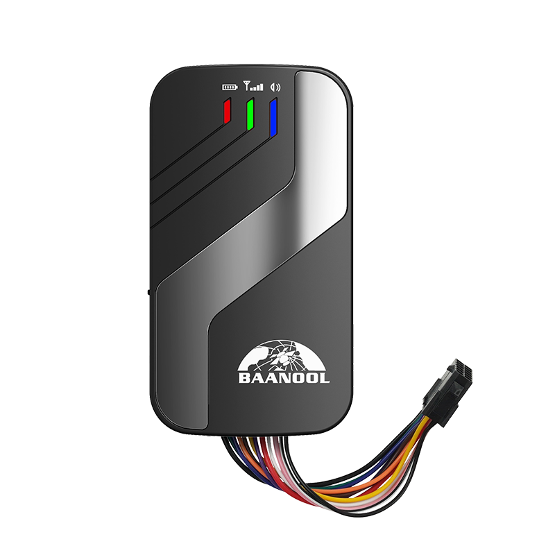

# Coban - BN-403C

El BN-403C es un rastreador GPS compacto para instalación en vehículos, diseñado para montaje oculto y gestión continua de la unidad. Ofrece seguimiento en tiempo real con conectividad LTE 4G y conmutación a 2G cuando es necesario, alimentación directa desde el vehículo y una pequeña batería recargable de respaldo para enviar posiciones durante cortes de energía, además de un conjunto de alarmas y funciones de control remoto útiles en flotas y aplicaciones antirrobo.

Como dispositivo compatible con Plaspy desde su configuración inicial, el BN-403C puede transmitir datos de ubicación y eventos a Plaspy para monitoreo y generación de informes centralizados. La integración con Plaspy permite mapas en vivo, notificaciones, reproducción histórica y comandos remotos, lo que hace que este modelo sea apropiado para operadores que requieren telemetría confiable, monitoreo de ignición y capacidades de inmovilizador remoto dentro de una misma plataforma de gestión de flotas.

## Características principales

- Compatibilidad nativa con Plaspy para una integración sencilla en paneles y flujos de trabajo de flotas.  
- Conectividad LTE 4G con respaldo 2G para mayor cobertura celular y reporte continuo.  
- Factor de forma compacto pensado para montaje oculto y despliegue discreto.  
- Batería de respaldo integrada que mantiene el envío de posiciones ante pérdida de alimentación del vehículo.  
- Conjunto de alarmas que incluye encendido (ACC), puertas abiertas, impacto, exceso de velocidad, geocerca y SOS para monitoreo basado en eventos.  
- Opciones de inmovilizador remoto y corte de alimentación mediante relé para respuestas antirrobo desde una plataforma central.  
- Configuración por Bluetooth y arming automático por inducción para facilitar la puesta en marcha local y cambios de estado por proximidad.

## Cómo funciona con Plaspy

Cuando está conectado, el BN-403C entrega posiciones GNSS y eventos de alarma a Plaspy mediante los métodos de transporte compatibles. Plaspy procesa esas actualizaciones para mostrar la ubicación en vivo, disparar alertas y conservar el historial para reproducción e informes. Los parámetros del dispositivo pueden administrarse localmente vía Bluetooth o controlarse de forma remota a través de las funcionalidades de gestión de dispositivos de Plaspy cuando estén disponibles.

- Las actualizaciones de ubicación en tiempo real alimentan los mapas en vivo y los paneles de control de flota en Plaspy.  
- Eventos de alarma como encendido ACC, puertas abiertas e impactos se reportan a Plaspy para activar alertas y flujos de trabajo automatizados.  
- La reproducción histórica y las consultas de informes en Plaspy permiten a los operadores analizar viajes, paradas y secuencias de eventos.  
- Comandos remotos como inmovilizador o control de relé pueden enviarse desde Plaspy para responder ante robos o movimientos no autorizados.  
- El armado por Bluetooth y el soporte para sensores Bluetooth ayudan a automatizar cambios de estado que se reflejan en el monitoreo de Plaspy.

## Casos de uso habituales

- Gestión de flotas para autos y vehículos comerciales ligeros que requieren seguimiento continuo y monitoreo de eventos.  
- Protección antirrobo de vehículos particulares con alertas de puertas y encendido además de control remoto de inmovilizador.  
- Monitoreo en alquileres y financiamiento para rastrear ubicación, movimientos y cumplimiento de geocercas.  
- Operaciones logísticas y de transporte que necesitan visibilidad constante de posiciones y notificaciones basadas en eventos.  
- Escenarios de aseguradoras y control de riesgos donde la reproducción histórica y las alertas por manipulación apoyan las investigaciones.

## Por qué elegir este rastreador con Plaspy

El BN-403C combina características de hardware prácticas con la visibilidad centralizada de Plaspy para ofrecer una solución equilibrada de monitoreo vehicular y control antirrobo. Su resistencia en la capa celular, la capacidad de reporte en respaldo de batería y su amplio conjunto de alarmas lo convierten en una opción sólida para operadores que buscan un rastreo confiable junto con capacidades de comando remoto dentro de una única plataforma.

Para obtener más información sobre Plaspy y cómo se gestionan los rastreadores compatibles en la plataforma visite https://www.plaspy.com. Las especificaciones del producto, la disponibilidad y los datos del fabricante pueden cambiar con el tiempo, por lo que verifique la información técnica actual y las opciones de accesorios en el sitio oficial de Coban https://www.coban.net/.
