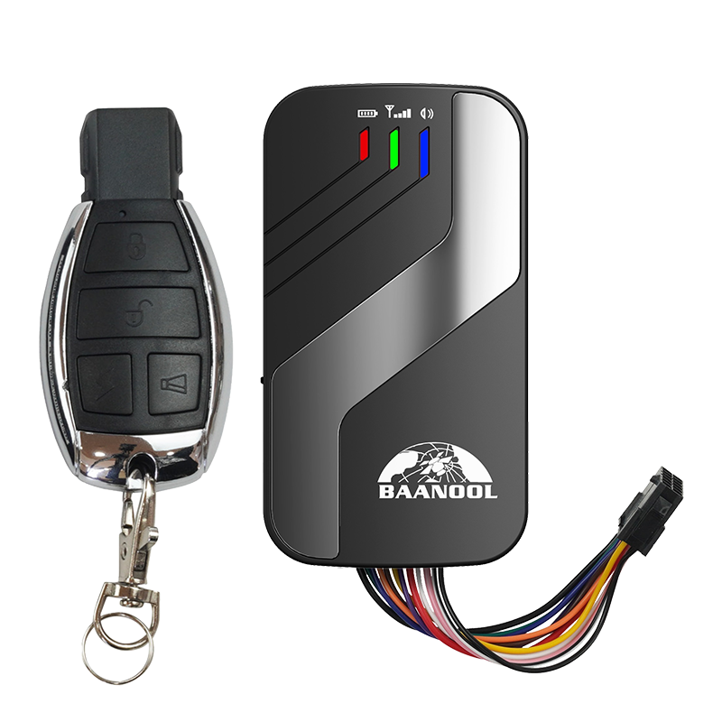

# Coban - BN-403D

# BN-403D LTE Vehicle GPS Tracker

El BN-403D es un rastreador GPS compacto para vehículo, diseñado para una localización fiable y una comunicación 2G/4G de amplio alcance. Compatible con Plaspy desde el inicio, este terminal inteligente ofrece seguimiento en tiempo real, alertas configurables y opciones de instalación encubiertas para que flotas y propietarios privados puedan monitorear vehículos, responder a incidentes y gestionar telemetría desde una única plataforma.

El dispositivo admite configuración por Bluetooth y armado/desarme por inducción automática, escucha de voz remota unidireccional para emergencias y una gama de tipos de alarma que incluyen ACC/encendido, apertura de puerta, golpes/vibraciones y eventos de geocerca. El monitoreo opcional de combustible está disponible cuando se utiliza con un sensor de combustible aprobado, lo que convierte al BN-403D en una opción práctica para anti‑robo, gestión de flotas y proyectos de telemática de seguros integrados con Plaspy.

## Aspectos destacados

- Rastreador GPS compatible con Plaspy con seguimiento en tiempo real y reproducción de rutas para una rápida conciencia situacional y gestión de flotas.
- Conectividad de amplio alcance: LTE \(4G\) y respaldo 2G para asegurar la transmisión continua ante distintas condiciones de red.
- Instalación encubierta en el vehículo con conexión de alimentación directa de 12V–24V y una batería de respaldo recargable de 3.7V 300mAh integrada para telemetría ininterrumpida.
- Configuración por Bluetooth y armado/desarme por inducción automática para una instalación cómoda y el emparejamiento de accesorios.
- Alarmas integrales: ACC/encendido, apertura de puerta, golpes/vibraciones, exceso de velocidad, geocerca, SOS y pérdida de batería/energía externa.
- Escucha de voz remota unidireccional para emergencias y control de corte de energía remoto mediante el relé para apagados controlados.
- Monitoreo opcional de combustible: consultas de combustible restante y alarmas de detección de combustible cuando se utiliza con el sensor de combustible compatible; útil para el monitoreo de combustible y la prevención de pérdidas.

## Cómo funciona con Plaspy

El BN-403D se integra con Plaspy utilizando protocolos de transporte estándar de la industria para entregar ubicación y telemetría continuas en la plataforma Plaspy. Las correcciones de posición, actualizaciones de estado y eventos de alarma se transmiten mediante TCP, UDP o SMS para que los paneles y aplicaciones móviles de Plaspy reciban información oportuna para seguimiento en tiempo real, aplicación de geocercas y reproducción histórica. Los comandos de configuración pueden emitirse de forma remota o a través de Bluetooth para la configuración en el vehículo.

- Actualizaciones de ubicación y telemetría en tiempo real transmitidas a Plaspy para seguimiento en vivo y reproducción de rutas.
- Encendido \(ACC\), estado de la puerta y alarmas reportados para anti‑robo y monitorización operativa.
- Monitoreo opcional de combustible: consultas de combustible restante y alarmas de detección de combustible cuando se utiliza con el sensor de combustible compatible.
- Control remoto de corte de energía vía el relé incluido—comúnmente utilizado para deshabilitar la energía del vehículo de forma segura desde Plaspy cuando sea necesario.
- Configuración por Bluetooth para una instalación rápida y armado/desarme por inducción automática; compatible con accesorios en el vehículo y una puesta en servicio sencilla.

## Resumen técnico

| Conectividad | LTE \(4G\) y 2G GSM comunicación |
| --- | --- |
| Bandas | B1/B2/B3/B4/B5/B7/B8/B28A/B28B/B40; 2G: 850/900/1800/1900 MHz |
| Alimentación y batería | Conexión directa de alimentación del vehículo 12V–24V; batería de respaldo Li‑ion recargable de 3.7V 300mAh integrada |
| Interfaces | Incluye relé; micrófono externo; cable de extensión con SOS y control remoto; entrada ACC/encendido y E/S digital para alarmas |
| GNSS | Receptor GNSS de alta precisión, sensibilidad de -165 dBm; precisión típica GPS ~5 m; TTFF: frío 45 s, tibio 35 s, caliente 1 s |
| Bluetooth | Configuración por Bluetooth para la instalación del dispositivo y armado/desarme por inducción automática |
| Gestión remota | Admite protocolos de transporte TCP, UDP y SMS para informes y configuración remota; informes en línea en tiempo real y comandos SMS configurables |
| Ambiental | Temperatura de funcionamiento -20°C a +45°C; almacenamiento -40°C a +85°C; humedad 5%–95% no condensable |
| Formato | Terminal compacto montado en vehículo; dimensiones 9.6 × 5.3 × 1.8 cm; peso ~70 g |

## Casos de uso

- Antirrobo para coche particular: instalación encubierta, alarmas de puerta/ACC/golpes y control de corte de energía remoto para proteger vehículos personales.
- Gestión de flotas y logística: seguimiento en tiempo real, reproducción de rutas y gestión de geocercas para supervisar rutas y control operativo.
- Control de riesgos automotrices y telemática de seguros: telemetría y registros de alarmas permiten el análisis de incidentes y la monitorización respaldada por la póliza.
- Gestión de vehículos y transporte público: escucha de voz unidireccional y alertas configurables para la seguridad del conductor y la respuesta ante incidentes.
- Monitoreo de combustible y prevención de pérdidas: soporte opcional de sensor de combustible proporciona consultas de combustible restante y alarmas de detección para flotas mixtas.

## Por qué elegir este rastreador con Plaspy

Al integrarse con Plaspy, el BN-403D ofrece una solución equilibrada para clientes que buscan seguimiento GPS confiable, telemetría y capacidades anti‑robo. Su soporte de red LTE/2G y su modo de bajo consumo inteligente proporcionan informes consistentes mientras ahorra energía cuando los vehículos están estacionados. La configuración por Bluetooth simplifica la instalación y la puesta en servicio, y su formato compacto facilita un montaje discreto para una mayor seguridad.

Para gestores de flotas y proyectos de telemática, el BN-403D aporta una cobertura de alarmas práctica \(encendido, puerta, golpes, exceso de velocidad, geocerca, SOS y pérdida de energía\), monitoreo de voz unidireccional para eventos críticos y monitoreo opcional de combustible para controlar los costos de operación. Combinado con los paneles de Plaspy en tiempo real, alertas y reproducción, este rastreador es una opción rentable para la gestión de flotas escalable, protección anti‑robo y programas de telemetría de vehículos.

