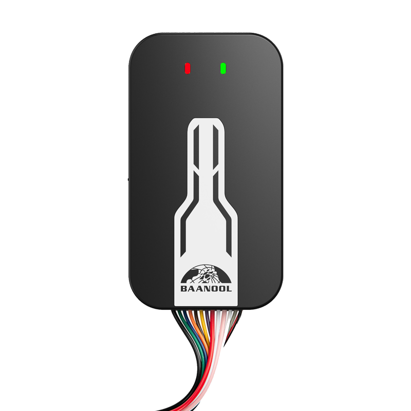

# Coban - BN-405C

El BN-405C es un rastreador GPS inteligente, compacto y para montaje vehicular, diseñado para la gestión de flotas, logística y aplicaciones antirrobo. Combina un formato de instalación discreta con alimentación desde el vehículo y batería de respaldo para ofrecer seguimiento continuo y visibilidad operativa en camiones, vehículos de obra y flotas de servicio público.

Como dispositivo compatible con Plaspy, el BN-405C proporciona seguimiento en tiempo real confiable, telemetría completa y un amplio conjunto de funciones de alarma que se integran con los paneles y notificaciones de Plaspy. Su compatibilidad con conectividad celular multinetwork y protocolos estándar de plataforma facilita el envío de datos a Plaspy para ubicación en vivo, alertas de eventos y reproducción histórica de trayectos.

## Aspectos clave

- Compatible con Plaspy para una integración sencilla y visibilidad centralizada de la flota.
- Soporte multinetwork celular incluyendo 2G, 3G y 4G para cobertura amplia en distintos despliegues.
- GNSS de alta sensibilidad con precisión típica de aproximadamente 5 m para datos de ubicación y trayectoria precisos.
- Conjunto completo de alarmas que cubre geocercas, exceso de velocidad, movimiento, golpes, puertas abiertas, batería baja y corte de alimentación externa.
- Telemetría vehicular e entradas como reporte de ACC (encendido), y control remoto de corte de combustible o de alimentación para flujos de trabajo antirrobo.
- Soporte opcional para sensores de nivel de combustible y temperatura, además de integración con cámaras Wi Fi para mayor percepción situacional.
- Diseño compacto y oculto, ideal para montaje resistente a manipulación en entornos vehiculares.

## Cómo funciona con Plaspy

Al integrarse con Plaspy, el BN-405C transmite coordenadas GPS, mensajes de estado y eventos de alarma a través de canales compatibles con la plataforma, de modo que usted pueda monitorear vehículos en tiempo real, recibir notificaciones y revisar trayectos históricos para cumplimiento y análisis.

- La ubicación y la telemetría en tiempo real alimentan los mapas y paneles de Plaspy para una conciencia operativa inmediata.
- El reporte de ACC y los mensajes de estado permiten registrar eventos de encendido/apagado del motor y soportan flujos de trabajo de ruta y conductor.
- Las alarmas por geocerca, exceso de velocidad, movimiento y golpes generan notificaciones en Plaspy para monitoreo de seguridad y antirrobo.
- El control remoto de corte de combustible o alimentación y las alertas por pérdida de alimentación externa permiten respuestas de inmovilización cuando están configuradas.
- Los datos opcionales de sensores de nivel de combustible y temperatura amplían la telemetría en Plaspy para logística y monitoreo del estado de los activos.
- Las funciones de escucha unidireccional y la integración con cámaras Wi Fi proporcionan verificación adicional de incidentes cuando se habilitan.

## Casos de uso típicos

- Gestión de flotas y optimización de despacho mediante seguimiento en vivo y reproducción de rutas.
- Monitoreo logístico y de transporte con geocercas para hacer cumplir rutas y proteger la carga.
- Flujos de trabajo antirrobo e inmovilización remota usando alarmas de movimiento y corte de alimentación externa junto con control de relé.
- Supervisión de vehículos de servicio público y municipal para visibilidad operativa y evidencias de incidentes.
- Seguimiento de vehículos de ingeniería y servicio para reducir tiempos de inactividad y mejorar la utilización de activos.

## Por qué elegir este rastreador con Plaspy

El BN-405C combina hardware de grado vehicular con las capacidades de la plataforma Plaspy para ofrecer una solución práctica a organizaciones que requieren ubicación precisa, alertas oportunas e informes históricos. Su conectividad celular multinetwork y su sólido rendimiento GNSS mantienen los vehículos visibles en áreas con cobertura variable, y su diseño compacto y oculto reduce el riesgo de manipulación en entornos exigentes.

Para flotas que necesitan telemetría ampliable, el BN-405C admite sensores opcionales e integración con cámaras para ofrecer mayor contexto en incidentes y reportes operativos. Si desea conocer más sobre cómo el BN-405C funciona con Plaspy y ver las funciones de la plataforma, visite https://www.plaspy.com. Las especificaciones y la disponibilidad del producto pueden cambiar con el tiempo, por lo que le recomendamos verificar los detalles actuales y la documentación oficial en el sitio del fabricante https://www.coban.net/.
