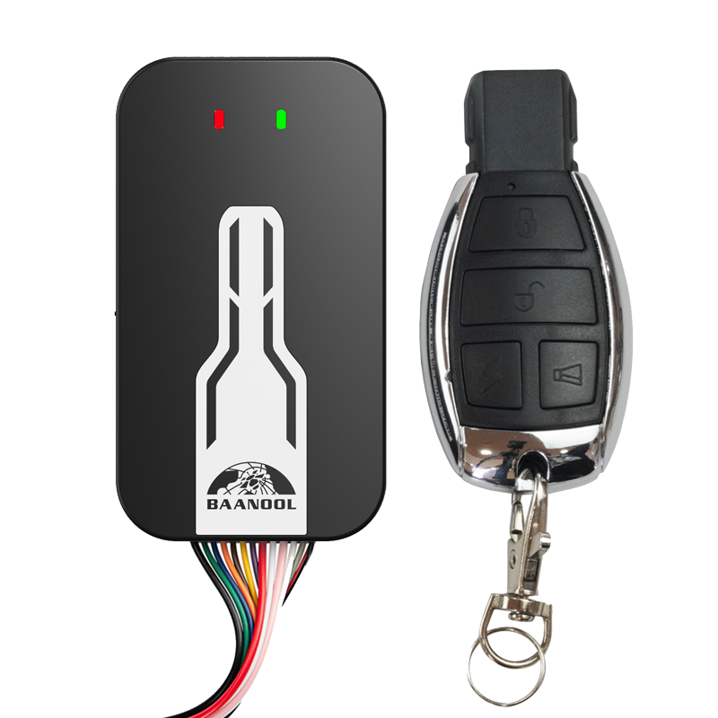

# Coban - BN-405D

El BN-405D es un rastreador GPS compacto montado en vehículo, diseñado para la gestión profesional de flotas, logística, obra civil y transporte público. Diseñado para ofrecer seguimiento en tiempo real y alta fiabilidad, el BN-405D combina conectividad celular multibanda con un receptor GNSS de alta sensibilidad para entregar posición, telemetría e informes de alarma en entornos de red mixtos. Su factor de forma y conjunto de funciones orientadas a vehículos lo hacen apto para instalación embebida en unidades de 12–24 V usadas en operaciones comerciales.

Como dispositivo compatible con Plaspy, el BN-405D puede enviar datos de ubicación y eventos de forma continua a los paneles de Plaspy para brindar visibilidad y supervisión operativa. Al integrarlo con Plaspy, la telemetría y los reportes de alarma del equipo apoyan la optimización de flotas, los flujos de trabajo de seguridad y las alertas automáticas, permitiendo a las organizaciones monitorear vehículos, responder a incidentes y centralizar el seguimiento en una sola plataforma telemática.

## Puntos clave

- Compatible con Plaspy y opciones de integración mediante TCP, UDP y SMS para el envío directo a los servidores de Plaspy y una incorporación rápida.
- Conectividad celular multibanda para cobertura estable y roaming en entornos con redes mixtas.
- Receptor GNSS de alta sensibilidad con precisión típica de posición alrededor de 5 m para un informe de ubicación confiable.
- Conjunto completo de alarmas que incluye exceso de velocidad, geocerca, choque, apertura de puertas, movimiento, batería baja y desconexión de alimentación externa para protección antirrobo robusta.
- Funciones remotas y de seguridad como corte de combustible o de corriente por relé, armado/desarmado y alarma SOS para una respuesta rápida.
- Soporte de telemetría flexible con opciones de sensor de nivel de combustible y ambientales, además de compatibilidad con módulos de cámara externos y escucha remota.
- Diseño para uso vehicular pensado para instalación embebida, con factor de forma compacto y capacidad de respaldo para alertas por manipulación.

## Cómo funciona con Plaspy

El BN-405D envía posiciones, estados y eventos de alarma a Plaspy para que los gestores de flota puedan ver la ubicación en vivo, reproducir recorridos históricos y activar alertas y flujos de trabajo automatizados. La integración aprovecha los métodos de reporte del dispositivo para alimentar Plaspy con datos continuos y accionables destinados al monitoreo y la respuesta ante incidentes.

- Actualizaciones de ubicación y telemetría en tiempo real entregadas a Plaspy mediante TCP, UDP o SMS según lo soporte el equipo.
- Reportes de eventos y alarmas como encendido ACC, apertura de puertas, choques y movimiento que permiten a Plaspy correlacionar el comportamiento de conducción y los incidentes de seguridad.
- Telemetría opcional de nivel de combustible y sensores que puede integrarse en Plaspy para la gestión de combustible y la detección de sustracciones cuando hay sensores externos instalados.
- Capacidades de inmovilizador remoto y corte de energía o combustible que permiten acciones iniciadas desde Plaspy para prevención de robos y control de riesgos.
- Alarmas SOS, escucha remota y evidencia de cámara que apoyan los flujos de trabajo de seguridad e investigaciones de incidentes dentro de Plaspy.

## Casos de uso típicos

- Gestión de flotas y optimización de despacho con rastreo en vivo y reproducción de rutas para flotas de vehículos comerciales.
- Protección antirrobo e inmovilización de vehículos de alto valor mediante alarmas y control remoto de relés.
- Supervisión de seguridad en transporte público y vehículos de pasajeros con visibilidad de eventos ACC y apertura de puertas, y respuesta SOS.
- Control de combustible y activos usando sensores de combustible opcionales y telemetría para detectar anomalías en el consumo y sustracciones.
- Seguimiento de flotas de obra y vehículos off road que operan en zonas de cobertura mixta con reportes de alarma robustos.

## Por qué elegir este rastreador con Plaspy

El BN-405D ofrece una combinación práctica de conectividad, precisión posicional y funciones orientadas a vehículos que se alinean con las capacidades de monitoreo y seguridad de Plaspy. Su soporte celular multibanda y el receptor GNSS de alta sensibilidad ayudan a mantener un rastreo confiable en distintos escenarios de cobertura, mientras que la lógica de alarmas incorporada y las funciones de control remoto brindan a los operadores herramientas para la respuesta antirrobo y el control operativo.

Al integrarse con Plaspy, el BN-405D puede incorporarse rápidamente a paneles centralizados para ofrecer visibilidad en tiempo real, alertas basadas en eventos e informes históricos. Esto lo convierte en una opción adecuada para organizaciones que buscan estandarizar la telemática en flotas mixtas y añadir workflows de seguridad remota y telemetría operativa.

Para conocer más sobre cómo usar el BN-405D con Plaspy visite https://www.plaspy.com. Las especificaciones del producto, disponibilidad y detalles del fabricante pueden cambiar con el tiempo por lo que le recomendamos verificar las especificaciones y la documentación actual en el sitio del fabricante https://www.coban.net/ antes de la compra o el despliegue.
