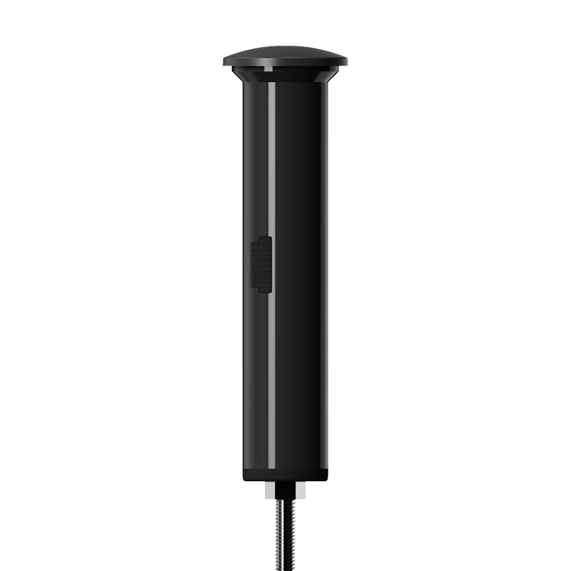

# Coban - BN-407

El BN-407 es un terminal de gestión para bicicletas 4G, compacto y diseñado para una instalación oculta dentro del cuadro. Pensado para protección antirrobo discreta y uso en flotas, ofrece actualizaciones de ubicación en vivo, telemetría de movimiento, alertas configurables por geocerca y reproducción de recorridos sin alterar la estética de la bicicleta. Su formato cilíndrico de pequeño tamaño y bajo peso lo hace ideal para bicicletas de montaña, flotas compartidas y bicicletas personales donde la resistencia a la manipulación y un montaje poco visible son prioritarios.

Como rastreador GPS compatible con Plaspy, el BN-407 entrega los datos de ubicación y eventos básicos que Plaspy necesita para monitoreo en tiempo real y revisión histórica. Al integrarlo con Plaspy, los reportes de seguimiento, las alarmas de movimiento y las notificaciones de geocerca forman parte de un flujo unificado de gestión de flota o activos, ayudando a operadores y usuarios a mantener visibilidad sobre recorridos, eventos y estado de batería sin sacrificar una instalación discreta.

## Características principales

- Diseñado específicamente para bicicletas con un formato integrado en el cuadro que minimiza el impacto estético y el riesgo de manipulación.
- Rastreo en tiempo real y reproducción de recorridos para historial de viajes y revisión de rutas.
- Alarmas de movimiento y seguridad, incluyendo detección de choque, movimiento, exceso de velocidad, batería baja y notificaciones por geocerca, para apoyar flujos de trabajo de antirrobo y seguridad.
- Funcionamiento de bajo consumo con estrategias inteligentes de posicionamiento para extender la autonomía entre cargas.
- Batería recargable y carga por USB para uso práctico en campo y mantenimiento sencillo.
- Soporte multipropósito de modos de transporte y compatibilidad de red para operaciones regionales e integración con plataformas de seguimiento como Plaspy.

## Cómo funciona con Plaspy

El BN-407 envía datos de posición y eventos a Plaspy, donde se procesan para monitoreo en vivo, alertas basadas en reglas y reproducción histórica. Plaspy traduce la telemetría del dispositivo en mapas, reportes y notificaciones para que los administradores de flota y los usuarios puedan supervisar la actividad a distancia y reaccionar ante incidentes de forma rápida.

- Las actualizaciones de ubicación en tiempo real y la telemetría aparecen en Plaspy para seguimiento en vivo y visualización en mapas.
- Eventos de alarma como choque, movimiento, exceso de velocidad, geocerca y batería baja se mapean a alertas y flujos automatizados en Plaspy.
- La reproducción de recorridos en Plaspy utiliza el historial del dispositivo para revisión de incidentes, análisis de rutas e informes de utilización.
- Un comportamiento inteligente fuera de línea conserva batería cuando el dispositivo está estacionario y asegura reportes oportunos ante alarmas o movimiento, proporcionando supervisión confiable.
- Los cambios de estado del equipo, como activación y desactivación mediante llave inductiva, se reportan y pueden reflejarse en los indicadores de estado dentro de Plaspy.

## Casos de uso típicos

- Protección antirrobo discreta y recuperación de bicicletas privadas y bicicletas de alto valor.
- Gestión de flotas de bicicletas compartidas o de alquiler, con seguimiento de utilización, historial de rutas y alertas.
- Supervisión de paseos de menores, ofreciendo a padres o tutores visibilidad de ubicación y alertas de movimiento.
- Historial de recorridos y revisión de incidentes para análisis de rendimiento o conciliación de eventos.
- Rastreo de pequeños activos donde la instalación oculta y larga autonomía sean prioritarias.

## Por qué elegir este rastreador con Plaspy

El BN-407 combina un diseño de hardware pensado para bicicletas con la plataforma de seguimiento de Plaspy para ofrecer una solución práctica de rastreo discreto y supervisión de flotas. Su pequeño factor de forma, comportamiento de bajo consumo y alarmas configurables lo convierten en una opción adecuada cuando la discreción, la disponibilidad y historiales de viaje claros son importantes. Con Plaspy, organizaciones e individuos pueden consolidar los datos de ubicación y eventos del BN-407 en mapas, reportes y alertas que apoyen decisiones operativas y respuestas ante robos.

Para más información sobre el funcionamiento de las unidades BN-407 con Plaspy visite https://www.plaspy.com para detalles de la plataforma y sus capacidades. Las especificaciones del producto, la disponibilidad y los datos del fabricante pueden cambiar con el tiempo, por favor verifique las especificaciones técnicas actuales y descargue la documentación oficial en el sitio del fabricante https://www.coban.net/ para obtener la información más reciente.
