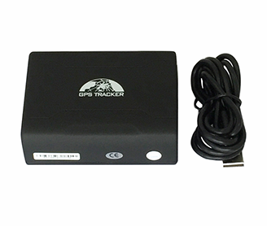

# Coban - GPS109

El Coban GPS109 es un rastreador GPS compacto y versátil diseñado para localizar y monitorear objetivos remotos mediante la red móvil GSM GPRS y los satélites GPS. Con dimensiones reducidas y construcción liviana, el GPS109 ofrece informes de posición precisos y un conjunto de funciones prácticas que incluyen localización puntual y seguimiento automático continuo, geocercas, alertas por movimiento y exceso de velocidad, avisos de batería baja y clasificación IP67 para uso en entornos variados.

Como dispositivo compatible con Plaspy, el GPS109 puede enviar información de ubicación y estado a la plataforma Plaspy para brindar visibilidad centralizada y supervisión operativa. Plaspy puede mostrar el dispositivo en mapas, consolidar el historial de ubicaciones y generar alertas e informes para que los equipos gestionen vehículos y activos desde una única interfaz, aprovechando las funciones del propio rastreador.

## Características principales

- Factor de forma compacto y liviano, adecuado para despliegues portátiles y colocación discreta
- Informes de ubicación precisos con GPS de alta sensibilidad y precisión horizontal típica alrededor de 5 metros
- Capacidad de funcionamiento prolongado gracias a una batería recargable de alta capacidad
- Carcasa con clasificación IP67 para funcionamiento fiable en condiciones húmedas o polvorientas
- Alarmas integradas y funciones configurables, incluidas geocercas, detección de movimiento, exceso de velocidad, choque y alertas de batería baja
- Funciona sobre redes móviles GSM GPRS existentes para una amplia cobertura geográfica

## Cómo funciona con Plaspy

El GPS109 puede integrarse con Plaspy de modo que las actualizaciones de posición y las alertas del dispositivo se envíen a la plataforma para monitoreo, informes y uso operativo. Plaspy ingiere los datos de ubicación y eventos del rastreador y ofrece un punto único para visualizar la actividad del dispositivo y responder incidentes.

- Vista en mapa en vivo para rastreo en tiempo real de vehículos y activos dentro de Plaspy
- Alertas e historial de geocercas para notificar cuando las unidades entran o salen de áreas definidas
- Notificaciones de movimiento y exceso de velocidad enviadas a Plaspy para alertas operativas y seguimiento
- Alertas de batería y estado del dispositivo mostradas en Plaspy para gestión proactiva
- Reportes históricos de rutas y posiciones para reconstrucción de viajes y revisión de desempeño

## Casos de uso típicos

- Rastreo de vehículos para flotas pequeñas y medianas que requieren dispositivos portátiles y resistentes
- Monitoreo de activos donde el formato compacto y la impermeabilidad ayudan a proteger el rastreador en entornos adversos
- Alquileres temporales y renta de equipos donde se necesita despliegue sencillo y actualizaciones de ubicación confiables
- Visibilidad en entregas y logística para rastrear rutas, paradas y tiempo en sitio
- Monitoreo de personal remoto o trabajadores solitarios cuando se prefieren rastreadores portátiles discretos

## Por qué elegir este rastreador con Plaspy

El GPS109 es una opción práctica cuando necesita un equilibrio entre tamaño compacto, posicionamiento preciso y un conjunto de funciones útiles como geocercas, alertas por movimiento y exceso de velocidad, y protección contra el agua. Al integrarlo con Plaspy, la transmisión de ubicaciones y señales de eventos del dispositivo se incorpora a un flujo de trabajo unificado de monitoreo e informes que apoya la supervisión de flotas, las alertas y el análisis histórico.

Si desea obtener más información sobre el uso del Coban GPS109 con Plaspy y cómo la plataforma puede ayudar a gestionar datos de rastreo, visite Plaspy en el sitio web principal https://www.plaspy.com. Las especificaciones del producto, la disponibilidad y los detalles del fabricante pueden cambiar con el tiempo, por lo que verifique las especificaciones actuales en el sitio del fabricante https://www.coban.net/ para obtener la información más actualizada.
