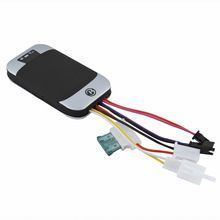

# Coban - GPS303

El rastreador GPS Coban GPS303 es un dispositivo de seguimiento y control que utiliza la tecnología de satélites GSM/GPRS y GPS para localizar y monitorear objetivos a distancia a través de SMS o Internet. Con un nivel de protección IP66 a prueba de polvo y resistente al agua, este rastreador cuenta con una apariencia compacta y elegante.

El GPS303 admite soluciones de seguimiento GPS y LBS \(servicio basado en la ubicación\) para una mayor precisión en la localización. Además, ofrece la posibilidad de configurar los ajustes de forma remota y cuenta con múltiples funciones de seguridad, seguimiento, control de vigilancia y alarmas de emergencia.

El GPS303 se encuentra disponible en diferentes modelos, cada uno con características específicas. El modelo 303F, por ejemplo, es un rastreador de vehículos completamente funcional que incluye un arnés de 12 pines y soporte para alarma de puerta abierta y gestión del nivel de combustible.

Algunas de las características destacadas del modelo 303F incluyen:

- Seguimiento basado en GPS y LBS
- Alerta de punto ciego GPS
- Modo de ahorro de energía con opciones de sueño profundo y despertar en una hora específica
- Modo de ahorro de tráfico GPRS
- Alarmas GSM anti-robo, incluyendo alarma de movimiento, alarma de geo-cerca, alarma de velocidad y más
- Apagado remoto del motor
- Soporte para tarjeta microSD
- Memoria interna para almacenar hasta 16,000 posiciones
- Batería de polímero de litio de 500 mA incorporada
- Seguimiento por SMS con enlace a Google Maps
- Localización de dirección absoluta por SMS
- Compatibilidad con servidor web, software de seguimiento gratuito para PC y aplicación móvil

El rastreador GPS Coban GPS303 es una opción confiable y versátil para el seguimiento y control de vehículos. ¡No dudes en adquirirlo y disfrutar de sus numerosas funciones y características!

