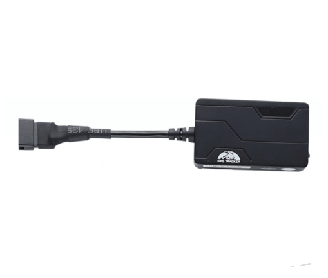

# Coban - GPS311

El Coban GPS311 es un rastreador GPS vehicular compacto pensado para una variedad de activos de transporte. Integra funciones de posicionamiento y monitoreo con un conjunto de prestaciones de seguridad y alertas, incluyendo alarmas de emergencia, geocercas, notificaciones por movimiento y exceso de velocidad, además de otras alertas relacionadas con el vehículo. El equipo transmite ubicación mediante SMS, GPRS y datos por internet, y puede ser supervisado desde software para PC, dispositivos móviles o visores cartográficos como Google Earth. Su tamaño reducido y su amplio rango de voltaje lo hacen apropiado para autos, bicicletas eléctricas y motocicletas.

Como dispositivo compatible con Plaspy, el GPS311 puede enviar datos de ubicación y alertas al entorno de gestión de flotas de Plaspy para ofrecer visibilidad centralizada e informes. Plaspy puede recibir los flujos de ubicación del GPS311 y mostrarlos en mapas, incorporar las alarmas en flujos operativos, y añadir la unidad a reproducciones históricas y reportes de flota. Esta compatibilidad convierte al GPS311 en una opción práctica para organizaciones que buscan un rastreo vehicular sencillo combinado con las herramientas de monitoreo y gestión de Plaspy.

## Aspectos destacados

- Rastreador orientado a vehículos que combina posicionamiento, monitoreo y funciones de seguridad
- Soporta transmisión por SMS, GPRS y datos por internet para conectividad flexible
- Múltiples tipos de alarma, incluyendo geocerca, exceso de velocidad, movimiento y batería baja
- Compatible con monitoreo en PC, seguimiento móvil y visores de mapas comunes para acceso versátil
- Diseño compacto, fácil de ubicar y ocultar en instalaciones vehiculares
- Amplio rango de voltaje de entrada que admite diversos tipos de vehículos
- Adecuado tanto para uso en un solo vehículo como para entornos de monitoreo a escala

## Cómo funciona con Plaspy

Al conectarse a Plaspy, el GPS311 entrega datos continuos de ubicación y alarmas que Plaspy utiliza para proporcionar visibilidad en tiempo real y supervisión operativa. La información del rastreador puede mostrarse en mapas, incluirse en reglas de alerta y almacenarse para informes y reproducciones.

- Mostrar la ubicación GPS en vivo en los mapas de Plaspy para unidades individuales y flotas
- Disparar alertas configurables en Plaspy por eventos como saltos de geocerca, exceso de velocidad y movimiento
- Guardar y reproducir trayectos históricos para análisis de rutas y revisión de incidentes
- Agregar el estado de los vehículos a través de la flota para paneles operativos y monitoreo
- Incluir eventos y resúmenes del GPS311 en los informes de Plaspy para cumplimiento y revisión de desempeño

## Casos de uso típicos

- Monitoreo de flotas y despacho para operaciones de vehículos comerciales
- Supervisión de seguridad y recuperación para vehículos de alto valor o en riesgo
- Rastreo de vehículos de alquiler y de uso compartido para controlar uso y devoluciones
- Supervisión de rutas de entregas y logística para evaluar desempeño y pruebas de movimiento
- Seguimiento de flotas urbanas de dos ruedas o bicicletas eléctricas donde el hardware compacto es una ventaja

## Por qué elegir este rastreador con Plaspy

El Coban GPS311 es una opción práctica para organizaciones que requieren un equilibrio entre funciones básicas de rastreo y capacidades de alarma sin complejidad innecesaria. Sus múltiples opciones de transmisión y su conjunto de alarmas lo hacen aplicable a distintos tamaños de flota y tipos de vehículo. En conjunto con Plaspy, el GPS311 puede formar parte de una estrategia de monitoreo centralizado que mejora la conciencia situacional y respalda los informes operativos rutinarios.

Dado que las descripciones comerciales disponibles suelen centrarse en capacidades generales y compatibilidad, la mejor manera de evaluar el GPS311 con Plaspy es comparar las funciones de monitoreo y tipos de alarma requeridos con sus necesidades operativas. Si usted necesita visibilidad consolidada de vehículos, alertas configurables y seguimiento histórico dentro de Plaspy, el GPS311 es una opción a considerar.

Aprenda más sobre Plaspy en el sitio principal https://www.plaspy.com. Las especificaciones del producto, la disponibilidad y los datos del fabricante pueden cambiar con el tiempo, por lo que verifique la información técnica actual en el sitio oficial del fabricante https://www.coban.net/.
