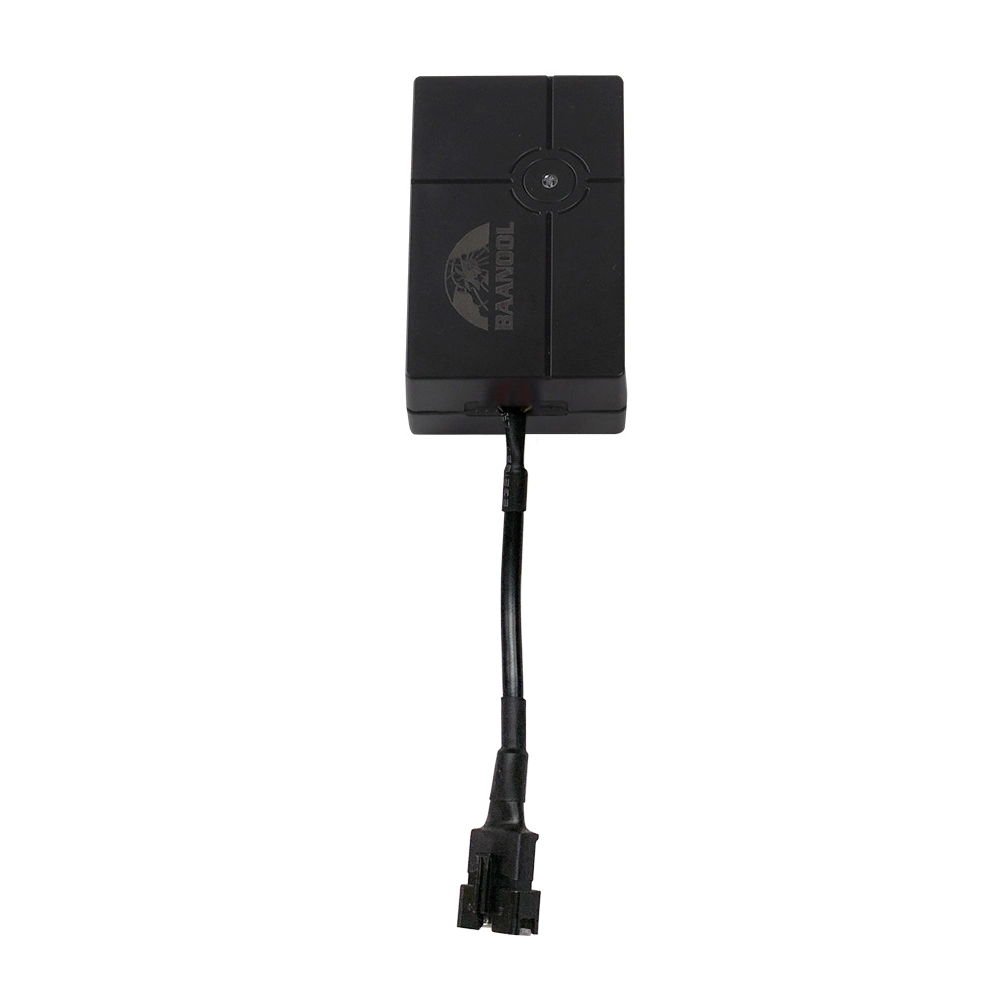

# Coban - GPS-401

El Coban GPS-401 es un rastreador GPS compacto y versátil pensado principalmente para motocicletas y autos pequeños. Soporta redes GSM 2G y 4G para el reporte de posición y ofrece rastreo en tiempo real por GPS y LBS. El equipo cuenta con certificación IP67 y un amplio rango de voltaje DC, lo que lo hace apto para uso exterior y para distintos sistemas eléctricos vehiculares.

Como dispositivo compatible con Plaspy, el GPS-401 puede enviar actualizaciones de ubicación, reportes de estado y eventos de alarma al sistema de gestión de flotas Plaspy. Esa integración permite una visibilidad y monitoreo centralizados de motos y autos pequeños rastreados, de modo que los operadores pueden usar Plaspy para ver ubicaciones en vivo, configurar alertas y generar informes a partir de los datos que envía el dispositivo.

## Características principales

- Diseñado para motocicletas y autos pequeños con factor de forma compacto, ideal para instalaciones con espacio limitado
- Opera en redes GSM 2G y 4G para ofrecer amplia cobertura en el reporte de ubicación
- Clasificación IP67 para uso confiable en exteriores y en condiciones expuestas
- Amplio rango de voltaje DC para compatibilidad con los sistemas eléctricos más comunes en vehículos
- Rastreo en tiempo real por GPS y LBS para visibilidad continua de la ubicación
- Funciones de alerta integradas, como geocerca, exceso de velocidad, movimiento, batería baja y desconexión de alimentación externa
- Soporta funciones remotas y de estado, incluyendo corte y reanudación del motor según lo reportado por el dispositivo

## Cómo funciona con Plaspy

Al integrarse con Plaspy, el GPS-401 envía datos de posición y eventos que Plaspy procesa, normaliza y muestra mediante sus herramientas de monitoreo y generación de informes. Plaspy utiliza los reportes del dispositivo para ofrecer visibilidad operativa y gestión centralizada de flotas o vehículos individuales.

- Seguimiento de ubicación en vivo y reproducción histórica de rutas en los mapas y líneas de tiempo de Plaspy
- Gestión de alertas y eventos por violación de geocercas, exceso de velocidad, movimiento no autorizado, batería baja y desconexión de energía
- Paneles de control y vistas por grupos para supervisar múltiples dispositivos GPS-401 simultáneamente
- Notificaciones y escalaciones basadas en eventos, configurables dentro de Plaspy para el control operativo
- Informes agregados sobre uso, viajes e historial de alarmas que apoyan la toma de decisiones en la gestión de flotas

## Casos de uso habituales

- Rastreo de flotas de motocicletas para seguridad y supervisión de rutas
- Monitoreo de autos pequeños para alquiler, reparto o vehículos de uso corporativo
- Protección de vehículos personales para uso exterior o expuesto gracias a su impermeabilidad
- Visibilidad de flotas de última milla o vehículos comerciales ligeros para operadores de vehículos pequeños
- Monitoreo remoto cuando se requiere un rastreador compacto y resistente a la intemperie

## Por qué elegir este rastreador con Plaspy

El GPS-401 es una opción práctica cuando necesita un rastreador compacto y resistente para motocicletas y autos pequeños, y desea centralizar la supervisión a través de Plaspy. Su soporte de redes y capacidades de rastreo en tiempo real permiten que Plaspy muestre información puntual de ubicación y alarmas a los operadores, mientras que las alertas del dispositivo cubren riesgos operativos comunes en vehículos pequeños.

Para organizaciones que administran flotas ligeras o requieren un rastreador discreto para motos y autos individuales, la combinación del Coban GPS-401 con Plaspy ofrece un camino sencillo hacia una mejor visibilidad y detección de incidentes. Para conocer más sobre Plaspy y cómo administra dispositivos como el GPS-401 visite https://www.plaspy.com. Las especificaciones y la disponibilidad del producto pueden cambiar con el tiempo, por lo que conviene verificar los detalles técnicos actuales y la documentación oficial en el sitio del fabricante https://www.coban.net/.
