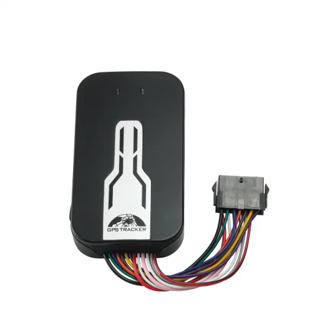

# Coban - GPS-405

El Coban GPS-405 es un rastreador vehicular versátil pensado para ofrecer gestión y monitoreo en tiempo real en distintos tipos de vehículos. Diseñado para operar con la plataforma BAANOOL IOT y la plataforma APP, el GPS-405 proporciona seguimiento de movimiento, geocercas, alertas por exceso de velocidad, detección de puerta y ACC, detección de golpes, notificaciones de corte de alimentación externa y un botón SOS. Algunos modelos amplían sus capacidades con opciones como punto de acceso Wi‑Fi, sensores de temperatura y humedad y cámara Wi‑Fi integrada, lo que lo hace adaptable a diversas necesidades operativas.

Como dispositivo compatible con Plaspy, el GPS-405 integra esas funciones de rastreo y alerta en Plaspy para ofrecer visibilidad centralizada de la flota y supervisión operativa. Su soporte para múltiples bandas celulares y una combinación de métodos de localización, junto con la clasificación IP66 y certificaciones del sector, convierten al GPS-405 en una opción práctica para organizaciones que desean incorporar un rastreador probado en Plaspy para monitoreo, alertas e informes.

## Aspectos destacados

- GPS en tiempo real y métodos auxiliares de localización para visibilidad continua del vehículo
- Amplia gama de eventos y alertas, incluyendo geocercas, exceso de velocidad, detección de impactos, ACC y monitoreo de puertas
- Botón SOS de emergencia integrado y opciones para control de corte externo de motor o alimentación
- Modelos disponibles con sensores y accesorios adicionales, como cámara Wi‑Fi y monitoreo ambiental
- Soporte para múltiples bandas de red para conectividad consistente entre regiones
- Clasificación IP66 y certificaciones industriales para uso confiable en campo

## Cómo funciona con Plaspy

El GPS-405 puede enviar sus datos de ubicación y eventos a Plaspy para que los administradores de flota visualicen posiciones, historiales y eventos de seguridad en una interfaz unificada. Plaspy recoge los reportes del dispositivo y los traduce en mapas en vivo, alertas e informes que apoyan la toma de decisiones operativas.

- Visualización en vivo de la ubicación y reproducción de rutas históricas para cada vehículo
- Eventos de geocerca y exceso de velocidad mostrados como alertas en Plaspy para atención inmediata
- Eventos de puerta, ACC, choque, corte de alimentación y SOS integrados en los flujos de notificación
- Informes consolidados y resúmenes exportables de viajes y eventos para análisis de flota
- Monitoreo centralizado en flotas mixtas para que los vehículos con GPS-405 aparezcan junto a otros dispositivos compatibles

## Casos de uso habituales

- Seguimiento de flotas logísticas y de transporte para supervisión de rutas y visibilidad de entregas
- Monitoreo de transporte de valores y vehículos bancarios donde la seguridad y las alertas rápidas son críticas
- Prevención de robo y seguimiento para automóviles particulares y vehículos comerciales
- Gestión y control de vehículos oficiales de flotas públicas o corporativas
- Monitoreo ambiental o de cargas especializadas cuando las unidades incluyen opciones de temperatura y humedad

## Por qué elegir este rastreador con Plaspy

El GPS-405 combina un conjunto completo de funciones con robustez y múltiples opciones de conectividad, por lo que resulta adecuado para flotas que requieren tanto visibilidad como medidas de seguridad. Al integrarlo con Plaspy, los eventos y los datos de posición del rastreador se consolidan en paneles y reglas de alerta que mejoran las operaciones diarias de la flota y la respuesta ante incidentes.

Si desea explorar cómo el Coban GPS-405 puede encajar en su implementación de Plaspy, obtenga más información sobre Plaspy en el sitio principal https://www.plaspy.com. Las especificaciones del producto, la disponibilidad y los detalles del fabricante pueden cambiar con el tiempo, por lo que le recomendamos verificar las especificaciones actuales con el fabricante en https://www.coban.net/.
