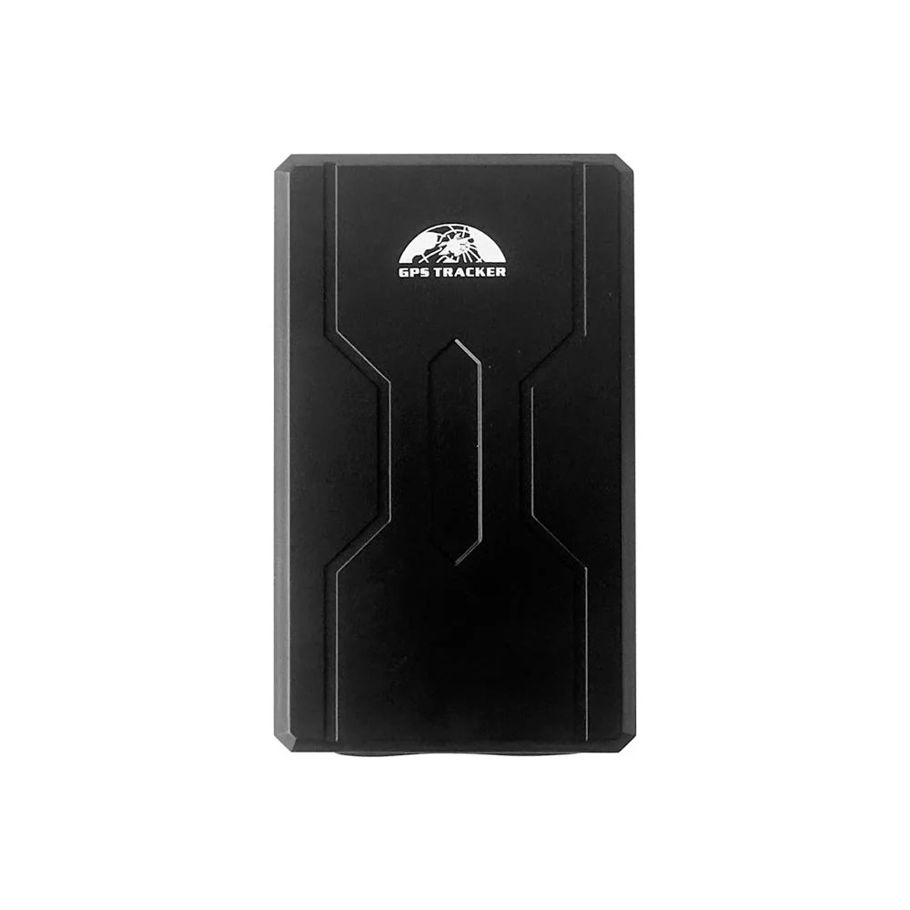

# Coban - GPS-408

El Coban GPS-408 es un rastreador vehicular versátil diseñado para ofrecer seguimiento y gestión en tiempo real de vehículos en diversos sectores. Pensado para aplicaciones como logística y transporte de carga, protección contra robo, transporte de valores para bancos y gestión de vehículos oficiales, el GPS-408 combina la localización con funciones orientadas a la seguridad para ayudar a las organizaciones a mantener visibilidad y control sobre sus activos móviles.

Como dispositivo compatible con Plaspy, el GPS-408 puede enviar posiciones e información de eventos al entorno de gestión de flotas de Plaspy. Su larga autonomía en modo espera, carcasa robusta y funciones antimanipulación lo convierten en una opción práctica para operadores que necesitan seguimiento continuo y alertas operativas integradas en Plaspy para monitoreo, generación de informes y supervisión.

## Principales características

- Posicionamiento GPS en tiempo real, adecuado para supervisión continua de vehículos
- Compatibilidad con las principales generaciones de redes celulares para cobertura amplia
- Batería interna de gran capacidad para mayor autonomía en espera y menos mantenimiento
- Opción de montaje magnético potente para colocación conveniente y ocultamiento
- Función anti demolición por infrarrojos para detectar intentos de manipulación
- Carcasa con clasificación IP67 para uso exterior y resistencia al clima
- Funciones remotas como monitoreo de voz y corte/arranque remoto del motor (Modelo B)

## Cómo funciona con Plaspy

Al conectarse a Plaspy, el GPS-408 suministra actualizaciones de ubicación y estado que Plaspy muestra en mapas, líneas de tiempo e informes, permitiendo a los gestores de flota rastrear activos y revisar eventos. Plaspy puede consolidar los eventos y alarmas del dispositivo para generar alertas accionables e información operativa.

- Visualización en vivo de la ubicación en los mapas de Plaspy para visibilidad en tiempo real de la flota
- Reenvío de eventos y alarmas como alertas de movimiento, violaciones de geocercas, exceso de velocidad, manipulación y batería baja
- Reproducción histórica de rutas e informes para revisión de viajes y cumplimiento
- Flujos de notificación para alertar a los operadores por correo electrónico o SMS cuando esté configurado
- Uso de eventos de monitoreo y control remoto en los paneles de Plaspy donde estén soportados

## Casos de uso típicos

- Supervisión de logística de largo recorrido y transporte local para mejorar la visibilidad de rutas y seguimiento de entregas
- Operaciones de recuperación y prevención de robo de vehículos mediante alertas de movimiento y manipulación
- Transporte seguro de valores, como efectivo bancario en vehículos blindados
- Supervisión de flotas gubernamentales y corporativas para la gestión de vehículos oficiales
- Seguimiento temporal de activos que requieren montaje discreto y autonomía prolongada

## Por qué elegir este rastreador con Plaspy

El GPS-408 es una opción práctica para organizaciones que buscan un equilibrio entre larga autonomía en espera, instalación discreta y construcción duradera. Su combinación de reportes de ubicación, detección antimanipulación y clasificación para uso exterior ayuda a mantener un rastreo fiable en entornos exigentes. Al integrarlo con Plaspy, estas capacidades del dispositivo quedan disponibles a través de una plataforma centralizada de gestión de flotas que facilita la visibilidad, las alertas y la generación de informes.

Si desea conocer más sobre cómo Plaspy puede aprovechar el Coban GPS-408 para el seguimiento de flotas y la supervisión operativa, visite https://www.plaspy.com. Para las especificaciones de producto más recientes, disponibilidad y detalles del fabricante, verifique la información con la documentación oficial de Coban en https://www.coban.net/.
